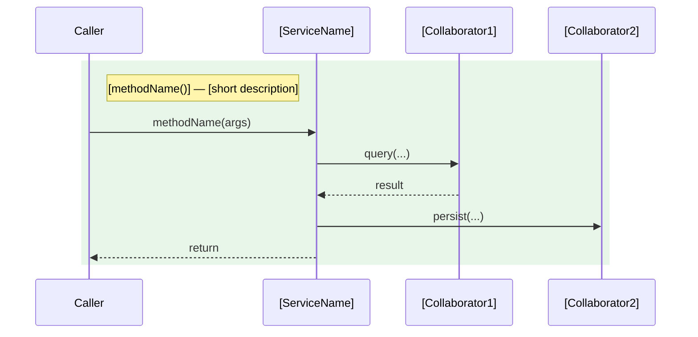
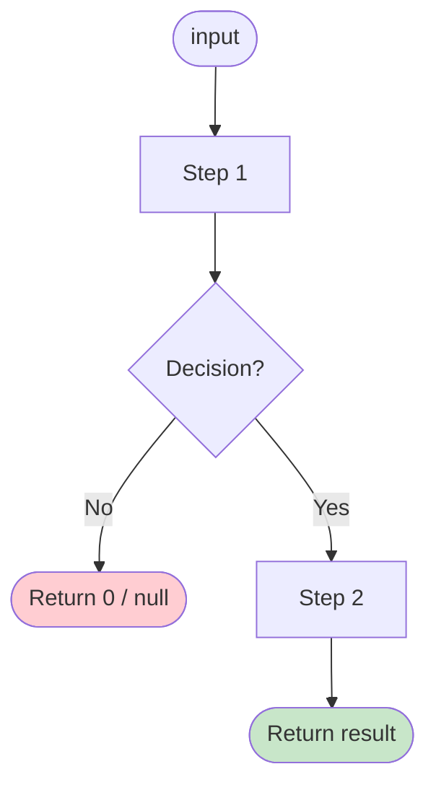

# Domain Service: [ServiceName]

## 📋 Definition
* **Description:** [What this service does and why it exists as a domain service rather than inside an aggregate]
* **Type:** Domain Service (stateless)
* **Source file:** `[path/to/ServiceName.ext]`
* **Owner Team:** [Team name]

---

## 🤝 Collaborators

| Collaborator | Role |
|--------------|------|
| `[RepositoryOrService]` | [What it provides to this service] |

---

## 🎯 Methods

### `[methodName(args)]: ReturnType`
[One-line description of what this method does.]

| Aspect | Detail |
|--------|--------|
| **Guards** | [Preconditions that must hold] |
| **Steps** | [Ordered list of what the method does] |
| **Side Effects** | [Domain events published, records persisted, etc.] |
| **Returns** | [What it returns and what the value means] |

---

## 🗺️ Sequence Diagram

---

## 🔄 Flow Diagram — `[methodName()]()`

*Repeat one flow diagram block per method.*

---

## 🔒 Invariants

* [INV-[XXX]](../invariants/INV-[XXX]-[invariant-name].md): [Short invariant title]

---

## 🔗 Linked User Stories & Flows

| Flow | Usage |
|------|-------|
| [FlowName](../flows/flow-XX-name.md) | [Which method is called and at which step] |
