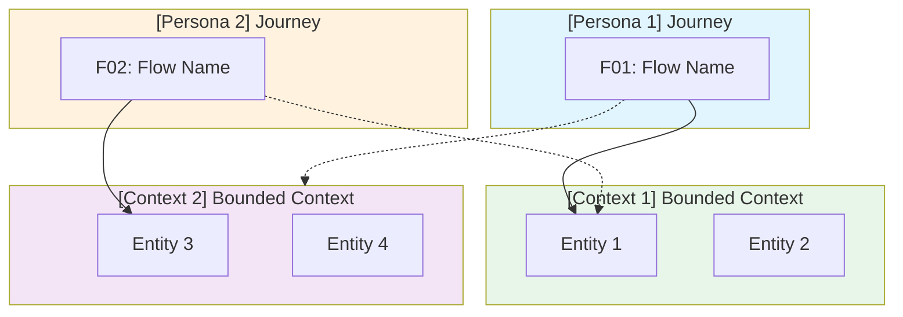

# User Flows & Journeys

**Primary entry point for understanding user journeys** across [Project Name]'s bounded contexts.

Each flow represents a complete user story from start to finish, documenting system interactions, entity lifecycle, acceptance criteria, business rules, and invariants.

---

## 🗺️ Flow Catalog

| ID | Journey Name | Primary Bounded Context | Related Contexts | Wave | Status |
|:---|:-------------|:----------------------|:-----------------|:----:|:------:|
| **F01** | [Flow Name](bounded-context/flows/flow-01-name.md) | [Context] | [Related Context] | W1 | ✅ Complete |

---

## 📋 Flow Details

### F[XX] — [Flow Name]

**As a** [Persona]  
**I want to** [action]  
**So that** [outcome]

**Bounded Contexts:** [Primary Context] (primary) · [Secondary Context] (consumed)  
**Features:** [comma-separated feature list from Step 5]  
→ [Full Flow Specification](path/to/flow.md)

---

## 🔗 Cross-Context Flow Diagram

---

## 📐 Business Rules & Invariants

| ID | Name | Context | Flows |
|:---|:-----|:-------:|:------|
| [BR-001](context/business-rules/BR-001-rule-name.md) | Rule name | [Context] | F01 |
| [INV-001](context/invariants/INV-001-invariant-name.md) | Invariant name | [Context] | F01 |

---

## 📊 Flow Status Legend

| Status | Meaning |
|:------:|:--------|
| ✅ | Fully documented — flow spec, diagrams, BRs, INVs |
| ⏳ | Flow identified, documentation pending |
| 🔄 | Under review or revision |

---

## 📚 Related Documentation

- [Step 6: User Journeys](../../inception/6-user-journeys/README.md) — Source journeys this documentation is derived from
- [Step 7: Features & Sequencing](../../inception/7-features-and-sequencing.md) — Wave planning and feature prioritisation
- [Step 5: Brainstorming](../../inception/5-brainstorming.md) — Feature definitions and confidence signals

---

**Last Updated:** YYYY-MM-DD  
**Total Flows:** N (N documented, N pending)  
**Products:** [Product 1] · [Product 2]
