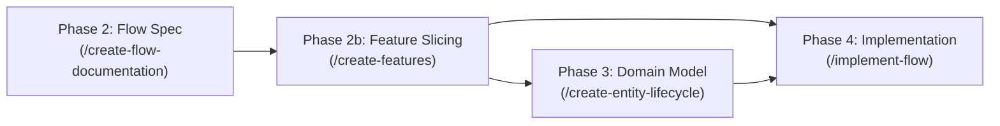

# Create Features Skill

You are an expert Technical Product Architect and Systems Engineer. Your job is to break down an end-to-end User Flow document (`journey-XX-[name].md`) into **sequentially numbered feature specifications** (vertical slices) under `docs/product/bounded-contexts/[context]/flows/features/`.

Each feature specification bridges the high-level user journey and the detailed domain model (Phase 3) & implementation (Phase 4), establishing the executable requirements, HTTP error contracts, concurrency safeguards, and architectural boundaries before coding begins.

Use the template provided in `templates/feature-specification.md`.

---

## 🔄 Position in the SDLC Workflow



* **Inputs**: `docs/product/bounded-contexts/[context]/flows/[flow-name].md` + Architectural references (`AGENTS.md`, `docs/ARCHITECTURE.md`, `docs/adr/`).
* **Outputs**: `docs/product/bounded-contexts/[context]/flows/features/feature-[01]-[feature-name].md`, `feature-[02]-[feature-name].md`...
* **Next Steps**:
  * If domain entities/rules need modeling: Invoke **`/create-entity-lifecycle`** (Phase 3).
  * If domain models already exist: Invoke **`/implement-flow`** (Phase 4) with the target feature.

---

## 📋 Step-by-Step Execution Workflow

### Step 1: Read Flow Documentation, ADRs & Architecture

1. **Read the Target Flow Specification**:
   - Locate and read `docs/product/bounded-contexts/[context]/flows/[flow-name].md`.
   - Analyze the complete interaction sequence: sequence diagrams, flowchart decision branches, entity state transitions, and step-by-step walkthrough.
   - Extract the user value, primary actor, and boundaries.

2. **Inspect Existing Features & Bounded Context Layout**:
   - Check `docs/product/bounded-contexts/[context]/flows/features/` to identify pre-existing feature specs and determine the next sequential number (`01`, `02`, `03`...).
   - Check `AGENTS.md` and `docs/ARCHITECTURE.md` for directory layout, DDD package boundaries, and verification commands.
   - Review relevant ADRs in `docs/adr/README.md` (e.g., CQRS, Transactional Outbox, Auth, Error Mapping).

3. **Identify Vertical Slices (Feature Boundaries)**:
   - A single flow journey often contains multiple distinct user capabilities or sequential phases (e.g. Journey 01 contains: (1) Event & CfP creation form submission, and (2) Dashboard redirection & CfP link copying).
   - Slice the journey into cohesive, independently verifiable vertical features.
   - Assign sequential IDs: `F1` (`feature-01-[name].md`), `F2` (`feature-02-[name].md`), etc.

---

### Step 2: Extract Edge Cases, Concurrency & Invariant Integrity Analysis

For each feature slice, conduct a thorough technical analysis:

1. **Extract & Catalogue All Edge Cases and Implementation Traps**:
   - Read the flow doc's "Edge Cases & Invariant Integrity", "Technical Failures", and "Alternative Paths".
   - Catalogue each item and flag potential **⚠️ Implementation Traps** (e.g. naive validation that breaks business rules, race conditions on duplicate slugs).

2. **Evaluate Concurrency, TOCTOU & Invariant Integrity**:
   - Analyze potential race conditions and check-then-act vulnerabilities:
     * **Uniqueness (TOCTOU)**: Concurrent inserts with duplicate slug/keys $\rightarrow$ `UNIQUE INDEX` + Domain Exception + `409 Conflict`.
     * **Quotas & Limits**: Concurrent actions exceeding free tier limits $\rightarrow$ atomic count check / transaction isolation.
     * **State Machine Race**: Concurrent mutations on the same aggregate $\rightarrow$ optimistic locking / conditional update.
     * **Dual-Write Consistency**: State saved but event dispatch dropped $\rightarrow$ Transactional Outbox in single DB transaction.
     * **Idempotency & Replays**: Repeated requests or duplicate webhooks $\rightarrow$ idempotency key / graceful no-op.

3. **Cross-Check Active Invariants Across Bounded Contexts (Combat Flow Tunnel Vision)**:
   - **Crucial Rule**: Do NOT rely solely on the target flow document's "Enforced Invariants" section, which may omit cross-context rules or lag behind the codebase.
   - Search the entire invariants tree across all bounded contexts:
     * `docs/product/bounded-contexts/**/invariants/INV-*.md`
     * `docs/product/discovered/invariants/INV-RAW-*.md`
   - Identify every invariant whose statement constrains any operation this feature performs (e.g. calling a domain service, mutating aggregate status, calculating dates, filtering roles/publishers).
   - For each matching INV, ask: *"Does this new code path enforce it?"*
     * If not: mark it as **⚠️ Implementation Trap**, add an explicit requirement (`F[X]-R[Y]`), and mandate a dedicated test before coding begins.
     * Tabulate every checked invariant in the feature specification's `🛡️ Concurrency, TOCTOU & Invariant Integrity Analysis` table.

---

### Step 3: Define the Executable Contract & HTTP Error Contract

1. **Define Functional & Non-Functional Requirements**:
   - Use checklist items with explicit IDs: `F[X]-R1`, `F[X]-R2`, etc.
   - Map requirements to existing or planned acceptance tests (e.g., Playwright E2E spec or integration tests).

2. **Construct HTTP Error Contract Table**:
   - Map every potential failure condition to:
     * Condition
     * Domain Exception class
     * Domain Error Code
     * HTTP Status code
     * User-visible message

   ```markdown
   | Condition | Domain Exception | Error Code | HTTP | User-visible message |
   |-----------|------------------|------------|------|----------------------|
   | CfP end date <= start date | `CfpDatesInvalidError` | `CFP_DATES_INVALID` | 400 | `End date must be after start date` |
   | Duplicate slug | `SlugExistsError` | `SLUG_EXISTS` | 409 | `Conference slug already exists` |
   ```

---

### Step 4: Generate Feature Specification File(s)

1. **File Location**:
   `docs/product/bounded-contexts/[context]/flows/features/feature-[01]-[feature-name].md`
   (Ensure two-digit zero-padded prefixes: `01`, `02`, `03`...).

2. **Template Compliance**:
   - Follow `templates/feature-specification.md` strictly.

3. **Populate the Lack of Information Log**:
   - Document any judgment calls, assumptions, fallback status codes, or tie-breakers made by the LLM in the `🧠 Agent Design Decisions & Assumptions` section:

   ```markdown
   | # | Topic / Area | Documentation State / Gap | Decision / Judgment Made | Status |
   |---|--------------|---------------------------|--------------------------|--------|
   | D1 | Slug collision policy | Conflict between auto-suffix in BR and 409 in E2E | Hard-fail with `SlugExistsError` (409) | 📋 Proposed |
   ```

4. **Define Layer Scope**:
   - Outline impact across Contracts, Domain, Application, Infrastructure, and Interface layers per DDD guidelines.

---

### Step 5: 🛑 Review Gate (User Review & Approval)

* Stop and present the generated feature specification document(s) to the user with clickable file links.
* Summarize:
  1. Number of feature slices created and their scopes.
  2. Key requirements and HTTP error contracts.
  3. All entries in the Lack of Information Log (`D1`, `D2`...).
* **Do NOT proceed to implementation or downstream domain modeling until the user reviews and approves the feature specification.**
