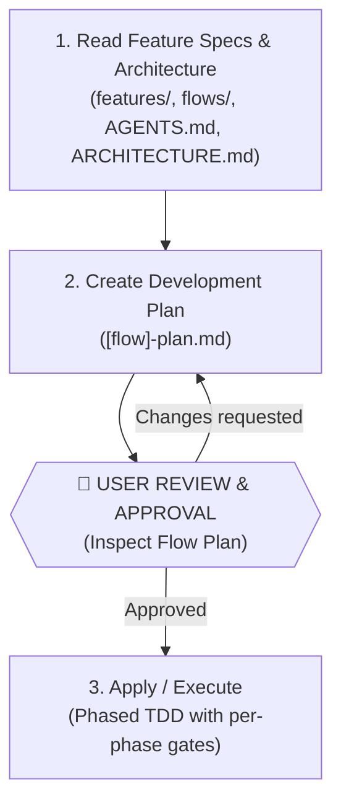
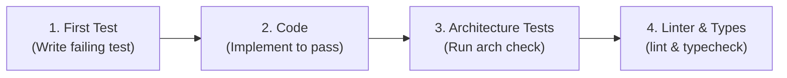

# Implement Flow Skill

This skill guides feature implementation through flow-driven analysis, document review, and phased, user-controlled TDD development.

> **Single Source of Truth**:
> - Consult **`AGENTS.md`** and **`docs/ARCHITECTURE.md`** for folder layout, coding style, naming conventions, layer boundaries, and exact verification commands.
> - Consult **`docs/adr/README.md`** for architectural decision records.

---

## 🚦 Interactive Control & Review Principle

The user maintains explicit control over every stage and execution step:
1. **Never write implementation code without document approval**: Feature specifications and the flow development plan must be reviewed and approved by the user before code execution begins.
2. **Review gates between stages**: Stop and present documents for user inspection after creating Feature Specs and after creating the Flow Plan.
3. **Phase-by-phase execution control**: Execute code in discrete phases (Phase 0 $\rightarrow$ Phase 5). After each phase, report status, verify architecture/tests, update the plan document, and confirm with the user before proceeding to the next phase.

---

## 🔄 The Implementation Lifecycle

---

### Step 1: Read Feature Specifications, Flow Documentation & Architecture

1. **Verify Prerequisites (Feature Specs Must Exist)**:
   - Check `docs/product/bounded-contexts/[context]/flows/features/` for the feature specification(s) to implement (e.g. `feature-01-[name].md`).
   - If feature specifications do NOT exist yet, stop and invoke **`/create-features`** first to slice and specify the features before planning implementation.

2. **Inspect Existing Codebase & Artifacts First (Search-First)**:
   - Consult **`AGENTS.md`** and **`docs/ARCHITECTURE.md`** (or **`CLAUDE.md`** if `AGENTS.md` is absent) to determine the repository's folder structure, bounded context paths, and framework transport layers.
   - **Check for cross-repo dependencies**: Read the `CLAUDE.md` (or `AGENTS.md`) **Cross-Repo Dependencies** section. If this flow touches other repositories, declare them in the plan's `🔗 Cross-Repo Dependencies` table **before writing the plan**. Flag any deploy-order constraint to the user at the summary step.
   - Check if the target bounded context module already exists in the codebase before scaffolding. **Never re-scaffold or overwrite existing modules**.

3. **Read Feature Specification & Domain Rules**:
   - Read the target feature specification: `docs/product/bounded-contexts/[context]/flows/features/feature-[XX]-[feature-name].md`.
   - Read the parent flow document: `docs/product/bounded-contexts/[context]/flows/[flow-name].md`.
   - Read any associated domain models: `entities/`, `business-rules/`, `invariants/`.
   - Extract the HTTP error contract table, concurrency safeguards, acceptance criteria, and layer scope.

4. **Extract & Catalogue All Edge Cases and Implementation Traps**:
   - Read the feature spec's and flow doc's edge cases, technical failures, and alternative paths.
   - Produce a numbered catalogue of **every** edge case, technical failure mode, and validation boundary.
   - For each item, explicitly ask: *"Would a naive implementation contradict this?"* — mark those as **⚠️ Implementation Trap**. These are the cases most likely to be implemented incorrectly (e.g. a guard that skips delivery when the spec says delivery must continue).
   - This catalogue is the primary input for Phase 0 test writing. Every item must map to at least one test before implementation begins.

5. **Consult Architectural Documents & ADRs (Single Sources of Truth)**:
   - **`AGENTS.md` & `docs/ARCHITECTURE.md`**: For directory layout, package boundaries, framework routes/entrypoints, and verification commands.
   - **`docs/ARCHITECTURE-RULES.md`**: For strict DDD templates (Value Objects, Entities, Domain Events, Exceptions, CQRS Handlers, Response DTOs, and Repositories).
   - **`docs/adr/README.md`**: For architectural decisions relevant to this flow (CQRS, Auth, Storage, Data Access, Outbox, API Contracts).

6. **Summarize Understanding & Scope**:
   - Present a clear summary of the current codebase state (existing vs missing files), target feature scope, and impacted layers to the user before generating the implementation plan.

---

### Step 2: Create Flow Development Plan

1. Create a flow-level or feature-level development plan alongside the flow document:
   `docs/product/bounded-contexts/[context]/flows/[flow-name]-plan.md`
2. Use the template: `templates/flow-development-plan.md` (located in this skill).
3. **Populate the Lack of Information Log**:
   - Consolidate all architectural decisions, runtime configurations, and tie-breakers in the `🧠 Agent Design Decisions & Assumptions` table.
4. The plan acts as the **state tracker** containing phased checkboxes (`[ ]` $\rightarrow$ `[x]`) for sequential execution.
5. **🛑 Review Gate**:
   - Stop and present the generated flow development plan to the user with file links.
   - Confirm phase ordering, test scope, affected files, and LLM design decisions.
   - **Do NOT start implementing code (Step 3) until the user explicitly approves the plan.**

---

### Step 3: Apply & Execute (Phase-by-Phase TDD with User Control)

Execute one phase at a time according to `[flow-name]-plan.md`. Within each phase, strictly follow the 4-step micro-cycle:

#### Execution Protocol:
1. **First: Write Test**
   - **Phase 0 only — spec-driven test enumeration before writing any code**:
     1. Open the edge case catalogue built in Step 1.
     2. Write one failing acceptance test per catalogue item — happy path AND every documented edge case, technical failure, and implementation trap.
     3. Tests must be derived from the spec, not from what the implementation will look like. If the spec says "delivery continues when X is null", the test must assert delivery happened — even if the naive implementation would skip it.
     4. Only proceed to implementation once the full catalogue has test coverage.
   - **Phases 1–4 — spec cross-check before each test**:
     Before writing each unit or integration test, verify it against the flow spec's acceptance criteria and edge case catalogue. If a test would pass with a naive implementation that contradicts a documented edge case, **the spec wins** — fix the test to match the spec, not the other way around.
   - Run the test $\rightarrow$ must **FAIL** initially (verifying test validity).
2. **After: Implement Code**
   - Implement only the code necessary to make the test **PASS**.
3. **After: Run Architecture Tests & Checks**
   - Run the architecture checks defined in `AGENTS.md` (e.g. `npm run check:arch`).
   - Ensure layer boundaries and invariants remain unviolated.
4. **After: Run Linter & Typecheck**
   - Run project linter and typecheck commands defined in `AGENTS.md` (e.g. `npm run lint:fix && npm run typecheck`).
5. **Update State & Checkpoint**:
   - Mark completed checkboxes (`- [x]`) in `[flow-name]-plan.md`.
   - **🛑 Phase Checkpoint**: Report the phase completion and verification results to the user.
   - Ask for user confirmation before beginning the next phase.

---

## 📝 Planning Templates

- **Flow Plan Template**: `templates/flow-development-plan.md`
- **Feature Spec Template**: `templates/feature-specification.md`

---

## ✅ Definition of Done
A flow/feature is considered complete when:
1. All checkboxes in `[flow-name]-plan.md` are marked `[x]`.
2. All Definition of Done criteria listed in `AGENTS.md` pass (Architecture tests, Unit/Integration tests, E2E tests, Linting, and Typechecking).
3. Final verification results have been presented to and approved by the user.