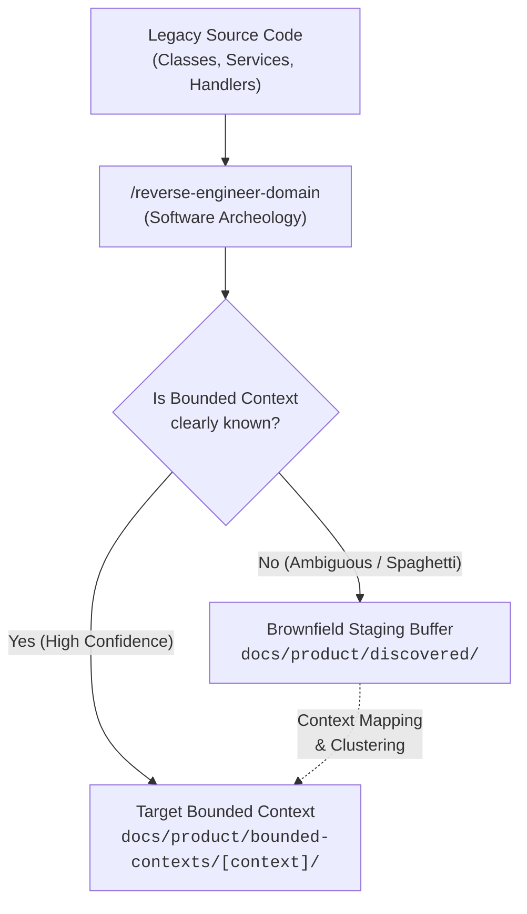

# Reverse Engineer Domain Agent Skill

A platform-agnostic AI agent skill for performing **bottom-up software archeology** on legacy and brownfield codebases to extract implicit Business Rules (`BR-XXX`) and Domain Invariants (`INV-XXX`) into clean, standardized Domain-Driven Design (DDD) documentation.

---

## The Brownfield Challenge & Staging Buffer

When working with legacy applications (often monolithic or *Big Ball of Mud* codebases), domain boundaries are rarely well-defined. Attempting to force an extracted rule into a formal Bounded Context prematurely can introduce artificial coupling and distort the architecture.

This skill solves this problem by using a **Progressive Staging Buffer**:



---

## Quick Start

### Conversational Examples (Claude Code, Cursor, AGY, Pi)

- **Analyze a single file:**
  > "Read `src/legacy/ConferenceManager.ts` and reverse engineer its business rules and invariants."

- **Analyze a legacy module:**
  > "Perform software archeology on `src/legacy/billing/` and extract all domain invariants."

- **Extract rules to staging:**
  > "Extract the business rules from this spaghetti controller into the discovered staging buffer."

- **Review staged rules for graduation:**
  > "Review the staged rules in `docs/product/discovered/` and propose candidate bounded contexts."

---

## Directory Structure of the Skill

```text
.agents/skills/sessioflow-sdlc/reverse-engineer-domain/
├── SKILL.md                                          # Skill definition, triage engine, and instructions
├── README.md                                         # This guide
└── templates/                                        # Standardized extraction templates
    ├── business-rules.md                             # Template for BR-XXX with source traceability
    └── invariants.md                                 # Template for INV-XXX with Gherkin scenarios
```
