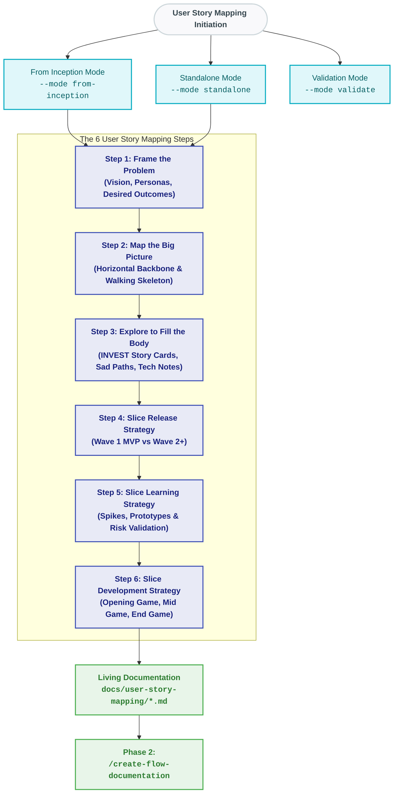

# User Story Mapping Agent Skill

A platform-agnostic AI agent skill for facilitating Jeff Patton's User Story Mapping methodology through 6 structured steps. This skill can operate standalone from scratch or act as an analytical bridge that transforms Lean Inception artifacts into granular, INVEST-compliant story maps with technical notes and release slices.

---

## Process & Modes Overview



---

## Quick Start

### 1. In Claude Code, Cursor, or Other AI Coding Assistants

Instruct your agent using natural language:

- **Synthesize from Lean Inception:**
  > "Read `.pi/skills/user-story-mapping/SKILL.md` and generate the user story mapping documentation from the existing inception artifacts."

- **Interactive Facilitation (Step by Step):**
  > "Read `.pi/skills/user-story-mapping/SKILL.md` and facilitate Step 2: Map the Big Picture for our project."

- **Validate Completed Story Map:**
  > "Read `.pi/skills/user-story-mapping/SKILL.md` and validate `docs/user-story-mapping/3-explore-to-fill-the-body.md` using the Step 3 validator rubric."

### 2. In the Pi CLI Tool

```bash
# Convert existing Inception to User Story Mapping (Steps 1–6)
pi skill user-story-mapping --mode from-inception

# Run a specific step from Inception (e.g., Step 2 Backbone)
pi skill user-story-mapping --mode from-inception --step 2

# Start interactive standalone facilitation
pi skill user-story-mapping --mode standalone --step 1

# Batch generate story map from context
pi skill user-story-mapping --mode standalone --batch --context "SessioFlow"

# Validate Step 3 output
pi skill user-story-mapping --mode validate --step 3 --file docs/user-story-mapping/3-explore-to-fill-the-body.md
```

---

## Directory Structure of the Skill

```text
.pi/skills/user-story-mapping/
├── SKILL.md                                          # Skill definition, triggers, and execution rules
├── README.md                                         # This guide
├── templates/                                        # Markdown templates & inception mapping guides
│   ├── 1-frame-the-problem.md
│   ├── 1-frame-the-problem-inception-mapping.md
│   ├── 2-map-the-big-picture.md
│   ├── 2-map-the-big-picture-inception-mapping.md
│   ├── 3-explore-to-fill-the-body.md
│   ├── 3-explore-to-fill-the-body-inception-mapping.md
│   ├── 4-slice-out-a-release-strategy.md
│   ├── 4-slice-out-a-release-strategy-inception-mapping.md
│   ├── 5-slice-out-a-learning-strategy.md
│   ├── 5-slice-out-a-learning-strategy-inception-mapping.md
│   ├── 6-slice-out-a-development-strategy.md
│   └── 6-slice-out-a-development-strategy-inception-mapping.md
└── references/                                       # Quality audit rubrics & validators
    ├── 1-frame-the-problem-validator.md
    ├── 2-map-the-big-picture-validator.md
    ├── 3-explore-to-fill-the-body-validator.md
    ├── 4-slice-out-a-release-strategy-validator.md
    ├── 5-slice-out-a-learning-strategy-validator.md
    └── 6-slice-out-a-development-strategy-validator.md
```

---

## Integration with Downstream SDLC Phases

Outputs produced by this skill in `docs/user-story-mapping/` directly feed downstream phases:

1. **Step 2 (Backbone) & Step 3 (Story Cards):** Provide user steps, variations, and technical constraints directly consumed by **Phase 2 (`/create-flow-documentation`)** to produce technical sequence diagrams and Gherkin scenarios.
2. **Step 4 (Release Strategy):** Dictates the prioritization waves for **Phase 4 (`/implement-flow`)**.
3. **Step 6 (Development Strategy):** Outlines the tracer bullets (Opening Game) for setting up deployment infrastructure and end-to-end walking skeletons.
