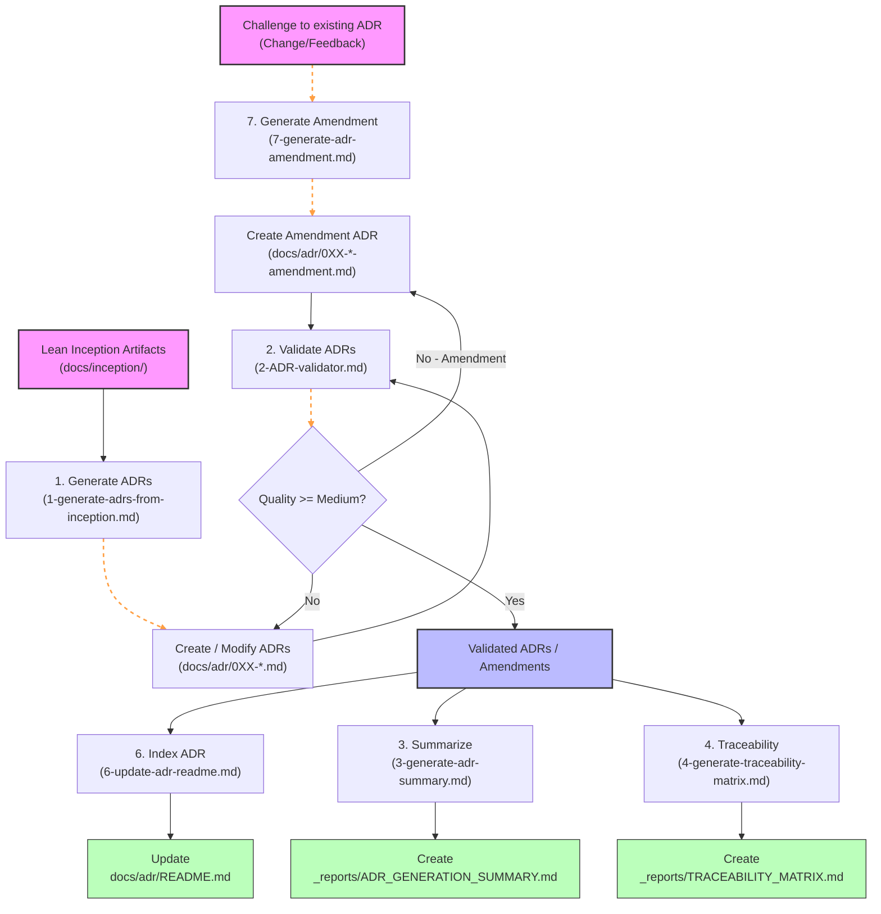
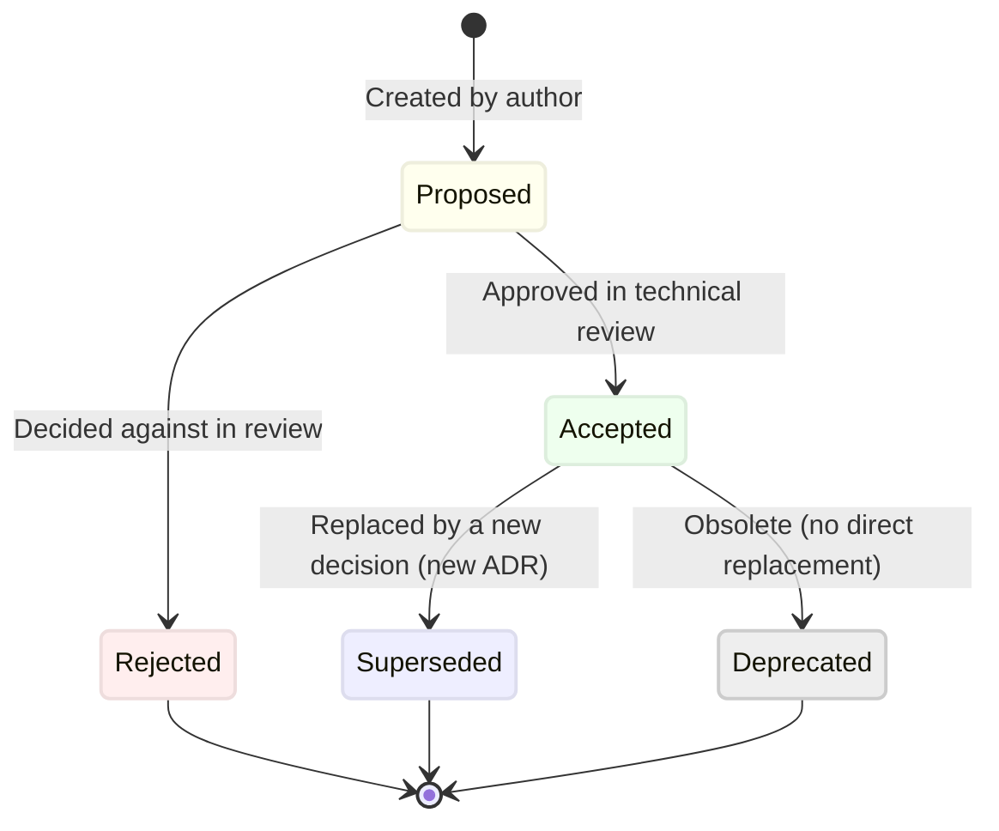
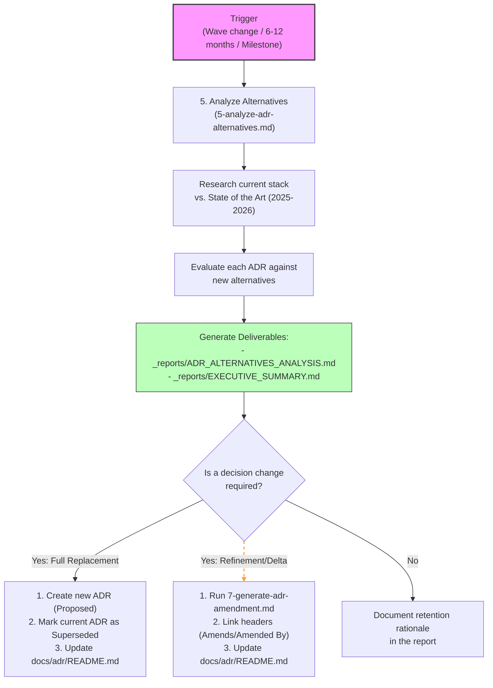

# ADR Manager Pi Skill

This directory contains the `adr-manager` Pi Skill, which standardizes and automates the lifecycle of Architecture Decision Records (ADRs) and Amendments in any repository.

---

## Workflows & Lifecycles

### ADR Generation Workflow

When starting a project, new ADRs or Amendments are validated and indexed through this sequence:



---

### ADR Status Lifecycle



---

### Alternatives Analysis Workflow



---

## Directory Structure & Assets

This skill bundles all references and templates as assets, keeping them separate from the project files:

```
.pi/skills/adr-manager/
├── SKILL.md                 # Core prompt & instructions for the AI agent
├── README.md                # This usage guide
├── templates/               # Standardized markdown templates
│   ├── TEMPLATE.md
│   ├── TEMPLATE-ADR_VALIDATOR.md
│   ├── TEMPLATE-ADR_GENERATION_SUMMARY.md
│   ├── TEMPLATE-TRACEABILITY_MATRIX.md
│   ├── TEMPLATE-ADR_ALTERNATIVES_ANALYSIS.md
│   ├── TEMPLATE-EXECUTIVE_SUMMARY.md
│   └── TEMPLATE-AMENDMENT.md
└── references/              # Step-by-step command guides
    ├── 0-ADR-WORKFLOW.md
    ├── 1-generate-adrs-from-inception.md
    ├── 2-ADR-validator.md
    ├── 3-generate-adr-summary.md
    ├── 4-generate-traceability-matrix.md
    ├── 5-analyze-adr-alternatives.md
    ├── 6-update-adr-readme.md
    └── 7-generate-adr-amendment.md
```

---

## How to Run

### 1. Conversational Activation
Simply ask the AI agent in the chat:
*   *"Create an ADR for [technology choice] using the adr-manager skill"*
*   *"Validate ADR-003"*
*   *"Draft an amendment for ADR-002 to add a repository interface"*
*   *"Run the alternatives analysis for Q3"*

### 2. Command Line Interface (CLI)
Execute specific modes using the Pi CLI tool:
```bash
# Generate a new ADR
pi skill adr-manager --mode generate

# Validate an ADR
pi skill adr-manager --mode validate --file docs/adr/003-use-docker-compose-for-deployment.md

# Propose an amendment
pi skill adr-manager --mode amend --file docs/adr/002-use-supabase-for-backend-and-database.md
```
