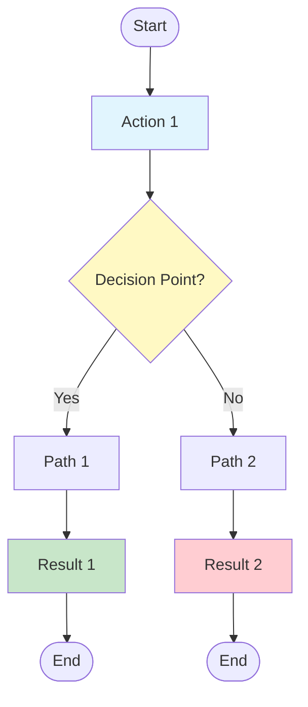
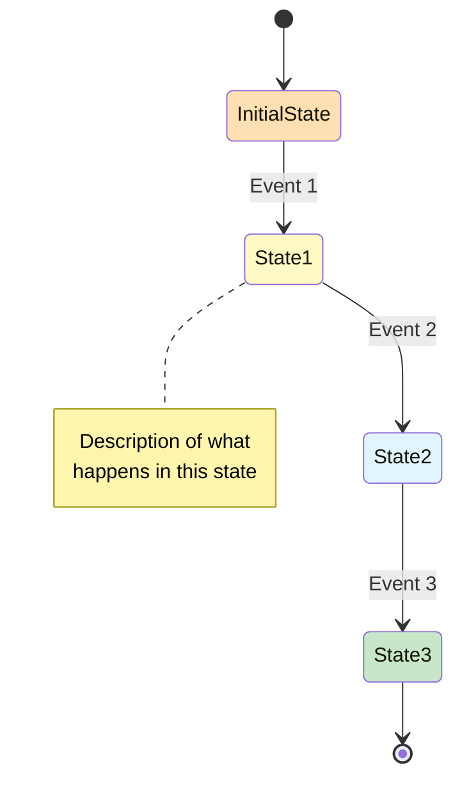

# Journey [XX]: [Feature/Flow Title]

## 🛡️ ADR Compliance Checklist
After generating the flow document, review the project's Architecture Decision Records (ADRs) to ensure alignment with established architectural decisions.

- [ ] Entity mutations use domain methods rather than direct property setters
- [ ] State transitions match entity lifecycle state machine
- [ ] Domain events are published on state changes
- [ ] Repository pattern is used for data access
- [ ] Input validation uses schema validation

## 📋 Overview
* **As a:** [User Role / Persona]
* **I want to:** [Action they want to take]
* **So that:** [The value or outcome they receive]
* **Source:** Inception Step 6 - User Journey Mapping (Journey [X])
* **Related Feature:** [Feature Name] from Wave [X] ([MVP/Phase])
* **Impacted Entities:** 
  * [[entity-name-1]] (e.g., `Order` changes from `Draft` -> `Pending`)
  * [[entity-name-2]] (e.g., `Inventory` item quantity decrements)
* **Bounded Context:** [Bounded Context Name]

---

## 🗺️ Visual Flow & Sequence
*Maps the sequence of user actions, domain behavior, and system reactions for this journey. Follows DDD patterns per ADR-009. **Must include error paths and alternative flows**, not just happy path.*

```mermaid
sequenceDiagram
    autonumber
    actor User as [Actor Role]
    participant UI as Frontend
    participant API as Application Service
    participant Domain as [Aggregate Name]
    participant DB as Repository
    participant Ext as External Service (optional)

    Note over User,Ext: Journey [XX]: [Flow Name]

    User->>UI: [Initial Action]
    UI->>API: [Request]
    API->>API: [Validation/Processing]
    API->>DB: [Query]
    DB-->>API: [Response]
    
    rect rgb(232, 245, 233)
        note right of UI: Happy Path - All Valid
        API->>Domain: [Domain Operation]
        Note over Domain: Entity state: [State]
        Domain->>Domain: [Domain Method Call]
        Note over Domain: Publishes [Domain Event]
        API->>DB: Save aggregate
        DB-->>API: Persisted
        API->>Ext: [Async operation if applicable]
        API-->>UI: Success Response
        UI-->>User: [Success Feedback]
    end

    rect rgb(255, 235, 238)
        note right of UI: Error Path - [Error Type]
        [Error handling sequence]
        API-->>UI: Error Response
        UI-->>User: [Error Feedback]
    end

    Note over User,Ext: Domain Events Published
    Note right of Domain: [Event 1] → [Side Effect 1]<br/>[Event 2] → [Side Effect 2]
```

---

## 🔄 Alternative Flow (Flowchart)

*Shows decision points, branching logic, and error handling paths:*



---

## 📊 Entity State Diagram

*Shows the lifecycle of the primary entity/aggregate involved in this flow:*



---

## 🏃‍♂️ Step-by-Step Walkthrough (Happy Path)

| Step | User Action | System Reaction | Entity Lifecycle Impact |
| :--- | :--- | :--- | :--- |
| **1** | Clicks "Place Order" | Validates fields, shows loading spinner, sends API request. | None (UI Level) |
| **2** | — | Validates stock availability, reserves items. | `InventoryItem` -> `Reserved` |
| **3** | — | Generates unique order ID, saves invoice draft. | `Order` -> `Draft` |
| **4** | Views payment modal | Redirects user to Stripe checkout overlay. | `Order` -> `PendingPayment` |

---

## ✅ Acceptance Criteria & Scenarios

### Scenario 1: Successful Execution (Happy Path)
* **Given** the user has items in their cart,
* **When** they click "Place Order",
* **Then** the system should redirect them to the payment gateway,
* **And** the `Order` state must transition to `PendingPayment`.

### Scenario 2: Alternative / Parallel Path
* **Given** ...
* **When** ...
* **Then** ...

---

## ⚠️ Edge Cases, Errors, & Boundary Conditions

### 1. Business Logic Failures

| What If | System Handling | Domain Method | Entity Impact |
|---------|-----------------|---------------|---------------|
| Stock drops to 0 at submit | Rollback partial writes, display *"Item no longer available"*, redirect to cart | `Order.create()` throws `InsufficientStockError` | No lifecycle change; `Order` not created |
| [Edge case 2] | [System handling] | [Domain method] | [Entity impact] |

### 2. Technical Failures

| What If | System Handling | Domain Impact |
|---------|-----------------|---------------|
| Stripe webhook fails/delays | Background reconciliation cron polls Stripe every 5 minutes | `Order` safely sits in `PendingPayment` until background task pushes to `Paid` |
| [Technical issue 2] | [System handling] | [Domain impact] |

### 3. Validation Boundary Conditions

| What If | System Handling | Domain Method | Entity Impact |
|---------|-----------------|---------------|---------------|
| [Validation edge case] | [System handling] | [Domain method] | [Entity impact] |

---

## 🛠️ Technical Notes & Validation Rules

### RESTful API Endpoint (ADR-006)

```
POST /api/v1/[endpoint]
Content-Type: application/json
Authorization: Bearer {jwt}

Request Body:
{
  "field1": "type (required)",
  "field2": "type (optional)"
}

Response: 201 Created
{
  "id": "uuid",
  "field1": "value",
  "status": "state"
}
```

### Zod Validation Schema (ADR-007)

```typescript
const [entity]CreateSchema = z.object({
  field1: z.string().min(3).max(100),
  field2: z.number().int().positive().optional()
});
```

### Database Constraints (ADR-002)

| Constraint | Description |
|------------|-------------|
| `[table].[column]` | [Constraint description] |

### Row-Level Security (ADR-002)

```sql
-- RLS Policy: [Policy description]
CREATE POLICY "[Policy name]"
ON [table] FOR [operation]
WITH CHECK ([condition]);
```

### Generated Fields

| Field | Value |
|-------|-------|
| `slug` | [Description] |
| `status` | [Description] |

### Enforced Business Rules

* [BR-[XXX]](../business-rules/BR-[XXX]-[rule-name].md): [Short business rule active title]

### Enforced Invariants

* [INV-[XXX]](../invariants/INV-[XXX]-[invariant-name].md): [Short invariant strict title]

### Domain Events Published

| Event | Triggered By | Side Effects |
|-------|--------------|--------------|
| `[EventName]` | `[Method call]` | [Side effect description] |

---

## 📝 Diagram & Walkthrough Consistency

This flow document follows consistency guidelines:

1. **Step Numbering:** Each step in the walkthrough table corresponds to a logical action in the sequence diagram
2. **Sequence Alignment:** The order of steps matches the sequence shown in the Mermaid diagram
3. **Completeness:** Every major action in the Mermaid diagram has a corresponding step in the walkthrough
4. **Detail Level:** The walkthrough provides additional detail for each Mermaid interaction
5. **Error Paths:** All error scenarios are shown with colored `rect` blocks in the sequence diagram

---

## 🔗 Linked Documentation

| Document | Relationship |
|----------|--------------|
| [[../entities/entity-name]] | Entity lifecycle and state machine |
| [[../value-objects/value-object-name]] | Value object definition |
| [[../../adr/XXX-xxx-xxx.md]] | Relevant architecture decision |
