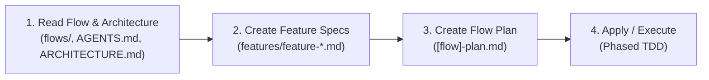
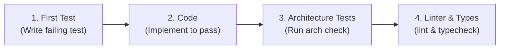

# Implement Flow Skill

This skill guides feature implementation through flow-driven analysis, planning, and phased TDD development.

> **Single Source of Truth**:
> - Consult **`AGENTS.md`** and **`docs/ARCHITECTURE.md`** for folder layout, coding style, naming conventions, layer boundaries, and exact verification commands.
> - Consult **`docs/adr/README.md`** for architectural decision records.

---

## 🔄 The 4-Stage Implementation Lifecycle

---

### Step 1: Read Flow Documentation, ADRs & Architecture
1. **Flow Specification**:
   - Read `docs/product/bounded-contexts/[context]/flows/[flow-name].md` for actors, steps, state transitions, and business rules.
2. **Architecture & Project Layout**:
   - Read **`AGENTS.md`** and **`docs/ARCHITECTURE.md`** to determine the current directory paths for each layer (Domain, Application, Infrastructure, Interfaces, Shared).
3. **ADR Index**:
   - Read `docs/adr/README.md` to identify relevant decisions (CQRS, Auth, Storage, Data Access).

---

### Step 2: Create Feature Specifications
1. Break down the flow into individual features under:
   `docs/product/bounded-contexts/[context]/flows/features/feature-[feature-name].md`
2. Use the template: `templates/feature-specification.md` (located in this skill)
3. Define the requirements, domain model, layer scope, and acceptance criteria.

---

### Step 3: Create Flow Development Plan
1. Create a flow-level plan alongside the flow document:
   `docs/product/bounded-contexts/[context]/flows/[flow-name]-plan.md`
2. Use the template: `templates/flow-development-plan.md` (located in this skill)
3. The plan acts as the **state tracker** containing phased checkboxes (`[ ]` $\rightarrow$ `[x]`) for the agent to execute sequentially.

---

### Step 4: Apply & Execute (Strict TDD Micro-Cycle)

In each phase of the plan, strictly follow the 4-step execution order:

1. **First: Write Test**
   - Write failing test (E2E in Phase 0; Unit/Integration in Phases 1–4).
   - Run the test $\rightarrow$ must **FAIL** initially (verifying test validity).
2. **After: Implement Code**
   - Implement only the code necessary to make the test **PASS**.
3. **After: Run Architecture Tests & Checks**
   - Run the architecture checks defined in `AGENTS.md` (e.g. `npm run check:arch`).
   - Ensure layer boundaries and invariants remain unviolated.
4. **After: Run Linter & Typecheck**
   - Run project linter and typecheck commands defined in `AGENTS.md` (e.g. `npm run lint:fix && npm run typecheck`).
5. **Update State**:
   - Mark completed checkboxes (`- [x]`) in `[flow-name]-plan.md` and proceed to the next step.

---

## 📝 Planning Templates

- **Flow Plan Template**: `templates/flow-development-plan.md`
- **Feature Spec Template**: `templates/feature-specification.md`

---

## ✅ Definition of Done
A flow/feature is considered complete when:
1. All checkboxes in `[flow-name]-plan.md` are marked `[x]`.
2. All Definition of Done criteria listed in `AGENTS.md` pass (Architecture tests, Unit/Integration tests, E2E tests, Linting, and Typechecking).