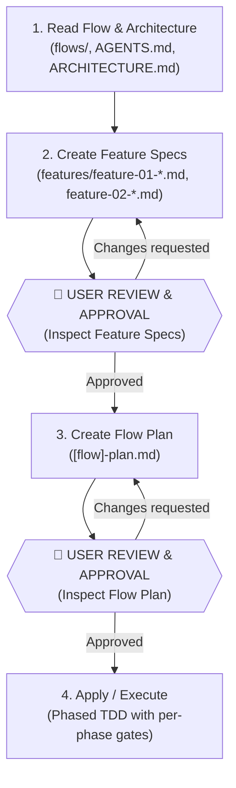
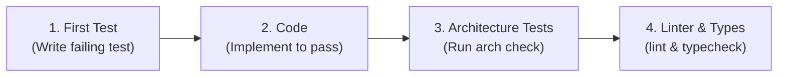

# Implement Flow Skill

This skill guides feature implementation through flow-driven analysis, document review, and phased, user-controlled TDD development.

> **Single Source of Truth**:
> - Consult **`AGENTS.md`** and **`docs/ARCHITECTURE.md`** for folder layout, coding style, naming conventions, layer boundaries, and exact verification commands.
> - Consult **`docs/adr/README.md`** for architectural decision records.

---

## 🚦 Interactive Control & Review Principle

The user maintains explicit control over every stage and execution step:
1. **Never write implementation code without document approval**: Feature specifications and the flow development plan must be reviewed and approved by the user before code execution begins.
2. **Review gates between stages**: Stop and present documents for user inspection after creating Feature Specs and after creating the Flow Plan.
3. **Phase-by-phase execution control**: Execute code in discrete phases (Phase 0 $\rightarrow$ Phase 5). After each phase, report status, verify architecture/tests, update the plan document, and confirm with the user before proceeding to the next phase.

---

## 🔄 The 4-Stage Implementation Lifecycle

---

### Step 1: Read Flow Documentation, ADRs & Architecture

1. **Inspect Existing Codebase & Artifacts First (Search-First)**:
   - Consult **`AGENTS.md`** and **`docs/ARCHITECTURE.md`** to determine the repository's folder structure, bounded context paths, and framework transport layers.
   - Check if the target bounded context module already exists in the codebase before scaffolding. **Never re-scaffold or overwrite existing modules**.
   - Check the flow's features directory and existing flow plan files to identify pre-existing specifications or plans to refine/update.

2. **Read Flow Specification & Business Rules**:
   - Read the target flow document: `docs/product/bounded-contexts/[context]/flows/[flow-name].md` (or the repository's flow specification path).
   - Extract the user journey, actors, sequence flow, state machine transitions, invariants, and business rules.
   - Extract domain event side-effects and external integration boundaries.

3. **Consult Architectural Documents & ADRs (Single Sources of Truth)**:
   - **`AGENTS.md` & `docs/ARCHITECTURE.md`**: For directory layout, package boundaries, framework routes/entrypoints, and verification commands.
   - **`docs/ARCHITECTURE-RULES.md`**: For strict DDD templates (Value Objects, Entities, Domain Events, Exceptions, CQRS Handlers, Response DTOs, and Repositories).
   - **`docs/adr/README.md`**: For architectural decisions relevant to this flow (CQRS, Auth, Storage, Data Access, Outbox, API Contracts).

4. **Summarize Understanding & Scope**:
   - Present a clear summary of the current codebase state (existing vs missing files), target flow scope, and impacted layers to the user before writing or updating specifications.

---

### Step 2: Create Feature Specifications (Sequentially Numbered)
1. **Sequential Numbering & Ordering**:
   - Break down the flow into **sequentially numbered** feature specifications under the context's flow features directory:
     `docs/product/bounded-contexts/[context]/flows/features/feature-01-[feature-name].md`
     `docs/product/bounded-contexts/[context]/flows/features/feature-02-[feature-name].md`
   - Use two-digit zero-padded prefixes (`01`, `02`, `03`...) and standard short identifiers (`F1`, `F2`, `F3`...) to ensure clear, unambiguous execution ordering.
2. Use the template: `templates/feature-specification.md` (located in this skill).
3. **Log All Design Decisions & Assumptions (Lack of Information Log)**:
   - Explicitly record any judgment calls, fallback ports, error code mappings, or tie-breakers made by the LLM in the `🧠 Agent Design Decisions & Assumptions` section so they are visible for user audit.
4. **Perform Concurrency, TOCTOU, Idempotency & Invariant Analysis**:
   - Explicitly evaluate race conditions, check-then-act vulnerabilities, idempotency / duplicate replay handling, and data consistency safeguards (e.g. database-level unique constraints, optimistic locking versioning, transactional outbox atomicity, idempotent event dispatch) in the `🛡️ Concurrency, TOCTOU & Invariant Integrity Analysis` section.
5. Define the requirements, domain model, layer scope, and acceptance criteria (including idempotent replay scenarios) mapped to the repository's architectural layers.
6. **🛑 Review Gate**:
   - Stop and present the generated feature specification document(s) to the user with file links.
   - Ask the user to review the document and provide feedback on the design decisions.
   - **Do NOT proceed to Step 3 until the user approves the feature specifications.**

---

### Step 3: Create Flow Development Plan
1. Create a flow-level plan alongside the flow document:
   `docs/product/bounded-contexts/[context]/flows/[flow-name]-plan.md`
2. Use the template: `templates/flow-development-plan.md` (located in this skill).
3. **Populate the Lack of Information Log**:
   - Consolidate all architectural decisions, runtime configurations, and tie-breakers in the `🧠 Agent Design Decisions & Assumptions` table.
4. The plan acts as the **state tracker** containing phased checkboxes (`[ ]` $\rightarrow$ `[x]`) for sequential execution.
5. **🛑 Review Gate**:
   - Stop and present the generated flow development plan to the user with file links.
   - Confirm phase ordering, test scope, affected files, and LLM design decisions.
   - **Do NOT start implementing code (Step 4) until the user explicitly approves the plan.**

---

### Step 4: Apply & Execute (Phase-by-Phase TDD with User Control)

Execute one phase at a time according to `[flow-name]-plan.md`. Within each phase, strictly follow the 4-step micro-cycle:

#### Execution Protocol:
1. **First: Write Test**
   - Write failing test (E2E in Phase 0; Unit/Integration in Phases 1–4).
   - Run the test $\rightarrow$ must **FAIL** initially (verifying test validity).
2. **After: Implement Code**
   - Implement only the code necessary to make the test **PASS**.
3. **After: Run Architecture Tests & Checks**
   - Run the architecture checks defined in `AGENTS.md` (e.g. `npm run check:arch`).
   - Ensure layer boundaries and invariants remain unviolated.
4. **After: Run Linter & Typecheck**
   - Run project linter and typecheck commands defined in `AGENTS.md` (e.g. `npm run lint:fix && npm run typecheck`).
5. **Update State & Checkpoint**:
   - Mark completed checkboxes (`- [x]`) in `[flow-name]-plan.md`.
   - **🛑 Phase Checkpoint**: Report the phase completion and verification results to the user.
   - Ask for user confirmation before beginning the next phase.

---

## 📝 Planning Templates

- **Flow Plan Template**: `templates/flow-development-plan.md`
- **Feature Spec Template**: `templates/feature-specification.md`

---

## ✅ Definition of Done
A flow/feature is considered complete when:
1. All checkboxes in `[flow-name]-plan.md` are marked `[x]`.
2. All Definition of Done criteria listed in `AGENTS.md` pass (Architecture tests, Unit/Integration tests, E2E tests, Linting, and Typechecking).
3. Final verification results have been presented to and approved by the user.