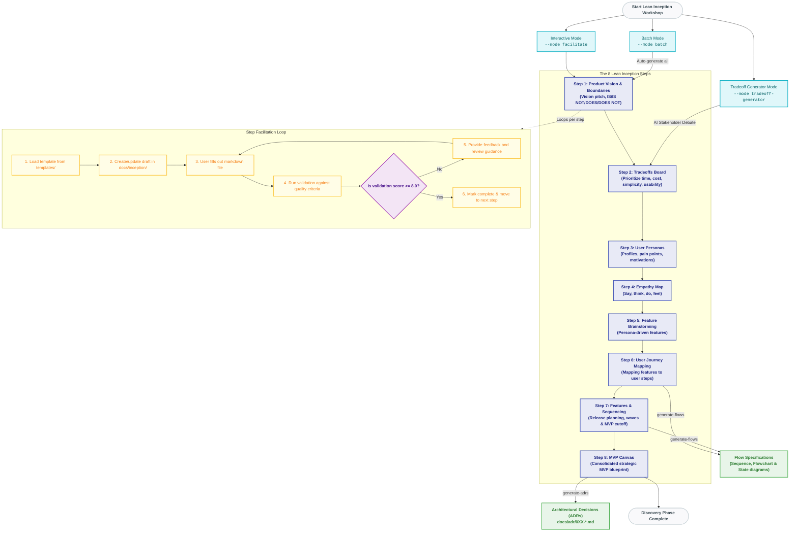

# Inception Workshop Agent Skill

A platform-agnostic AI agent skill for facilitating Lean Inception workshops through 8 structured steps. This skill consists of templates, validators, and guidelines that enable any agentic software development environment (e.g., Claude Code, Cursor, Copilot, or Pi) to guide product discovery.

## Quick Start

Since this skill is a collection of structured prompt definitions, templates, and reference validators, you can instruct any agentic development environment to execute it.

### 1. In Claude Code, Cursor, or other AI Coding Agents

Instruct your agent to execute the workshop using the files in this folder:

*   **Interactive Facilitation (Step-by-Step)**:
    > "Read the instructions in `.pi/skills/inception-workshop/SKILL.md` and facilitate Step 1 of the Lean Inception workshop."
*   **Batch Mode (Automated Discovery)**:
    > "Read `.pi/skills/inception-workshop/SKILL.md` and generate all 8 steps in batch mode for: [your product description]."
*   **Tradeoff Debate Simulation (Step 2)**:
    > "Read `.pi/skills/inception-workshop/SKILL.md` and run the tradeoff debate simulation based on the vision in `docs/inception/1-product-vision-and-boundaries.md`."

### 2. In the Pi CLI Tool

If you have the `pi` tool installed, you can use the built-in skill commands:

```bash
# Start interactive facilitation from Step 1
pi skill inception-workshop

# Run batch generation for all 8 steps automatically
pi skill inception-workshop batch "Your product description here"

# Use AI debate simulation to generate tradeoffs (Step 2)
pi skill inception-workshop tradeoff
```

## How It Works

### Inception Process & Workflow

The Lean Inception workshop is a collaborative discovery process that aligns business goals and technical feasibility to define a Minimum Viable Product (MVP). This skill guides you through the 8 sequential steps, validates your outputs against strict quality criteria, and prepares your workspace for downstream development tasks.



### Useful Information for Future Users

To run the workshop successfully and ensure your documentation passes validation, please follow these guidelines and best practices:

#### 1. Critical Quality Rules
The facilitator uses strict validator files in `references/` to score your progress. Failing these rules will prevent you from moving to the next step:

*   **Product Name Consistency (Step 1)**: Use the exact product name consistently throughout all files. After defining it in Step 1, you may use pronouns or "the platform" naturally, but do not alternate between different names (e.g., "SessioFlow" vs. "SessionFlow").
*   **Boundary Definition Completeness (Step 1)**: You **must** define at least **4 items in each** of the four boundary columns: *IS*, *IS NOT*, *DOES*, and *DOES NOT*. This forces strict boundary mapping early on.
*   **Tradeoff Board Constraints (Step 2)**: Standard prioritization uses a matrix of priorities (e.g., Cost, Usability, Scalability). Under the **Golden Rule**, you can have **exactly one checkmark (X) per priority column**. This enforces strict, un-compromised ranking (e.g., you cannot have two items marked as rank #1).

#### 2. Process Scoring & Status
Each step is evaluated on a 1-10 scale based on completeness, depth, and compliance with the validation checklist:
*   **9.0 - 10.0 (Excellent)**: Automatically unlocked. Proceed directly to the next step.
*   **8.0 - 8.9 (Good)**: Unlocked. Ready to proceed to the next step.
*   **6.0 - 7.9 (Needs Work)**: Facilitator will give actionable feedback. Revise the file and type `ready` or run validate again.
*   **Below 6.0 (Poor)**: Critical details are missing. High-priority feedback will be given; significant edits are required.

#### 3. Post-Inception Integration
A successful Lean Inception workshop creates a bridge directly to architecture and coding:
*   **Flow Specifications**: Once you complete Step 6 (User Journey Mapping) and Step 7 (Sequencing), you can instruct your AI coding agent to generate flow specifications:
    > "Read docs/inception/6-user-journey.md and docs/inception/7-features-and-sequencing.md. For each MVP feature, create a flow specification using docs/templates/product/flows.md."
    *(If using the Pi CLI tool, you can also run `pi skill inception-workshop --mode generate-flows --from-step 6`)*. This will automatically map your user journeys into structured flows containing **Sequence Diagrams**, **Flowcharts**, and **State Lifecycle Diagrams**.
*   **Architectural Decision Records (ADRs)**: Use the output of Step 8 (MVP Canvas) and the product vision boundaries to write formal [ADRs](file:///home/fernando/src/sessioflow/docs/commands/adr/1-generate-adrs-from-inception.md) documenting decisions like DB stack, state management, and framework choices.


## Usage

### Start Interactive Facilitation

```bash
# Start from Step 1
pi skill inception-workshop

# Start from a specific step (e.g., Step 6)
pi skill inception-workshop 6
```

### Tradeoff Generator (Step 2 Special)

**Use AI debate simulation** to generate tradeoff analysis:

```bash
# Generate tradeoffs using AI debate
pi skill inception-workshop tradeoff
```

**What it does:**
- Reads Step 1 (Product Vision)
- Simulates debate between 4 stakeholders (PO, User Advocate, Tech Lead, Agile Coach)
- Generates consensus tradeoff board with strict 1-7 ranking
- Validates against quality criteria

**Requirements:**
- Step 1 must be completed first
- Outputs: `docs/inception/2-tradeoffs.md`

### Batch Generation

```bash
# Generate all 8 steps at once
pi skill inception-workshop batch "SessioFlow: Call-for-Papers platform for event organizers"
```

### Validate a Specific Step

```bash
# Validate Step 1
pi skill inception-workshop validate 1
```

## Step Reference

| # | Step Name | Template | Output |
|---|-----------|----------|--------|
| 1 | Product Vision & Boundaries | `1-product-vision-and-boundaries.md` | `1-product-vision-and-boundaries.md` |
| 2 | Tradeoffs | `2-tradeoffs.md` | `2-tradeoffs.md` |
| 3 | Personas | `3-personas.md` | `3-personas.md` |
| 4 | Empathy Map | `4-empathy-map.md` | `4-empathy-map.md` |
| 5 | Brainstorming | `5-brainstorming.md` | `5-brainstorming.md` |
| 6 | User Journey | `6-user-journey-mapping.md` | `6-user-journey.md` |
| 7 | Features & Sequencing | `7-features-and-sequencing.md` | `7-features-and-sequencing.md` |
| 8 | MVP Canvas | `8-mvp-canvas-definition.md` | `8-mvp-canvas.md` |

## File Locations

**Templates:** `templates/` (bundled with skill)  
**References:** `references/` (bundled with skill)  
**Outputs:** `docs/inception/` (created at runtime)

## Integration with Flow Documentation

After completing Step 6 (User Journey) and Step 7 (Sequencing), you can generate detailed flow specifications by prompting your AI coding agent (or running the Pi CLI subagent):

**AI Agent Prompt:**
> "Read docs/inception/6-user-journey.md and docs/inception/7-features-and-sequencing.md. For each MVP feature, create a flow specification using docs/templates/product/flows.md. Make sure to:
> 1. Include 3 diagrams (sequence, flowchart, state).
> 2. Extract business rules and invariants.
> 3. Save the outputs to docs/product/bounded-contexts/{context}/flows/"

**Using Pi CLI Subagent:**
```bash
pi subagent << 'EOF'
Read docs/inception/6-user-journey.md and docs/inception/7-features-and-sequencing.md

For each MVP feature:
1. Create flow specification using docs/templates/product/flows.md
2. Include 3 diagrams (sequence, flowchart, state)
3. Extract business rules and invariants
4. Output to docs/product/bounded-contexts/{context}/flows/
EOF
```

## Validation Scoring

| Score | Status | Action |
|-------|--------|--------|
| 9-10 | ✅ Excellent | Proceed to next step |
| 8-8.9 | ✅ Good | Proceed to next step |
| 6-7.9 | ⚠️ Needs Work | Provide feedback, revise |
| < 6 | ❌ Poor | Detailed feedback, revise |

## Examples

### Tradeoff Generator (AI Debate Simulation)

**Prompt / CLI Command:**
> "Run the tradeoff debate simulation using the vision in docs/inception/1-product-vision-and-boundaries.md"
*(Or: `pi skill inception-workshop tradeoff`)*

**Output:**
```
Skill: Tradeoff Generator (AI Debate Simulation)

Reading: docs/inception/1-product-vision-and-boundaries.md
Template: docs/templates/inception/2-tradeoffs.md
Validator: docs/commands/inception/2.2-tradeoff-validator.md

Simulating stakeholder debate...

🎭 **Product Owner:** "Based on the vision's goal of 'quick MVP launch', I prioritize Time to Market and Cost over Scalability."

🎭 **User Advocate:** "The 'Who' is 'busy event organizers' - they need Simplicity and Usability above all."

🎭 **Tech Lead:** "The 'Is/Is Not' says this is NOT a complex enterprise system, so I can accept lower Flexibility for faster delivery."

🎭 **Agile Coach:** "Remember the Golden Rule - only one check per column. Let's find consensus."

---

Generating consensus trade-off board...

✅ Tradeoff analysis complete!

**Generated:** docs/inception/2-tradeoffs.md

**Key Trade-offs Made:**
- Cost > Scalability (MVP focus from vision)
- Simplicity > Flexibility (Non-technical users)
- Time to Market > Perfect Architecture (Quick launch goal)

Ready to proceed to Step 3: Personas? (yes/no)
```

### Interactive Session

**Prompt / CLI Command:**
> "Facilitate Step 1 of the inception workshop"
*(Or: `pi skill inception-workshop`)*

**Output:**
```
🚀 Starting Step 1...

========================================
  Step 1: Product Vision & Boundaries
========================================

📄 Template Structure:
━━━━━━━━━━━━━━━━━━━━━━━━━━━━━━━━━━━━━━━━
# Step 1: Product Vision & Boundaries

## Elevator Pitch
- **Problem:** [Fill this]
- **Solution:** [Fill this]
...

━━━━━━━━━━━━━━━━━━━━━━━━━━━━━━━━━━━━━━━━

📝 YOUR TURN
━━━━━━━━━━━━━━━━━━━━━━━━━━━━━━━━━━━━━━━━

Please fill the document at:
  docs/inception/1-product-vision-and-boundaries.md

When ready for validation, type: ready
```

### Batch Mode Output

**Prompt / CLI Command:**
> "Generate all 8 steps of the Lean Inception workshop in batch mode for SessioFlow platform"
*(Or: `pi skill inception-workshop batch "SessioFlow platform"`)*

**Output:**
```
🤖 Batch Mode: Generating all 8 steps...

Step 1: 1-product-vision-and-boundaries.md... ✓
Step 2: 2-tradeoffs.md... ✓
Step 3: 3-personas.md... ✓
Step 4: 4-empathy-map.md... ✓
Step 5: 5-brainstorming.md... ✓
Step 6: 6-user-journey.md... ✓
Step 7: 7-features-and-sequencing.md... ✓
Step 8: 8-mvp-canvas.md... ✓

🎉 All 8 steps generated successfully!
```

## Requirements

- Templates must exist in `docs/templates/inception/`
- Validators must exist in `docs/commands/inception/`
- Output directory `docs/inception/` will be created automatically

## Related Documentation

- [Inception Workshop Guide](../../docs/commands/inception/0-inception-workshop.md)
- [Flow Documentation Structure](../../docs/product/guidelines/flow-documentation-structure.md)
- [Templates](../../docs/templates/inception/)
- [Validators](../../docs/commands/inception/)

---

**Version:** 1.0.0  
**Last Updated:** 2026-06-13
