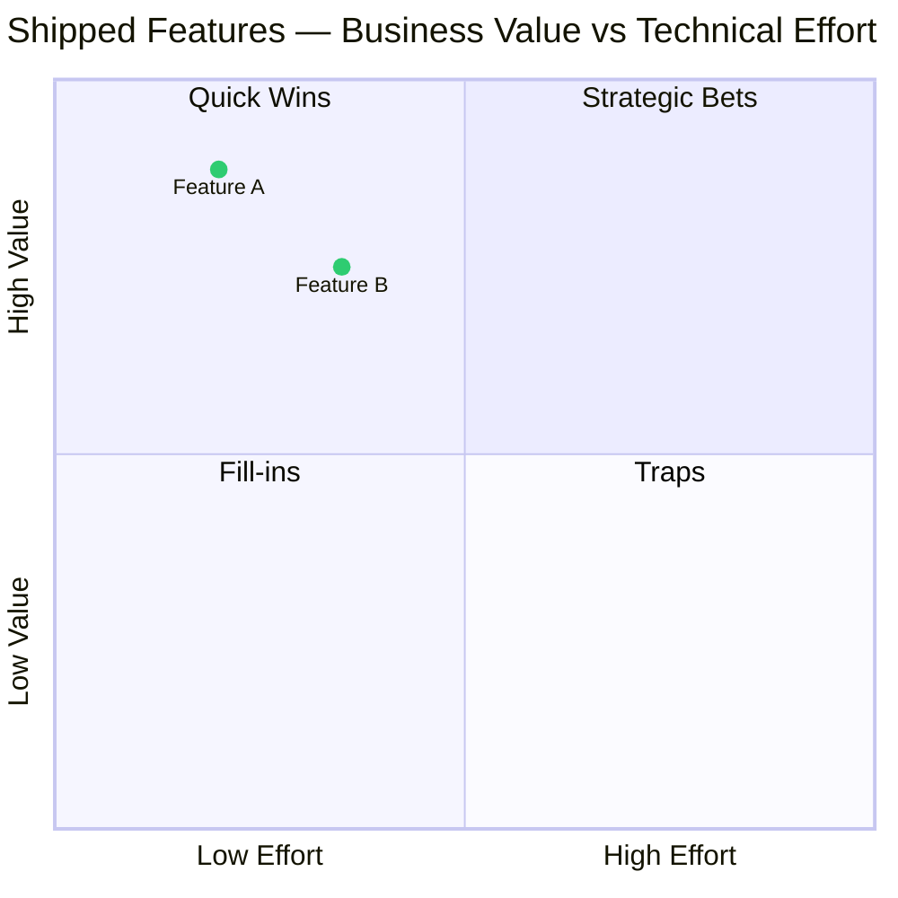
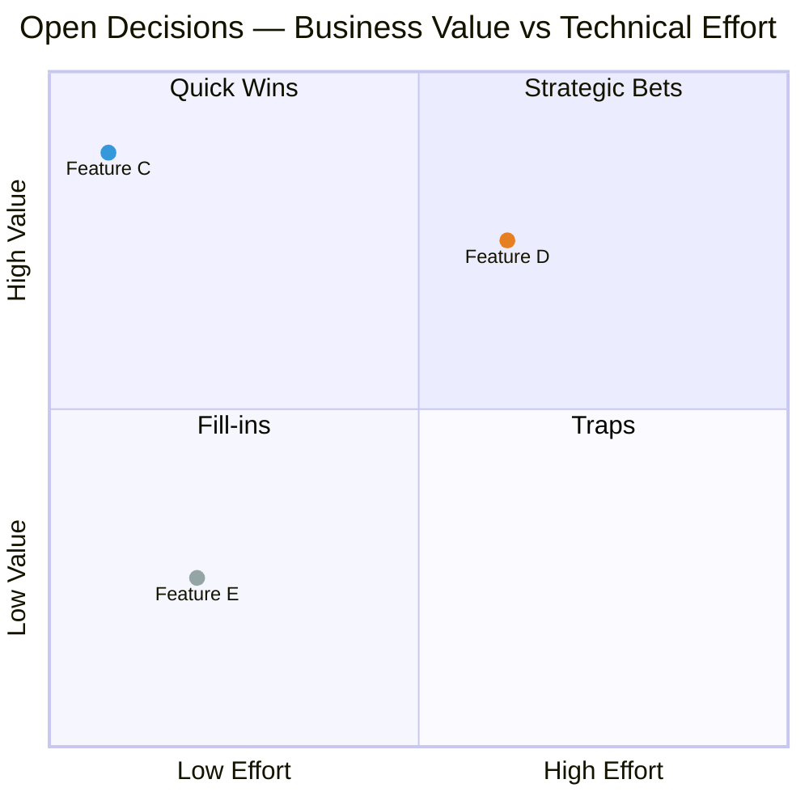

# Step 5: Features Brainstorming

## Goal
Brainstorm and identify potential features based on the personas and user journeys defined in previous steps. This is a divergent thinking exercise — quantity first, filtering second.

## Instructions
1. Review the personas (Step 3) and user journeys (Step 6) completed so far
2. Brainstorm feature ideas that address user needs, pain points, and goals
3. Organise features into the four categories below
4. For each feature: use a verb-first description, explain why it matters, and link explicitly to a persona name + need/pain ID
5. Fill the assessment columns inline — do not use a separate grid at the bottom
6. **No tech features** — describe what the user gets or does, not how the system implements it. Kafka events, crons, webhooks, and internal pipelines are implementation details; exclude them. If a technical mechanism is the only way to express a feature, reframe it as the user-facing outcome (e.g. "Annual Cap Enforcement" → "Fair Quota Delivery per Agency")

## Format

Each category uses a single table. The section heading carries the category color as a shields.io badge: `##  Category Name`. Colors: Core=`#2ecc71` · Supporting=`#3498db` · Differentiating=`#e67e22` · Nice-to-Have=`#95a5a6`

| Feature | Description | Why it matters | Related to | Biz Value | Tech Effort | UX Impact | Confidence | Priority |
| :--- | :--- | :--- | :--- | :---: | :---: | :---: | :---: | :---: |

- **Feature** — short name
- **Description** — starts with a VERB; what action does the user/system take?
- **Why it matters** — how does this address a real need or pain point?
- **Related to** — MUST link the persona name to its file and name the pain/need explicitly, e.g. `[Marta](3-personas/marta-particular-seller.md)'s Pain 2, Need 1`. Link the persona name only — not the individual pain/need ID
- **Biz Value / Tech Effort / UX Impact** — **High** / Medium / _Low_ (bold High, italic Low)
- **Confidence** — 🟢 well-understood / 🟡 some uncertainty (unknown scope or dependency) / 🔴 high risk (needs design spike before sequencing)
- **Priority** — **Must-have** / Should-have / _Nice-to-have_ (bold Must-have, plain Should-have, italic Nice-to-have)

---

##  Core Features
*Essential to the primary value proposition.*

| Feature | Description | Why it matters | Related to | Biz Value | Tech Effort | UX Impact | Confidence | Priority |
| :--- | :--- | :--- | :--- | :---: | :---: | :---: | :---: | :---: |
| **[Feature Name]** | [Verb-first description] | [Why it matters] | [Persona's Pain/Need X] | High/Medium/Low | High/Medium/Low | High/Medium/Low | 🟢/🟡/🔴 | Must-have |

---

##  Supporting Features
*Enhance the system but not critical to the core value.*

| Feature | Description | Why it matters | Related to | Biz Value | Tech Effort | UX Impact | Confidence | Priority |
| :--- | :--- | :--- | :--- | :---: | :---: | :---: | :---: | :---: |
| **[Feature Name]** | [Verb-first description] | [Why it matters] | [Persona's Pain/Need X] | High/Medium/Low | High/Medium/Low | High/Medium/Low | 🟢/🟡/🔴 | Should-have |

---

##  Differentiating Features
*Set the product apart from competitors.*

| Feature | Description | Why it matters | Related to | Biz Value | Tech Effort | UX Impact | Confidence | Priority |
| :--- | :--- | :--- | :--- | :---: | :---: | :---: | :---: | :---: |
| **[Feature Name]** | [Verb-first description] | [Why it matters] | [Persona's Pain/Need X] | High/Medium/Low | High/Medium/Low | High/Medium/Low | 🟢/🟡/🔴 | Must-have |

---

##  Nice-to-Have Features
*Could add value but lower priority.*

| Feature | Description | Why it matters | Related to | Biz Value | Tech Effort | UX Impact | Confidence | Priority |
| :--- | :--- | :--- | :--- | :---: | :---: | :---: | :---: | :---: |
| **[Feature Name]** | [Verb-first description] | [Why it matters] | [Persona's Pain/Need X] | Medium/Low | High/Medium/Low | High/Medium/Low | 🟢/🟡/🔴 | Nice-to-have |

---

## Feature Quadrant — Already Shipped (Core)

Plot Core features for retrospective alignment. Use the fixed grid below — place each feature at its true position, accept overlaps (a cluster means "equivalent priority, sequence freely").

**Effort grid (x-axis):** Very Low=0.08 · Low=0.20 · Medium-Low=0.35 · Medium-High=0.62 · High=0.75 · Very High=0.88  
**Value grid (y-axis):** same scale.  
Offset by ±0.04 only if two features share the exact same slot.

> **Color syntax:** define classes before points with `classDef myClass color: #hex`, then apply with `Point Name:::myClass: [x, y]`. Legend table: use a shields.io blank badge — `` — renders on GitHub and VS Code preview. Never use emoji or HTML style attributes (GitHub strips them).

| Color | Category |
| :---: | :--- |
|  | Core — shipped |

---

## Feature Quadrant — Open Decisions

Plot only Supporting, Differentiating, and Nice-to-Have features. Core (already shipped) are excluded. Same grid rules apply — overlaps are meaningful, do not artificially space them.

| Color | Category |
| :---: | :--- |
|  | Supporting |
|  | Differentiating |
|  | Nice-to-Have |

---

## Notes & Observations
*Capture patterns, gaps, and concerns that emerged during brainstorming.*

- [Observation 1]
- [Observation 2]

**Coach's question:** [One question that challenges the MVP scope — e.g. "If you could only ship three features from the Nice-to-have list to increase retention, which would they be?"]

---

**Next Step:** Map these features to user journeys and define sequencing in Step 7 — Features & Sequencing.
