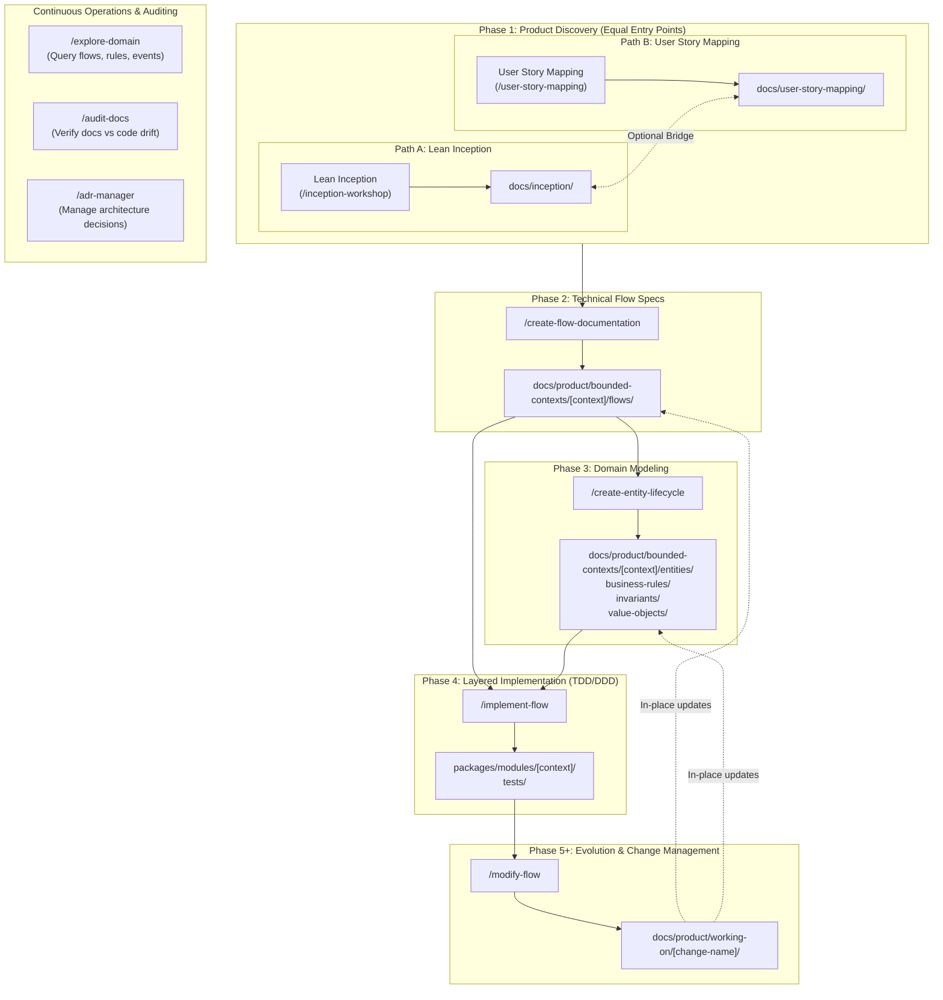

# SDLC Workflow Directory & Documentation Map

This document serves as the authoritative directory of all files, folders, skills, and artifacts that define and govern the **Software Development Life Cycle (SDLC)** in SessioFlow.

---

## 1. High-Level Lifecycle Flow

The workflow progresses from initial product discovery and story mapping through technical specification, domain modeling, layered implementation, and continuous evolution:



---

## 2. SDLC Process & Skill Definitions (`.agents/skills/`)

The automation skills that drive each step of the SDLC are defined as self-contained executable packages containing prompt workflows, rubrics, and templates in the canonical `.agents/skills/` directory (symlinked to `.pi/skills/` and `.claude/skills/` for seamless cross-agent compatibility):

| Skill | Directory | Primary Output | Trigger Condition |
| --- | --- | --- | --- |
| **`/inception-workshop`** | `.agents/skills/inception-workshop/` | `docs/inception/` | Starting a new product, initiative, or MVP from scratch (8-step Lean Inception). |
| **`/user-story-mapping`** | `.agents/skills/user-story-mapping/` | `docs/user-story-mapping/` | Slicing user journeys into horizontal backbone, INVEST story cards, and release waves. |
| **`/create-flow-documentation`** | `.agents/skills/create-flow-documentation/` | `docs/product/bounded-contexts/[context]/flows/` | User journeys (Inception) or story cards (USM) defined; technical specs needed. |
| **`/create-entity-lifecycle`** | `.agents/skills/create-entity-lifecycle/` | `docs/product/bounded-contexts/[context]/entities/` | Domain entities with distinct states, transitions, and rules emerge from flows. |
| **`/implement-flow`** | `.agents/skills/implement-flow/` | `packages/modules/[context]/`<br>`tests/` | Flow specification is complete and ready for TDD / DDD implementation. |
| **`/modify-flow`** | `.agents/skills/modify-flow/` | `docs/product/working-on/[change-name]/` | Existing, documented behavior needs modification or refactoring. |
| **`/explore-domain`** | `.agents/skills/explore-domain/` | *Read-only responses & diagrams* | Explaining behavior, querying business rules, cataloging domain events. |
| **`/audit-docs`** | `.agents/skills/audit-docs/` | *Drift analysis reports* | Health checks verifying alignment between living documentation and actual code. |
| **`/adr-manager`** | `.agents/skills/adr-manager/` | `docs/adr/` | Recording, amending, or superseding Architectural Decision Records. |
| **`/create-module`** | `.agents/skills/create-module/` | `packages/modules/[context]/` | Scaffolding a new DDD bounded context workspace package. |

---

## 3. Comprehensive Documentation Tree (`docs/`)

```text
docs/
├── SDLC-SKILLS-INDEX.md                   # Master index of SDLC phases, inputs, and outputs
├── SKILL-DECISION-GUIDELINES.md           # Heuristics for autonomous decisions & ambiguity resolution
├── SDLC-WORKFLOW-DIRECTORY.md             # This document (comprehensive filesystem directory)
│
├── inception/                             # ─── PHASE 1a: Lean Inception & Discovery ───
│   ├── 1-product-vision-and-boundaries.md # Vision statement, Is / Is Not / Does / Does Not
│   ├── 2-tradeoffs.md                     # Tradeoff matrix across speed, quality, scope, cost
│   ├── 3-personas/                        # User persona dossiers (roles, pain points, motivations)
│   ├── 4-empathy-map.md                   # User empathy map (Says, Thinks, Does, Feels)
│   ├── 5-user-journeys/                   # High-level end-to-end user journeys
│   ├── 6-brainstorming.md                 # Feature brainstorming and ideation
│   ├── 7-features-and-sequencing.md       # Feature prioritization waves (Wave 1 MVP, Wave 2, etc.)
│   └── 8-mvp-canvas-definition.md         # Final MVP canvas definition
│
├── user-story-mapping/                    # ─── PHASE 1b: User Story Mapping ───
│   ├── 1-frame-the-problem.md             # Strategic framing, problem space, and boundaries
│   ├── 2-map-the-big-picture.md           # Horizontal backbone activities and walking skeleton
│   ├── 3-explore-to-fill-the-body.md      # INVEST story cards, acceptance criteria, tech notes
│   ├── 4-slice-out-a-release-strategy.md  # Horizontal release slices (Wave 1 MVP vs Wave 2+)
│   ├── 5-slice-out-a-learning-strategy.md # Risk assumptions, validation spikes, and metrics
│   └── 6-slice-out-a-development-strategy.md # Opening Game, Mid Game, End Game delivery plan
│
├── product/                               # ─── PHASES 2, 3 & 5: Living Domain & Flow Specs ───
│   ├── README.md                          # Domain model overview and bounded context catalog
│   ├── guidelines/                        # Specification standards and conventions
│   │   ├── flow-documentation-structure.md# Standards for journey documentation & Mermaid diagrams
│   │   └── business-rules-vs-invariants.md# Distinction between validation, invariants, and BRs
│   ├── flows/                             # Cross-cutting user flow catalog
│   │   └── README.md
│   ├── bounded-contexts/
│   │   └── [context]/                     # e.g., conference, submission, review, scheduling
│   │       ├── README.md                  # Bounded context summary and boundary definition
│   │       ├── flows/                     # Phase 2: Flow specifications
│   │       │   ├── journey-XX-name.md     # Flow spec (Mermaid diagrams, Gherkin, BR references)
│   │       │   ├── journey-XX-plan.md     # Phase 4: Implementation task breakdown
│   │       │   └── features/              # Fine-grained feature specs
│   │       ├── entities/                  # Phase 3: Entity lifecycle specifications
│   │       │   └── [entity-name].md       # State machines, transitions, guards, actions
│   │       ├── business-rules/            # Phase 3: Business rules
│   │       │   └── BR-[XXX]-[name].md     # Standalone business rule definitions
│   │       ├── invariants/                # Phase 3: Domain invariants
│   │       │   └── INV-[XXX]-[name].md    # Non-negotiable domain integrity constraints
│   │       └── value-objects/             # Phase 3: Domain Value Object specifications
│   │           └── [vo-name].md           # Validation, immutability, and equality logic
│   └── working-on/                        # Phase 5+: In-flight change management
│       └── [change-name]/
│           ├── proposal.md                # Problem statement, current vs desired behavior, scope
│           └── implementation-plan.md     # Phased execution plan before updating living docs
│
├── templates/                             # ─── Standardized Documentation Templates ───
│   ├── inception/                         # Templates for steps 1 through 8 of Lean Inception
│   │   ├── 1-product-vision-and-boundaries.md
│   │   ├── 2-tradeoffs.md
│   │   ├── 3-personas.md
│   │   ├── 4-empathy-map.md
│   │   ├── 5-brainstorming.md
│   │   ├── 6-user-journey-mapping.md
│   │   ├── 7-features-and-sequencing.md
│   │   └── 8-mvp-canvas-definition.md
│   ├── product/                           # Templates for domain and flow artifacts
│   │   ├── flows.md                       # Journey and flow template
│   │   ├── entity-lifecycle.md            # Entity lifecycle template
│   │   ├── business-rules.md              # Business rule template
│   │   └── invariants.md                  # Invariant template
│   └── user-story-mapping/                # Templates for User Story Mapping (USM)
│
├── adr/                                   # ─── Architectural Decision Records (ADRs) ───
│   ├── README.md                          # ADR catalog and status index
│   ├── STRUCTURE.md                       # Format and lifecycle guidelines for ADRs
│   ├── 001-xxx.md ... 023-xxx.md          # Architecture decisions (DDD, Next.js, Drizzle, etc.)
│   └── _reports/                          # Comparative analyses and executive summaries
│
├── commands/                              # ─── Structured Prompt Commands & Validators ───
│   ├── prd/                               # PRD generation prompts and validators
│   └── product/                           # Business rule and invariant extraction prompts
│
├── ARCHITECTURE.md                        # High-level architecture & monorepo structure
├── ARCHITECTURE-RULES.md                  # Architectural invariants (enforced by ts-archunit)
├── API-DESIGN.md                          # REST API conventions and response structures
├── TESTING.md                             # Testing pyramid and test execution guidelines
└── LOGGING.md                             # Structured logging and tracing standards
```

---

## 4. Implementation Target Structure (`packages/` & `tests/`)

When a flow transitions to **Phase 4 (`/implement-flow`)**, specifications from `docs/product/bounded-contexts/[context]/` map directly into clean DDD layers:

```text
packages/modules/[context]/
├── package.json
├── tsconfig.json
├── src/
│   ├── domain/                            # Pure domain layer (zero external dependencies)
│   │   ├── entities/                      # Aggregate Roots & Child Entities
│   │   ├── value-objects/                 # Immutable Value Objects with validation
│   │   ├── events/                        # Domain Events (JSON serializable for Outbox)
│   │   ├── exceptions/                    # Domain-specific DomainErrors
│   │   └── repositories/                  # Domain Repository Interfaces
│   ├── application/                       # Application / Use Case layer (CQRS)
│   │   ├── commands/                      # Command DTOs and Handlers
│   │   └── queries/                       # Query DTOs and Handlers
│   ├── infrastructure/                    # Infrastructure / Adapter layer
│   │   └── repositories/                  # Drizzle ORM implementations of repository interfaces
│   ├── interfaces/                        # Presentation / Ingress layer
│   │   └── http/                          # HTTP Controller factories (mapping requests to commands)
│   └── container.ts                       # Module Composition Root (wiring repositories & use cases)

apps/frontend/src/app/api/v1/              # Next.js App Router API endpoints calling module container

tests/
├── unit/modules/[context]/                # Fast unit tests (Domain & Application logic)
├── backend/modules/[context]/             # Controller and HTTP serialization tests
├── integration/modules/[context]/         # Database repository tests (Drizzle + PostgreSQL)
├── e2e/                                   # Full user journey acceptance tests (Playwright)
└── unit/architecture/                     # ts-archunit architectural invariant verification
```

---

## 5. Decision & Governance Guidelines

When operating within this SDLC workflow, agents and engineers adhere to:

1. **[docs/SDLC-SKILLS-INDEX.md](file:///home/fernando/src/sessioflow/docs/SDLC-SKILLS-INDEX.md)**: Determines the exact sequence of phases and transition criteria between steps.
2. **[docs/SKILL-DECISION-GUIDELINES.md](file:///home/fernando/src/sessioflow/docs/SKILL-DECISION-GUIDELINES.md)**: Governs autonomous decisions:
   - **Autonomous Sensible Defaults**: Stick to existing workspace packages, maintain strict TypeScript Value Objects, throw domain-specific exceptions, and avoid unnecessary pauses.
   - **Lack of Information Log**: Record assumptions explicitly using standardized tables (`Decision Domain`, `Choice Made`, `Rationale`, `Impact`).
3. **[docs/ARCHITECTURE-RULES.md](file:///home/fernando/src/sessioflow/docs/ARCHITECTURE-RULES.md)**: Guardrails for domain isolation, Value Object invariants, and repository reconstitution patterns.
