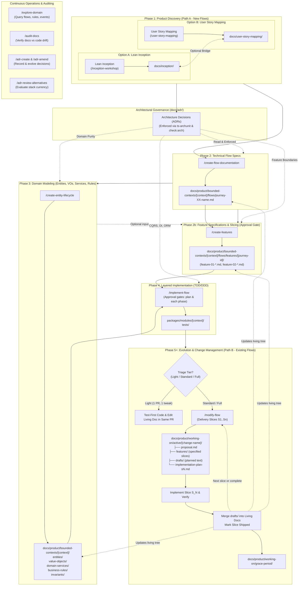

# SDLC Workflow Directory & Documentation Map

This document serves as the authoritative directory of all files, folders, skills, and artifacts that define and govern the **Software Development Life Cycle (SDLC)** in SessioFlow.

---

## 1. High-Level Lifecycle Flow

The workflow progresses from initial product discovery and story mapping through technical specification, domain modeling, layered implementation, and continuous evolution:


```mermaid
flowchart TD
    subgraph Discovery ["Phase 1: Product Discovery (Path A - New Flows)"]
        direction LR

        subgraph InceptionPath ["Option A: Lean Inception"]
            direction TB
            P1["Lean Inception\n(/inception-workshop)"] --> D1["docs/inception/"]
        end

        subgraph USMPath ["Option B: User Story Mapping"]
            direction TB
            P1b["User Story Mapping\n(/user-story-mapping)"] --> D1b["docs/user-story-mapping/"]
        end

        D1 <-.->|"Optional Bridge"| D1b
    end

    Discovery --> P2

    subgraph Specs ["Phase 2: Technical Flow Specs"]
        P2["/create-flow-documentation"] --> D2["docs/product/bounded-contexts/[context]/flows/journey-XX-name.md"]
    end

    subgraph DomainModel ["Phase 3: Domain Modeling (Entities, VOs, Services, Rules)"]
        P3["/create-entity-lifecycle"] --> D3["docs/product/bounded-contexts/[context]/\nentities/\nvalue-objects/\ndomain-services/\nbusiness-rules/\ninvariants/"]
    end

    subgraph Features ["Phase 2b: Feature Specifications & Slicing (Approval Gate)"]
        D2 --> P2b["/create-features"]
        P2b --> D2b["docs/product/bounded-contexts/[context]/flows/features/[journey-id]/\n(feature-01-*.md, feature-02-*.md)"]
    end

    Specs --> DomainModel
    DomainModel -. Optional input .-> Features
    Specs --> Features

    subgraph Implementation ["Phase 4: Layered Implementation (TDD/DDD)"]
        D2b & D3 --> P4["/implement-flow\n(Approval gates: plan & each phase)"]
        P4 --> D4["packages/modules/[context]/\ntests/"]
    end

    subgraph Evolution ["Phase 5+: Evolution & Change Management (Path B - Existing Flows)"]
        direction TB
        Triage{"Triage Tier?\n(Light / Standard / Full)"}
        Triage -->|"Light (1 PR, 1 tweak)"| LightExec["Test-First Code & Edit Living Doc in Same PR"]
        Triage -->|"Standard / Full"| P5["/modify-flow\n(Delivery Slices S1..Sn)"]
        P5 --> D5["docs/product/working-on/active/[change-name]/\n├── proposal.md\n├── features/ (specified slices)\n├── drafts/ (planned text)\n└── implementation-plan-sN.md"]
        D5 --> SliceExec["Implement Slice S_N & Verify"]
        SliceExec --> InPlace["Merge drafts/ into Living Docs\nMark Slice Shipped"]
        InPlace -. Next slice or complete .-> P5
        InPlace --> GP["docs/product/working-on/grace-period/"]
    end

    D4 --> Evolution
    InPlace -. Updates living tree .-> D2 & D2b & D3

    subgraph Operations ["Continuous Operations & Auditing"]
        O1["/explore-domain\n(Query flows, rules, events)"]
        O2["/audit-docs\n(Verify docs vs code drift)"]
        O3["/adr-create & /adr-amend\n(Record & evolve decisions)"]
        O4["/adr-review-alternatives\n(Evaluate stack currency)"]
    end

    subgraph Architecture ["Architectural Governance (docs/adr/)"]
        ADR["Architecture Decisions (ADRs)\n(Enforced via ts-archunit & check:arch)"]
    end

    Discovery --> ADR
    ADR -. Read & Enforced .-> Specs
    ADR -. Feature Boundaries .-> Features
    ADR -. Domain Purity .-> DomainModel
    ADR -. CQRS, DI, ORM .-> Implementation
```

---

## 2. SDLC Process & Skill Definitions (`.agents/skills/`)

The automation skills that drive each step of the SDLC are defined as self-contained executable packages containing prompt workflows, rubrics, and templates in the canonical `.agents/skills/` directory (symlinked to `.pi/skills/` and `.claude/skills/` for seamless cross-agent compatibility):

| Skill | Directory | Primary Output | Trigger Condition |
| --- | --- | --- | --- |
| **`/inception-workshop`** | `.agents/skills/sessioflow-sdlc/inception-workshop/` | `docs/inception/` | Starting a new product, initiative, or MVP from scratch (8-step Lean Inception). |
| **`/user-story-mapping`** | `.agents/skills/sessioflow-sdlc/user-story-mapping/` | `docs/user-story-mapping/` | Slicing user journeys into horizontal backbone, INVEST story cards, and release waves. |
| **`/create-flow-documentation`** | `.agents/skills/sessioflow-sdlc/create-flow-documentation/` | `docs/product/bounded-contexts/[context]/flows/` | User journeys (Inception) or story cards (USM) defined; technical specs needed. |
| **`/create-features`** | `.agents/skills/sessioflow-sdlc/create-features/` | `docs/product/bounded-contexts/[context]/flows/features/`<br>`docs/product/working-on/active/[change]/features/` | Flow document ready (Path A), or Full-tier proposal slice about to start (Path B); produces vertical feature specifications with HTTP error contracts. |
| **`/create-entity-lifecycle`** | `.agents/skills/sessioflow-sdlc/create-entity-lifecycle/` | `docs/product/bounded-contexts/[context]/entities/`<br>`domain-services/`<br>`value-objects/` | Domain entities or cross-aggregate domain services with distinct states, transitions, decision paths, and rules emerge from flows and features. |
| **`/implement-flow`** | `.agents/skills/sessioflow-sdlc/implement-flow/` | `packages/modules/[context]/`<br>`tests/`<br>`docs/product/working-on/active/[change]/` | Feature specifications and domain models ready for TDD / DDD implementation. |
| **`/modify-flow`** | `.agents/skills/sessioflow-sdlc/modify-flow/` | `docs/product/working-on/active/[change-name]/`<br>`docs/product/working-on/grace-period/[change-name]/` | Existing, documented behavior needs modification or refactoring (Triage: Light / Standard / Full). |
| **`/explore-domain`** | `.agents/skills/sessioflow-sdlc/explore-domain/` | *Read-only responses & diagrams* | Explaining behavior, querying business rules, cataloging domain events. |
| **`/audit-docs`** | `.agents/skills/sessioflow-sdlc/audit-docs/` | *Drift analysis reports* | Health checks verifying alignment between living documentation and actual code. |
| **`/adr-create`** | `.agents/skills/sessioflow-sdlc/adr-create/` | `docs/adr/0XX-*.md` | Recording a new Architectural Decision Record from discovery or technical need. |
| **`/adr-amend`** | `.agents/skills/sessioflow-sdlc/adr-amend/` | `docs/adr/0XX-01-*.md` | Refining or amending an existing ADR non-destructively with two-way links. |
| **`/adr-review-alternatives`** | `.agents/skills/sessioflow-sdlc/adr-review-alternatives/` | `docs/adr/_reports/` | Web research & evaluating tech stack currency against 2026 standards. |
| **`/adr-validate`** | `.agents/skills/sessioflow-sdlc/adr-validate/` | *Quality score rubric* | Auditing compliance, options, consequences, and AX ergonomics in an ADR. |
| **`/create-module`** | `.agents/skills/sessioflow-sdlc/create-module/` | `packages/modules/[context]/` | Scaffolding a new DDD bounded context workspace package. |
| **`/reverse-engineer-domain`** | `.agents/skills/sessioflow-sdlc/reverse-engineer-domain/` | `docs/product/discovered/`<br>`docs/product/bounded-contexts/` | Bottom-up software archeology extracting business rules and invariants from legacy code. |
| **`/prd-workshop`** | `.agents/skills/sessioflow-sdlc/prd-workshop/` | `docs/product/prd/` *(or draft)* | *[Optional / Under Evaluation]* Drafting and validating formal Product Requirements Documents. |

> **Shared Conventions**: Cross-cutting specifications (`guidelines/traceability.md`, `guidelines/business-rules-vs-invariants.md`, `guidelines/flow-documentation-structure.md`) are consolidated in `.agents/skills/sessioflow-sdlc/guidelines/` and referenced directly by SDLC skills via relative path (`../guidelines/`).

---

## 3. Comprehensive Documentation Tree (`docs/`)

```text
docs/
├── SDLC-SKILLS-INDEX.md                   # Master index of SDLC phases, inputs, and outputs
├── SKILL-DECISION-GUIDELINES.md           # Heuristics for autonomous decisions & ambiguity resolution
├── SDLC-WORKFLOW-DIRECTORY.md             # This document (comprehensive filesystem directory)
│
├── inception/                             # ─── PHASE 1a: Lean Inception & Discovery ───
│   ├── 1-product-vision-and-boundaries.md # Vision statement, Is / Is Not / Does / Does Not
│   ├── 2-tradeoffs.md                     # Tradeoff matrix across speed, quality, scope, cost
│   ├── 3-personas/                        # User persona dossiers (roles, pain points, motivations)
│   ├── 4-empathy-map.md                   # User empathy map (Says, Thinks, Does, Feels)
│   ├── 5-user-journeys/                   # High-level end-to-end user journeys
│   ├── 6-brainstorming.md                 # Feature brainstorming and ideation
│   ├── 7-features-and-sequencing.md       # Feature prioritization waves (Wave 1 MVP, Wave 2, etc.)
│   └── 8-mvp-canvas-definition.md         # Final MVP canvas definition
│
├── user-story-mapping/                    # ─── PHASE 1b: User Story Mapping ───
│   ├── 1-frame-the-problem.md             # Strategic framing, problem space, and boundaries
│   ├── 2-map-the-big-picture.md           # Horizontal backbone activities and walking skeleton
│   ├── 3-explore-to-fill-the-body.md      # INVEST story cards, acceptance criteria, tech notes
│   ├── 4-slice-out-a-release-strategy.md  # Horizontal release slices (Wave 1 MVP vs Wave 2+)
│   ├── 5-slice-out-a-learning-strategy.md # Risk assumptions, validation spikes, and metrics
│   └── 6-slice-out-a-development-strategy.md # Opening Game, Mid Game, End Game delivery plan
│
├── product/                               # ─── PHASES 2, 3 & 5: Living Domain & Flow Specs ───
│   ├── README.md                          # Domain model overview and bounded context catalog
│   ├── guidelines/                        # Specification standards and conventions
│   │   ├── flow-documentation-structure.md# Standards for journey documentation & Mermaid diagrams
│   ├── discovered/                        # Brownfield Staging Buffer (reverse-engineered rules)
│   │   ├── README.md                      # Staging buffer guide and graduation rules
│   │   ├── business-rules/                # Discovered rules pending context assignment (BR-RAW-XXX)
│   │   └── invariants/                    # Discovered invariants pending context assignment (INV-RAW-XXX)
│   ├── flows/                             # Cross-cutting user flow catalog
│   │   └── README.md
│   ├── bounded-contexts/
│   │   └── [context]/                     # e.g., conference, submission, review, scheduling
│   │       ├── README.md                  # Bounded context summary and boundary definition
│   │       ├── flows/                     # Phase 2 & 2b: Flow & Feature specifications
│   │       │   ├── journey-XX-name.md     # Phase 2: Flow spec (Mermaid diagrams, Gherkin, BR references)
│   │       │   ├── journey-XX-plan.md     # Phase 4: Implementation task breakdown
│   │       │   └── features/[journey-id]/ # Phase 2b: Feature specs grouped by journey (feature-01-*.md)
│   │       ├── entities/                  # Phase 3: Entity lifecycle specifications
│   │       │   └── [entity-name].md       # State machines, transitions, guards, actions
│   │       ├── domain-services/           # Phase 3: Domain service specifications
│   │       │   └── [service-name].md      # Product & Developer view, policies, decision flow
│   │       ├── business-rules/            # Phase 3: Business rules
│   │       │   └── BR-[XXX]-[name].md     # Standalone business rule definitions
│   │       ├── invariants/                # Phase 3: Domain invariants
│   │       │   └── INV-[XXX]-[name].md    # Non-negotiable domain integrity constraints
│   │       └── value-objects/             # Phase 3: Domain Value Object specifications
│   │           └── [vo-name].md           # Validation, immutability, and equality logic
│   └── working-on/                        # Phase 5+: Transient change proposals & grace period buffer
│       ├── README.md                      # Proposal lifecycle & strict agent isolation rules
│       ├── active/[change-name]/          # In-flight proposals being drafted or implemented
│       │   ├── proposal.md                # Roadmap: slices (Detail + Status), decisions, blockers, tickets
│       │   ├── features/                  # Phase 2b: Detailed feature specs (specified slices only)
│       │   ├── drafts/                    # Staged rewrites of living docs + README (draft → dest → slice)
│       │   └── implementation-plan-sN.md  # Slice-specific execution plans (written when slice N starts)
│       └── grace-period/[change-name]/    # Shipped proposals cooling off in production before purge
│
├── templates/                             # ─── Standardized Documentation Templates ───
│   ├── inception/                         # Templates for steps 1 through 8 of Lean Inception
│   │   ├── 1-product-vision-and-boundaries.md
│   │   ├── 2-tradeoffs.md
│   │   ├── 3-personas.md
│   │   ├── 4-empathy-map.md
│   │   ├── 5-brainstorming.md
│   │   ├── 6-user-journey-mapping.md
│   │   ├── 7-features-and-sequencing.md
│   │   └── 8-mvp-canvas-definition.md
│   ├── product/                           # Templates for domain and flow artifacts
│   │   ├── flows.md                       # Journey and flow template
│   │   ├── features.md                    # Feature specification template (vertical slices)
│   │   ├── entity-lifecycle.md            # Entity lifecycle template
│   │   ├── domain-services.md             # Domain service template (Part A Product / Part B Developer)
│   │   ├── business-rules.md              # Business rule template
│   │   └── invariants.md                  # Invariant template
│   └── user-story-mapping/                # Templates for User Story Mapping (USM)
│
├── adr/                                   # ─── Architectural Decision Records (ADRs) ───
│   ├── README.md                          # ADR catalog and status index
│   ├── STRUCTURE.md                       # Format and navigation guidelines for ADRs
│   ├── ADR-WORKFLOW.md                    # Pure ADR lifecycle and management workflow
│   ├── 001-xxx.md ... 023-xxx.md          # Architecture decisions (DDD, Next.js, Drizzle, etc.)
│   └── _reports/                          # Comparative analyses and executive summaries
│
├── ARCHITECTURE.md                        # High-level architecture & monorepo structure
├── ARCHITECTURE-RULES.md                  # Architectural invariants (enforced by ts-archunit)
├── API-DESIGN.md                          # REST API conventions and response structures
├── TESTING.md                             # Testing pyramid and test execution guidelines
└── LOGGING.md                             # Structured logging and tracing standards
```

---

## 4. Implementation Target Structure (`packages/` & `tests/`)

When a flow transitions to **Phase 4 (`/implement-flow`)**, specifications from `docs/product/bounded-contexts/[context]/` map directly into clean DDD layers:

```text
packages/modules/[context]/
├── package.json
├── tsconfig.json
├── src/
│   ├── domain/                            # Pure domain layer (zero external dependencies)
│   │   ├── entities/                      # Aggregate Roots & Child Entities
│   │   ├── value-objects/                 # Immutable Value Objects with validation
│   │   ├── events/                        # Domain Events (JSON serializable for Outbox)
│   │   ├── exceptions/                    # Domain-specific DomainErrors
│   │   └── repositories/                  # Domain Repository Interfaces
│   ├── application/                       # Application / Use Case layer (CQRS)
│   │   ├── commands/                      # Command DTOs and Handlers
│   │   └── queries/                       # Query DTOs and Handlers
│   ├── infrastructure/                    # Infrastructure / Adapter layer
│   │   └── repositories/                  # Drizzle ORM implementations of repository interfaces
│   ├── interfaces/                        # Presentation / Ingress layer
│   │   └── http/                          # HTTP Controller factories (mapping requests to commands)
│   └── container.ts                       # Module Composition Root (wiring repositories & use cases)

apps/frontend/src/app/api/v1/              # Next.js App Router API endpoints calling module container

tests/
├── unit/modules/[context]/                # Fast unit tests (Domain & Application logic)
├── backend/modules/[context]/             # Controller and HTTP serialization tests
├── integration/modules/[context]/         # Database repository tests (Drizzle + PostgreSQL)
├── e2e/                                   # Full user journey acceptance tests (Playwright)
└── unit/architecture/                     # ts-archunit architectural invariant verification
```

---

## 5. Decision & Governance Guidelines

When operating within this SDLC workflow, agents and engineers adhere to:

1. **[docs/SDLC-SKILLS-INDEX.md](file:///home/fernando/src/sessioflow/docs/SDLC-SKILLS-INDEX.md)**: Determines the exact sequence of phases and transition criteria between steps.
2. **[docs/SKILL-DECISION-GUIDELINES.md](file:///home/fernando/src/sessioflow/docs/SKILL-DECISION-GUIDELINES.md)**: Governs autonomous decisions:
   - **Autonomous Sensible Defaults**: Stick to existing workspace packages, maintain strict TypeScript Value Objects, throw domain-specific exceptions, and avoid unnecessary pauses.
   - **Lack of Information Log**: Record assumptions explicitly using standardized tables (`Decision Domain`, `Choice Made`, `Rationale`, `Impact`).
3. **[docs/ARCHITECTURE-RULES.md](file:///home/fernando/src/sessioflow/docs/ARCHITECTURE-RULES.md)**: Guardrails for domain isolation, Value Object invariants, and repository reconstitution patterns.
4. **[docs/adr/ADR-WORKFLOW.md](file:///home/fernando/src/sessioflow/docs/adr/ADR-WORKFLOW.md)**: Full lifecycle and operational standards for creating (`/adr-create`), amending (`/adr-amend`), researching alternatives (`/adr-review-alternatives`), and validating (`/adr-validate`) architectural decisions.
