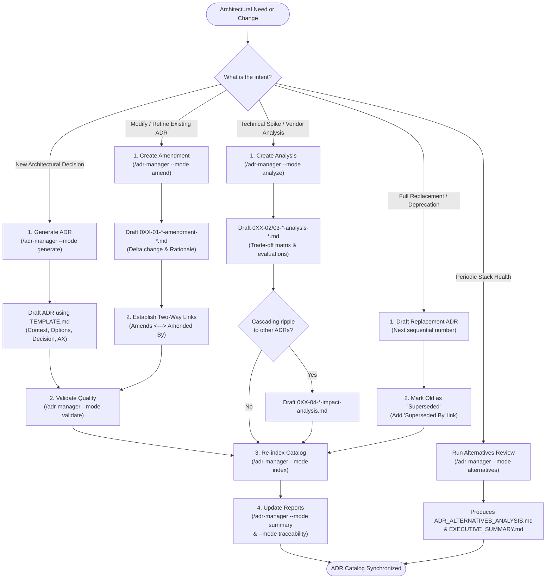
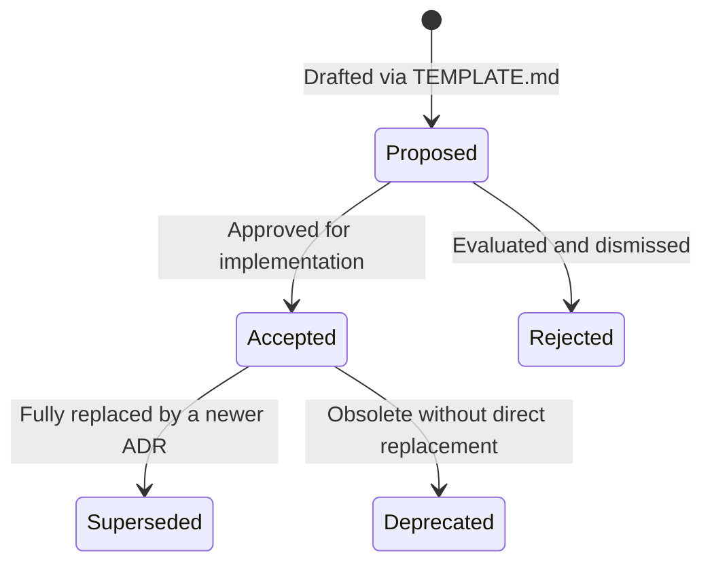

# ADR Workflow & Management Directory

This document provides a comprehensive, self-contained guide for **working exclusively within the Architecture Decision Record (ADR) subsystem** in SessioFlow. It details the directory structure, file naming and numbering mechanics, available skills and commands, and the step-by-step procedures for creating, amending, analyzing, and indexing architectural decisions.

---

## 1. High-Level ADR Lifecycle Flow

When working on architecture decisions, the entire workflow operates within the `docs/adr/` domain through the `/adr-manager` skill:



---

## 2. ADR Directory Structure & Filesystem Conventions (`docs/adr/`)

All architecture decisions and reports reside in `docs/adr/`, supported by central templates and scripts in `.agents/skills/sessioflow-sdlc/adr-manager/`:

```text
docs/adr/
├── README.md                                       # Master ADR catalog (statuses, AX tags, statistics)
├── STRUCTURE.md                                    # Quick file inventory and CLI navigation guide
├── ADR-WORKFLOW.md                                 # This operational guide (pure ADR workflows)
│
├── 001-use-nextjs-as-frontend-framework.md         # Base ADRs: {number}-{topic}.md
├── 002-00-use-supabase-for-backend-and-database.md # Base ADR with explicit sequence (00)
├── 002-01-use-supabase-amendment-ddd-abstraction.md# Amendment: {number}-01-*-amendment-*.md
├── 002-02-use-supabase-analysis-vendor-lock-in.md  # Deep technical analysis: {number}-02-*-analysis-*.md
├── 002-03-use-supabase-analysis-auth-strategy.md   # Secondary analysis: {number}-03-*-analysis-*.md
├── 002-04-use-supabase-impact-analysis.md          # Multi-ADR ripple: {number}-04-*-impact-analysis.md
│
├── 003-use-docker-compose-for-deployment.md
├── 004-00-implement-magic-link-authentication.md
├── 004-01-implement-magic-link-authentication-amendment-ddd-abstraction.md
├── 007-use-zod-for-validation.md
├── 007-01-use-zod-validation-amendment-domain-purity.md
├── 009-adopt-domain-driven-design-structure.md
├── 009-01-monorepo-backend-frontend-separation.md
├── 015-adopt-cqrs-pattern.md
├── 016-dependency-injection-strategy-for-nextjs.md
├── 016-01-controller-factory-di-amendment.md
├── 017-use-drizzle-orm-with-ddd-transactions.md
├── 019-use-ts-archunit-for-architecture-testing.md
├── 020-use-api-schema-package-pattern-for-contract-definition.md
├── 021-adopt-domain-module-structure-convention.md
├── 022-accept-frontend-backend-type-decoupling-strategy.md
├── 023-comprehensive-monorepo-structure-update.md
│
└── _reports/                                       # Aggregated cross-cutting reports & health checks
    ├── README.md                                   # Reports guide and compilation procedures
    ├── ADR_GENERATION_SUMMARY.md                   # Coverage and alignment summary across all ADRs
    ├── TRACEABILITY_MATRIX.md                      # Mapping ADRs back to business and inception drivers
    ├── ADR_ALTERNATIVES_ANALYSIS.md                # Periodic evaluation against current industry standards
    ├── EXECUTIVE_SUMMARY.md                        # High-level architecture review for stakeholders
    └── free-tier-comparison.md                     # Specific vendor cost & constraint analysis
```

### Numbering & Sequence Convention

Files follow a strict pattern: `{number}-{sequence}-{topic}[-{type}].md`

| Sequence | Category | Filename Pattern | Purpose |
| :--- | :--- | :--- | :--- |
| **`00`** | **Base Decision** | `0XX-00-{topic}.md` or `0XX-{topic}.md` | The original decision record, historical context, and drivers. |
| **`01`** | **Amendment** | `0XX-01-{topic}-amendment-{type}.md` | A delta change or scoping rule that refines an existing decision. |
| **`02`** | **First Analysis** | `0XX-02-{topic}-analysis-{subtype}.md` | Deep dive into alternatives, performance, or vendor lock-in. |
| **`03`** | **Second Analysis** | `0XX-03-{topic}-analysis-{subtype}.md` | Additional specialized spike (e.g. auth strategy, caching). |
| **`04`** | **Impact Analysis** | `0XX-04-{topic}-impact-analysis.md` | Documents cross-cutting ripple effects on other existing ADRs. |
| **`05+`** | **Further Analyses** | `0XX-{seq}-{topic}-analysis-{subtype}.md` | Continued specialized spikes or vendor benchmarks. |

### Decision Lifecycle Statuses



- **`Proposed`**: Under review, initial draft awaiting alignment.
- **`Accepted` / `Approved`**: Active decision governing the codebase.
- **`Superseded`**: Replaced by a newer ADR (must link to successor).
- **`Deprecated`**: Technology or pattern retired without direct replacement.
- **`Rejected`**: Evaluated but intentionally not adopted.
- **`Completed`**: Used specifically for reports and impact analyses once finalized.

---

## 3. Skills & Commands (`/adr-manager`)

All operations are automated through the **`adr-manager` skill** (`.agents/skills/sessioflow-sdlc/adr-manager/`). You can trigger it using the CLI or natural language phrases.

### Available Modes & Operations

```bash
pi skill adr-manager --mode [generate|validate|amend|analyze|index|summary|traceability|alternatives] [--file docs/adr/0XX-*.md] [--adr-id 0XX]
```

| Mode | Natural Language Examples | Primary Input | Produced Output |
| :--- | :--- | :--- | :--- |
| **`--mode generate`** | *"Create a new ADR for...", "Draft an architecture decision for Redis"* | Technical requirement / drivers | `docs/adr/0XX-*.md` (from `TEMPLATE.md`) |
| **`--mode validate`** | *"Validate ADR-017", "Check the quality of ADR-023"* | `--file docs/adr/0XX-*.md` | Score (High/Med/Low) & feedback checklist |
| **`--mode amend`** | *"Amend ADR-002 with DDD", "Create an amendment for ADR-016"* | Target ADR to modify | `docs/adr/0XX-01-*-amendment-*.md` |
| **`--mode analyze`** | *"Analyze vendor lock-in for Supabase", "Run technical spike on auth"* | Target ADR & topic | `docs/adr/0XX-02/03-*-analysis-*.md` |
| **`--mode index`** | *"Update ADR index", "Refresh docs/adr/README.md"* | Active files in `docs/adr/` | Updated `docs/adr/README.md` table & counts |
| **`--mode summary`** | *"Compile ADR summary report", "Summarize all ADRs"* | All validated ADRs | `docs/adr/_reports/ADR_GENERATION_SUMMARY.md` |
| **`--mode traceability`**| *"Map ADRs to inception goals", "Rebuild traceability matrix"* | ADRs + Inception drivers | `docs/adr/_reports/TRACEABILITY_MATRIX.md` |
| **`--mode alternatives`**| *"Research tech stack alternatives", "Run periodic stack check"* | Current ADR catalog | `docs/adr/_reports/ADR_ALTERNATIVES_ANALYSIS.md` & `EXECUTIVE_SUMMARY.md` |

### Bundled Assets Location

The skill contains all required templates and reference guides in its directory:
- **Templates**: `.agents/skills/sessioflow-sdlc/adr-manager/templates/`
  - `TEMPLATE.md` (Standard ADR)
  - `TEMPLATE-AMENDMENT.md` (Amendment with delta diff & AX section)
  - `TEMPLATE-ANALYSIS.md` (Technical spike & alternatives evaluation)
  - `TEMPLATE-ADR_VALIDATOR.md` (Validation audit rubric)
  - `TEMPLATE-ADR_GENERATION_SUMMARY.md` (Summary compilation format)
  - `TEMPLATE-TRACEABILITY_MATRIX.md` (Traceability mapping format)
  - `TEMPLATE-ADR_ALTERNATIVES_ANALYSIS.md` & `TEMPLATE-EXECUTIVE_SUMMARY.md` (Ecosystem review)
- **References**: `.agents/skills/sessioflow-sdlc/adr-manager/references/`
  - `0-ADR-WORKFLOW.md`, `1-generate-adrs-from-inception.md`, `2-ADR-validator.md`, `3-generate-adr-summary.md`, `4-generate-traceability-matrix.md`, `5-analyze-adr-alternatives.md`, `6-update-adr-readme.md`, `7-generate-adr-amendment.md`, `8-adr-naming-convention.md`.

---

## 4. Step-by-Step ADR Workflows

### Flow A: Defining a New Architectural Decision (From Scratch)

When a new architectural pattern, technology choice, or foundational constraint is introduced:

1. **Find Next Available Number**: Inspect `docs/adr/README.md` (e.g., if highest is `023`, next is `024`).
2. **Execute Generation Mode**:
   ```bash
   pi skill adr-manager --mode generate
   ```
   Or create `docs/adr/0XX-your-decision-name.md` copying `.agents/skills/sessioflow-sdlc/adr-manager/templates/TEMPLATE.md`.
3. **Complete the Required Sections**:
   - **Status**: `Proposed` or `Accepted`.
   - **Context**: Problem statement, business/technical drivers, forces at play.
   - **Considered Options**: Document at least 2–3 viable alternatives with pros and cons.
   - **Decision Outcome**: Selected solution and justified rationale.
   - **Consequences**: Positive effects, negative trade-offs, and mitigated risks.
   - **🤖 AI & Agentic Ergonomics (AX)**: Mandatory fields:
     - `LLM Corpus Alignment`: `High (>80%)`, `Medium (30-80%)`, or `Atypical (<30%)`.
     - `Guardrail Tax`: `Low`, `Medium`, or `High`.
     - `Drift Risks`: Where AI agents are prone to hallucinate or revert to generic patterns.
4. **Validate ADR Quality**:
   ```bash
   pi skill adr-manager --mode validate --file docs/adr/0XX-your-decision-name.md
   ```
   Ensure it satisfies the Checklist (scores ≥ Medium).
5. **Update Index & Catalog**:
   ```bash
   pi skill adr-manager --mode index
   ```
   Adds the new record to the quick reference table and updates statistics in `docs/adr/README.md`.

---

### Flow B: Modifying an Existing Decision (The Amendment Workflow)

> ⚠️ **Golden Rule**: **Never silently edit an accepted ADR's historical text.** Accepted ADRs represent the state of knowledge at the time of decision. Any modification or refinement must be captured as an **Amendment**.

1. **Trigger Amendment Mode**:
   ```bash
   pi skill adr-manager --mode amend --file docs/adr/0XX-original-decision.md
   ```
2. **Create Amendment File**:
   Named `docs/adr/0XX-01-{topic}-amendment-{type}.md` using `TEMPLATE-AMENDMENT.md`.
3. **Draft the Delta**:
   - **Scope**: What specific parts of the original ADR are amended vs. preserved.
   - **Amended Decision**: The refined architectural requirement (e.g. adding domain abstraction).
   - **Rationale**: What new findings or constraints triggered this amendment.
   - **AX Section**: Updated LLM alignment and guardrail tax.
4. **Establish Mandatory Two-Way Links**:
   - In the new Amendment file header:
     ```markdown
     **Amends:** [ADR-0XX: Original Title](0XX-original-decision.md)
     ```
   - In the original Base ADR file header:
     ```markdown
     **Amended By:** [ADR-0XX-01: Amendment Title](0XX-01-topic-amendment-type.md)
     ```
5. **Re-index**: Run `pi skill adr-manager --mode index` to register the amendment in `docs/adr/README.md`.

---

### Flow C: Proposing an Architectural Change / Spike (Analysis & Impact)

When evaluating complex trade-offs before committing to a decision or when analyzing cascading effects:

1. **Trigger Analysis Mode**:
   ```bash
   pi skill adr-manager --mode analyze --file docs/adr/0XX-original-decision.md
   ```
2. **Create Analysis File**:
   - Follow sequence: `0XX-02-*-analysis-*.md` (or `0XX-03-...`).
   - Use `TEMPLATE-ANALYSIS.md` to document benchmarks, vendor comparisons, or migration spikes.
3. **Assess Multi-ADR Cascading Effects (Impact Analysis)**:
   - If the change alters assumptions in other ADRs (e.g., changing from direct ORM to DDD abstraction impacts Auth, Storage, and Database):
   - Create `docs/adr/0XX-04-{topic}-impact-analysis.md`.
   - Map affected ADRs and track their status until all necessary amendments are completed.
4. **Re-index**: Run `pi skill adr-manager --mode index` to record the analysis and impact documents.

---

### Flow D: Superseding an ADR

When a decision is completely replaced by a fundamentally different architecture:

1. **Create the New ADR**: Follow Flow A to draft the replacement ADR with the next sequential number (e.g. `024`).
2. **Mark Original ADR as Superseded**:
   - Change `Status` of original ADR to: `⚠️ Superseded`.
   - Add link in original ADR header:
     ```markdown
     **Superseded By:** [ADR-0YY: New Decision Title](0YY-new-decision.md)
     ```
   - Add link in new ADR header:
     ```markdown
     **Supersedes:** [ADR-0XX: Old Decision Title](0XX-old-decision.md)
     ```
3. **Re-index**: Run `pi skill adr-manager --mode index` to update statuses across the catalog.

---

## 5. Quality Checklist & Governance Invariants

Before considering any ADR task complete, verify these non-negotiable invariants:

- [ ] **Sequential Numbering**: Used the exact next 3-digit number without sequence holes.
- [ ] **Considered Options**: Documented at least 2 viable alternative architectures with clear pros/cons.
- [ ] **AI & Agentic Ergonomics**: Filled `LLM Corpus Alignment`, `Guardrail Tax`, and drift risks.
- [ ] **Immutability Respected**: Never modified an accepted decision directly; created an amendment or successor.
- [ ] **Two-Way Links Verified**: Both files in an Amendment or Superseded relationship point to each other.
- [ ] **Catalog Synchronized**: `docs/adr/README.md` index and count statistics updated via `--mode index`.
- [ ] **Self-Contained Files**: All internal links use relative markdown paths within the `docs/adr/` directory.
