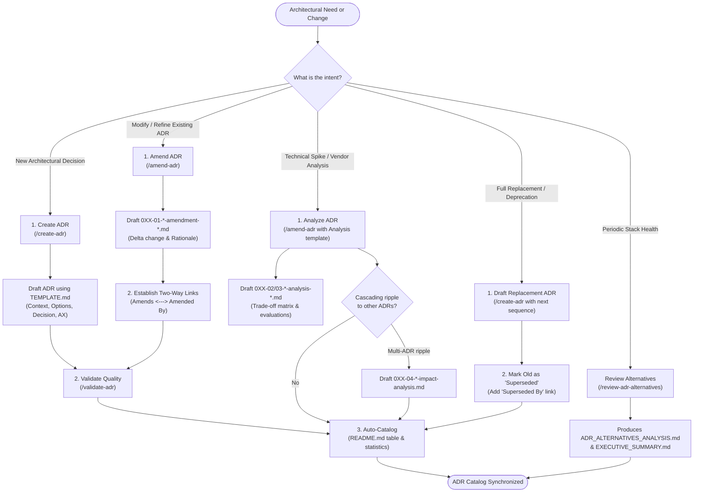
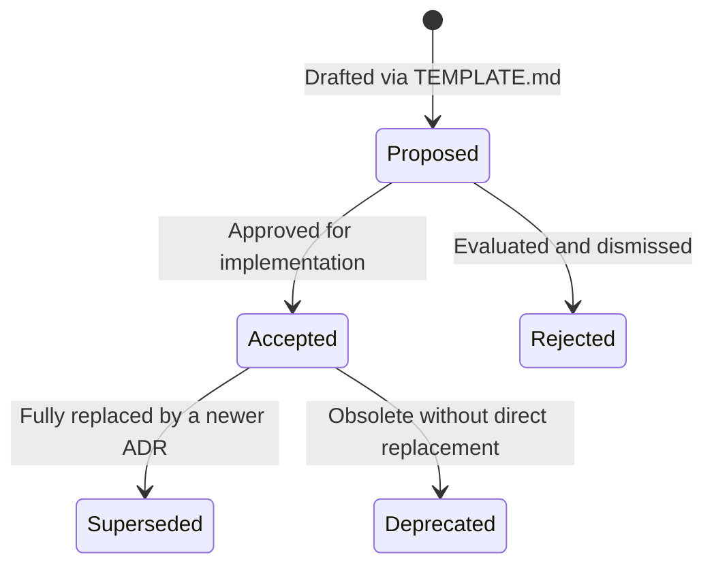

# ADR Workflow & Management Directory

This document provides a comprehensive, self-contained guide for **working exclusively within the Architecture Decision Record (ADR) subsystem** in SessioFlow. It details the directory structure, file naming and numbering mechanics, dedicated skills, and the step-by-step procedures for creating, amending, analyzing, validating, and cataloging architectural decisions.

---

## 1. High-Level ADR Lifecycle Flow

When working on architecture decisions, the entire workflow operates within `docs/adr/` through four clean, intention-driven skills:



---

## 2. ADR Directory Structure & Filesystem Conventions (`docs/adr/`)

All architecture decisions and reports reside in `docs/adr/`:

```text
docs/adr/
├── README.md                                       # Master ADR catalog (statuses, AX tags, statistics)
├── STRUCTURE.md                                    # Quick file inventory and navigation guide
├── ADR-WORKFLOW.md                                 # This operational guide (pure ADR workflows)
│
├── 001-use-nextjs-as-frontend-framework.md         # Base ADRs: {number}-{topic}.md
├── 002-00-use-supabase-for-backend-and-database.md # Base ADR with explicit sequence (00)
├── 002-01-use-supabase-amendment-ddd-abstraction.md# Amendment: {number}-01-*-amendment-*.md
├── 002-02-use-supabase-analysis-vendor-lock-in.md  # Deep technical analysis: {number}-02-*-analysis-*.md
├── 002-03-use-supabase-analysis-auth-strategy.md   # Secondary analysis: {number}-03-*-analysis-*.md
├── 002-04-use-supabase-impact-analysis.md          # Multi-ADR ripple: {number}-04-*-impact-analysis.md
│
├── 003-use-docker-compose-for-deployment.md
├── 004-00-implement-magic-link-authentication.md
├── 004-01-implement-magic-link-authentication-amendment-ddd-abstraction.md
├── 007-use-zod-for-validation.md
├── 007-01-use-zod-validation-amendment-domain-purity.md
├── 009-adopt-domain-driven-design-structure.md
├── 009-01-monorepo-backend-frontend-separation.md
├── 015-adopt-cqrs-pattern.md
├── 016-dependency-injection-strategy-for-nextjs.md
├── 016-01-controller-factory-di-amendment.md
├── 017-use-drizzle-orm-with-ddd-transactions.md
├── 019-use-ts-archunit-for-architecture-testing.md
├── 020-use-api-schema-package-pattern-for-contract-definition.md
├── 021-adopt-domain-module-structure-convention.md
├── 022-accept-frontend-backend-type-decoupling-strategy.md
├── 023-comprehensive-monorepo-structure-update.md
│
└── _reports/                                       # Aggregated cross-cutting reports & health checks
    ├── README.md                                   # Reports guide and compilation procedures
    ├── ADR_GENERATION_SUMMARY.md                   # Coverage and alignment summary across all ADRs
    ├── TRACEABILITY_MATRIX.md                      # Mapping ADRs back to business and inception drivers
    ├── ADR_ALTERNATIVES_ANALYSIS.md                # Periodic evaluation against current industry standards
    ├── EXECUTIVE_SUMMARY.md                        # High-level architecture review for stakeholders
    └── free-tier-comparison.md                     # Specific vendor cost & constraint analysis
```

### Numbering & Sequence Convention

Files follow a strict pattern: `{number}-{sequence}-{topic}[-{type}].md`

| Sequence | Category | Filename Pattern | Purpose |
| :--- | :--- | :--- | :--- |
| **`00`** | **Base Decision** | `0XX-00-{topic}.md` or `0XX-{topic}.md` | The original decision record, historical context, and drivers. |
| **`01`** | **Amendment** | `0XX-01-{topic}-amendment-{type}.md` | A delta change or scoping rule that refines an existing decision. |
| **`02`** | **First Analysis** | `0XX-02-{topic}-analysis-{subtype}.md` | Deep dive into alternatives, performance, or vendor lock-in. |
| **`03`** | **Second Analysis** | `0XX-03-{topic}-analysis-{subtype}.md` | Additional specialized spike (e.g. auth strategy, caching). |
| **`04`** | **Impact Analysis** | `0XX-04-{topic}-impact-analysis.md` | Documents cross-cutting ripple effects on other existing ADRs. |
| **`05+`** | **Further Analyses** | `0XX-{seq}-{topic}-analysis-{subtype}.md` | Continued specialized spikes or vendor benchmarks. |

### Decision Lifecycle Statuses



- **`Proposed`**: Under review, initial draft awaiting alignment.
- **`Accepted` / `Approved`**: Active decision governing the codebase.
- **`Superseded`**: Replaced by a newer ADR (must link to successor).
- **`Deprecated`**: Technology or pattern retired without direct replacement.
- **`Rejected`**: Evaluated but intentionally not adopted.
- **`Completed`**: Used specifically for reports and impact analyses once finalized.

---

## 3. Dedicated ADR Skills Directory (`.agents/skills/sessioflow-sdlc/`)

Operations are segmented into dedicated skills per intention, with zero mode parameters or flags:

| Skill | Directory | Natural Language Triggers | Primary Deliverable |
| :--- | :--- | :--- | :--- |
| **`/create-adr`** | `.agents/skills/sessioflow-sdlc/create-adr/` | *"Create a new ADR for...", "Draft an architecture decision for Redis"* | `docs/adr/0XX-*.md` (from `TEMPLATE.md`) + updated catalog |
| **`/amend-adr`** | `.agents/skills/sessioflow-sdlc/amend-adr/` | *"Amend ADR-002 with DDD", "Create an amendment for ADR-016"* | `docs/adr/0XX-01-*-amendment-*.md` + two-way links |
| **`/review-adr-alternatives`** | `.agents/skills/sessioflow-sdlc/review-adr-alternatives/` | *"Review alternatives for our stack", "Research tech stack alternatives"* | `docs/adr/_reports/ADR_ALTERNATIVES_ANALYSIS.md` & `EXECUTIVE_SUMMARY.md` |
| **`/validate-adr`** | `.agents/skills/sessioflow-sdlc/validate-adr/` | *"Validate ADR-017", "Check the quality of ADR-023"* | Compliance score (High/Med/Low) & remediation points |

### Shared Conventions & Templates
- Standard ADR template: `create-adr/templates/TEMPLATE.md`
- Amendment template: `amend-adr/templates/TEMPLATE-AMENDMENT.md`
- Technical analysis template: `amend-adr/templates/TEMPLATE-ANALYSIS.md`
- Tech review templates: `review-adr-alternatives/templates/`
- Validation rubric: `validate-adr/templates/TEMPLATE-ADR_VALIDATOR.md`
- Shared naming conventions: `.agents/skills/sessioflow-sdlc/guidelines/adr-naming-conventions.md`

---

## 4. Step-by-Step ADR Workflows

### Flow A: Defining a New Architectural Decision (From Scratch)

When a new architectural pattern, technology choice, or foundational constraint is introduced:

1. **Trigger the Skill**:
   ```bash
   /create-adr
   ```
   Or ask in natural language: *"Create a new ADR for adding Redis caching"*.
2. **Interactive Drafting**:
   - The skill auto-detects the next sequential 3-digit number from `docs/adr/README.md` (`024`).
   - Gathers context, decision drivers, considered options (min 2–3 with pros/cons), outcome, and consequences.
   - Completes the mandatory **🤖 AI & Agentic Ergonomics (AX)** section (`LLM Corpus Alignment`, `Guardrail Tax`, and drift risks).
3. **Quality Validation**:
   - Automatically verified via `/validate-adr` to ensure quality score ≥ Medium.
4. **Catalog Synchronization**:
   - The skill writes the file to `docs/adr/0XX-your-decision.md` and appends the entry in `docs/adr/README.md`.

---

### Flow B: Modifying an Existing Decision (The Amendment Workflow)

> ⚠️ **Golden Rule**: **Never silently edit an accepted ADR's historical text.** Accepted ADRs represent the state of knowledge at the time of decision. Any modification or refinement must be captured as an **Amendment**.

1. **Trigger the Skill**:
   ```bash
   /amend-adr
   ```
   Or ask in natural language: *"Amend ADR-016 to introduce controller factories"*.
2. **Draft the Delta**:
   - Generates `docs/adr/0XX-01-{topic}-amendment-{type}.md` using `TEMPLATE-AMENDMENT.md`.
   - Documents what parts of the original ADR are amended vs. preserved.
   - Updates AX ergonomics section.
3. **Establish Mandatory Two-Way Links**:
   - In Amendment header:
     ```markdown
     **Amends:** [ADR-0XX: Original Title](0XX-original-decision.md)
     ```
   - In Base ADR header:
     ```markdown
     **Amended By:** [ADR-0XX-01: Amendment Title](0XX-01-topic-amendment-type.md)
     ```
4. **Catalog Update**: Automatically registers the amendment under the base ADR in `docs/adr/README.md`.

---

### Flow C: Proposing an Architectural Change / Spike (Analysis & Impact)

When evaluating complex trade-offs or analyzing cascading effects across decisions:

1. **Create Technical Spike**:
   - Use `/amend-adr` specifying an analysis document.
   - Creates `docs/adr/0XX-02-{topic}-analysis-{subtype}.md` (or `03`) to document benchmarks, alternatives evaluation, or vendor lock-in.
2. **Assess Multi-ADR Ripple (Impact Analysis)**:
   - If the change alters assumptions in multiple ADRs (e.g. changing database ORM impacts auth, transactions, and repositories):
   - Creates `docs/adr/0XX-04-{topic}-impact-analysis.md`.
   - Tracks all affected ADRs until all necessary amendments are closed.

---

### Flow D: Superseding an ADR

When a decision is completely replaced by a fundamentally different architecture:

1. **Create Replacement ADR**: Use `/create-adr` to draft the successor with the next sequential number.
2. **Mark Original ADR as Superseded**:
   - Change `Status` of original ADR to: `⚠️ Superseded`.
   - Add link in original ADR header:
     ```markdown
     **Superseded By:** [ADR-0YY: New Decision Title](0YY-new-decision.md)
     ```
   - Add link in new ADR header:
     ```markdown
     **Supersedes:** [ADR-0XX: Old Decision Title](0XX-old-decision.md)
     ```
3. **Catalog Update**: `docs/adr/README.md` is updated reflecting the status change.

---

### Flow E: Periodic Review & Stack Health

To verify whether active decisions remain competitive and up-to-date:

1. **Trigger Tech Review**:
   ```bash
   /review-adr-alternatives
   ```
   Or: *"Review current alternatives for our database and auth stack"*.
2. **Active Web Search**:
   - The skill executes active web searches (`search_web`) with 2026 query templates to discover emerging tools, modern benchmarks, and surveys.
   - Classifies technologies in the Tech Radar (*Adopt / Trial / Assess / Hold*).
3. **Deliverables**:
   - Updates `docs/adr/_reports/ADR_ALTERNATIVES_ANALYSIS.md` and `docs/adr/_reports/EXECUTIVE_SUMMARY.md`.
   - Suggests running `/amend-adr` or `/create-adr` if action is warranted.

---

## 5. Quality Checklist & Governance Invariants

Before considering any ADR task complete, verify these non-negotiable invariants:

- [ ] **Sequential Numbering**: Used the exact next 3-digit number without sequence holes.
- [ ] **Considered Options**: Documented at least 2 viable alternative architectures with clear pros/cons.
- [ ] **AI & Agentic Ergonomics**: Filled `LLM Corpus Alignment`, `Guardrail Tax`, and drift risks.
- [ ] **Immutability Respected**: Never modified an accepted decision directly; created an amendment or successor.
- [ ] **Two-Way Links Verified**: Both files in an Amendment or Superseded relationship point to each other.
- [ ] **Catalog Synchronized**: `docs/adr/README.md` index and count statistics updated.
- [ ] **Self-Contained Files**: All internal links use relative markdown paths within `docs/adr/`.
