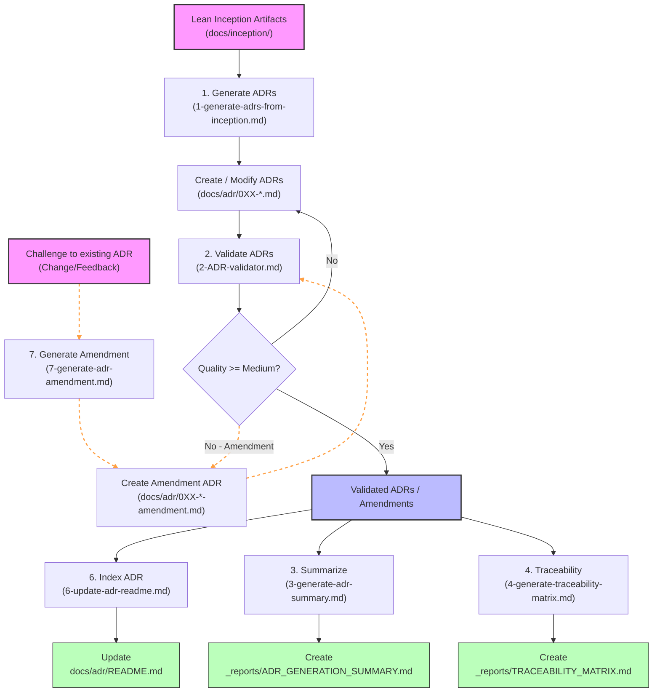
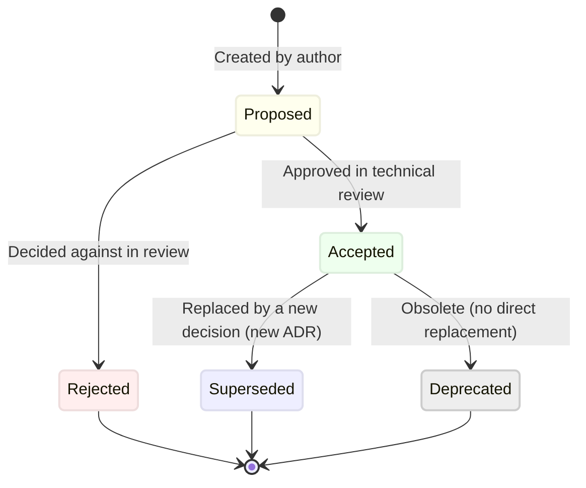
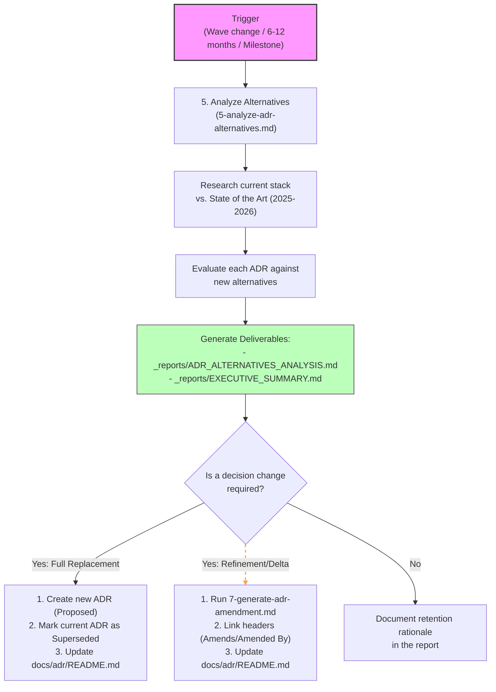

# Architecture Decision Records (ADR) Guide

This guide provides a comprehensive reference and visual workflows for working with Architecture Decision Records (ADRs) in SessioFlow.

---

## 1. Workflows & Lifecycles

### ADR Generation Workflow (Initial Setup)

When starting a project or a new phase, the base architecture is generated from Lean Inception results. The following diagram details the sequence of commands and files involved in the **generation, validation, and reporting** phases:



*   **1. Generation**: Follow [1-generate-adrs-from-inception.md](./1-generate-adrs-from-inception.md) to draft ADRs from Lean Inception artifacts using `_templates/TEMPLATE.md`.
*   **2. Validation**: Use [2-ADR-validator.md](./2-ADR-validator.md) to audit code compliance and quality criteria.
*   **3. Summarization**: Generate the overall system health report with [3-generate-adr-summary.md](./3-generate-adr-summary.md).
*   **4. Traceability**: Create mappings between business requirements and technical choices with [4-generate-traceability-matrix.md](./4-generate-traceability-matrix.md).
*   **6. Indexing**: Update status and indices in the main ADR catalog with [6-update-adr-readme.md](./6-update-adr-readme.md).
*   **7. Amendments**: Propose, write, and index modifications to existing decisions with [7-generate-adr-amendment.md](./7-generate-adr-amendment.md).


---

### ADR Status Lifecycle

Each ADR transitions through a series of states based on its maturity and technical validity:



| Status | Meaning |
| :--- | :--- |
| **Proposed** | Decision has been drafted by the author and is awaiting review. |
| **Accepted** | Decision has been approved during technical socialization and is active. |
| **Deprecated** | Decision is no longer recommended and is phased out without replacement. |
| **Superseded** | Decision has been replaced by a newer decision (referenced via a new ADR). |

---

### Alternatives Analysis Workflow (Continuous Maintenance)

Periodically, you must run the **alternatives analysis** workflow to ensure the technology stack remains optimal:



#### Triggers & Cadence:
*   ✅ **Recommended Triggers**: Before starting a new major feature wave (e.g. Wave 2+), when onboarding senior developers, when encountering technical debt/limits, or before major releases.
*   ⏰ **Cadence**:
    *   **Quarterly**: Quick scan of emerging trends (2-4 hours).
    *   **Bi-Annually**: Review 2-3 critical ADRs (8-12 hours).
    *   **Annually**: Full alternatives analysis (2-3 days).

---

## 2. Directory Structure & Deliverables

All generated reports and deliverables are placed under the `docs/adr/_reports/` directory.

```
docs/adr/_reports/
├── README.md                    # Directory guide & usage instructions
├── ADR_GENERATION_SUMMARY.md    # Consolidation of generated ADRs & Inception coverage
├── TRACEABILITY_MATRIX.md       # Detailed mapping of ADRs to Lean Inception goals/persona pains
├── ADR_ALTERNATIVES_ANALYSIS.md # Deep technical research & evaluation against 2025-2026 tech landscape
└── EXECUTIVE_SUMMARY.md         # High-level synthesis, risk assessment & cost radar for stakeholders
```

| File | Purpose | Generated When | Target Audience |
| :--- | :--- | :--- | :--- |
| **[README.md](../../adr/_reports/README.md)** | Directory guide and usage index. | Once (static directory reference) | Developers & Architects |
| **[ADR_GENERATION_SUMMARY.md](../../adr/_reports/ADR_GENERATION_SUMMARY.md)** | Summarizes the initial set of ADRs and scores their alignment with Inception. | After initial ADR generation or major setup changes | Tech Lead, Product Owner |
| **[TRACEABILITY_MATRIX.md](../../adr/_reports/TRACEABILITY_MATRIX.md)** | Maps each ADR to specific inception items (goals, constraints, personas, features). | After initial ADR validation or when mapping changes | Technical Auditors, Product Owner |
| **[ADR_ALTERNATIVES_ANALYSIS.md](../../adr/_reports/ADR_ALTERNATIVES_ANALYSIS.md)** | Performs exhaustive research on modern alternatives and evaluates health scores. | Periodically (every 6-12 months) or on Wave shifts | Architects, Senior Developers |
| **[EXECUTIVE_SUMMARY.md](../../adr/_reports/EXECUTIVE_SUMMARY.md)** | Synthesizes tech radar, risk matrices, budget projections, and roadmap timelines. | Periodically (accompanying the alternatives analysis) | Business Stakeholders, Leadership |

---

## 3. Practical Reference Guides

### How to Add a New ADR
1. **Identify the sequential number**: Review the latest ADR in [docs/adr/README.md](../../adr/README.md) (e.g., `015`).
2. **Copy the template**: Create `docs/adr/0XX-decision-name.md` by copying the format from `_templates/TEMPLATE.md`.
3. **Complete content**: Define context, evaluated alternatives, and the justification.
4. **Validate**: Ensure it complies with the checklist in [2-ADR-validator.md](./2-ADR-validator.md).
5. **Index**: Add the new ADR to the table in the ADRs README, increment statistics, and update the last-updated date following the rules in [6-update-adr-readme.md](./6-update-adr-readme.md).

### How to Update an Existing ADR (Superseded/Deprecated)
1. **Create the replacement** (if applicable) as a new ADR in `Proposed` state, then transition to `Accepted`.
2. **Update status**: Change the status of the original ADR to `Superseded` (referencing the new one, e.g., *"Superseded by ADR-015"*) or `Deprecated`.
3. **Update the index**: Modify the table in [docs/adr/README.md](../../adr/README.md) reflecting the status change.

### How to Challenge and Amend an Existing ADR
When a decision needs to be modified or refined (e.g., adding an abstraction layer to mitigate vendor lock-in) rather than completely replaced, you create an **Amendment** rather than a full replacement.

#### 1. Challenge & Propose
*   Identify the original ADR number to challenge (e.g., `002` for Supabase).
*   Create a new file in `docs/adr/` with the original number as prefix followed by `-amendment` (e.g., `docs/adr/002-supabase-backend-amendment-ddd-abstraction.md`).
*   Copy `_templates/TEMPLATE.md` to format the amendment.

#### 2. Link Header Metadata
*   In the **new Amendment ADR** header, specify:
    ```markdown
    Amends: [ADR-002](002-use-supabase-for-backend-and-database.md)
    Status: Proposed
    ```
*   In the **original ADR** header, add:
    ```markdown
    Amended By: [002-Amendment](002-supabase-backend-amendment-ddd-abstraction.md)
    ```

#### 3. Review & Validate
*   Draft the context (what changed/the challenge), options considered, and chosen solution.
*   Validate the amendment against [2-ADR-validator.md](./2-ADR-validator.md).

#### 4. Accept & Summarize
Once the amendment is approved:
1.  Set the amendment status to `Accepted`.
2.  Update the Quick Reference table in [docs/adr/README.md](../../adr/README.md) to index the amendment.
3.  Add the amendment under its category section in the main index.
4.  Update the **Statistics** block in `docs/adr/README.md`:
    *   Increment the **Total ADRs** count.
    *   Increment the **Amendments** count.
    *   Update the "Last Updated" date.


### Common Development Scenarios

#### Scenario 1: Starting a New Project
1. Run [1-generate-adrs-from-inception.md](./1-generate-adrs-from-inception.md) to map Lean Inception outputs to ADRs.
2. Validate with [2-ADR-validator.md](./2-ADR-validator.md).
3. Generate summary with [3-generate-adr-summary.md](./3-generate-adr-summary.md).
4. Create traceability matrix with [4-generate-traceability-matrix.md](./4-generate-traceability-matrix.md).

#### Scenario 2: Evaluating the Current Tech Stack
1. Run [5-analyze-adr-alternatives.md](./5-analyze-adr-alternatives.md) to inspect the 2025-2026 technical landscape.
2. Review the resulting executive summary and alternatives report under `_reports/`.
3. Implement recommended architectural updates.
4. Update affected ADR files and transition outdated files to `Superseded` or `Deprecated`.

#### Scenario 3: Adding a Major Feature
1. Review existing ADRs in [docs/adr/](../../adr/) to identify relevant guidelines.
2. If necessary, run alternatives analysis for the specific category to check for new technologies.
3. Write new ADRs for any brand-new structural decisions.
4. Update the traceability matrix.

---

## 4. Architectural Reference

### ADR Categories

| Category | Scope & Core Decisions | Examples |
| :--- | :--- | :--- |
| **Frontend Framework** | Base UI engine, rendering strategy (SSR/CSR), routing, meta-framework choices. | Next.js, Remix, SvelteKit |
| **Backend/Database** | Data persistence engines, ORMs, schema migrations, BaaS platforms. | Supabase, Firebase, PostgreSQL |
| **Authentication** | User identity provider, session management, sign-in methods (passwords, magic links). | Auth0, NextAuth, Magic Links |
| **API Design** | Networking protocols, payload formats, and interfaces between client and server. | REST, GraphQL, tRPC |
| **Validation** | Parsing user input, API payload validation, form schemas, and type assertion. | Zod, Valibot, ArkType |
| **Project Structure** | Repository organization, layering patterns, directory structure, module layout. | Feature-based, Domain-Driven Design |
| **Email/Communication** | Delivery services, mail servers, webhook systems, notification integrations. | Resend, SendGrid, Amazon SES |
| **CI/CD** | Automated testing, linting pipelines, builds, containerization, and deployments. | GitHub Actions, Docker Compose |
| **Language/Type System** | Programming language selection, compilation strictness, code standard baselines. | TypeScript, JavaScript (JSDoc) |
| **UI/UX** | Component library selection, styling methodologies, accessibility baselines. | Tailwind CSS, shadcn/ui, MUI |


### ADR Quality Checklist

*   **Before Finalizing an ADR:**
    *   [ ] All metadata fields complete (Status, Date, Decision Makers, etc.)
    *   [ ] Context is clear, objective, and unbiased.
    *   [ ] At least 2-3 viable alternatives considered.
    *   [ ] Decision is clearly justified using the listed decision drivers.
    *   [ ] Consequences (positives, negatives, and risks) are honestly documented.
    *   [ ] Traceability to inception artifacts is included.
    *   [ ] Follows the `_templates/TEMPLATE.md` structure.

*   **Before Running Alternatives Analysis:**
    *   [ ] All existing ADRs inventoried.
    *   [ ] Research includes recent 2025-2026 tech trends and sources.
    *   [ ] Multiple sources referenced per decision.
    *   [ ] Recommendations are concrete and actionable.
    *   [ ] Emerging technologies identified.

### Best Practices & Tips

*   💡 **DO**:
    *   Keep ADRs concise but complete.
    *   Focus on the "why" and not just the "what".
    *   Be honest about negative consequences (complexities, vendor lock-in).
    *   Link decisions to specific business constraints/goals.
*   🚫 **DON'T**:
    *   Create ADRs for trivial or obvious coding choices.
    *   List "strawman" options that are obviously unfeasible just to fill the page.
    *   Forget to update the status of superseded/deprecated records.
