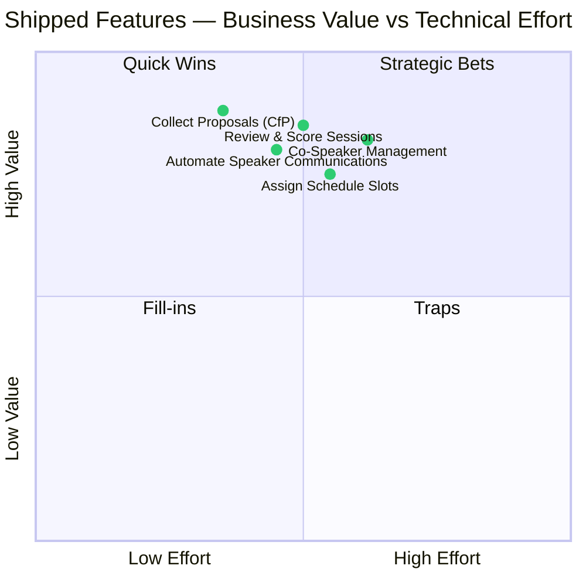
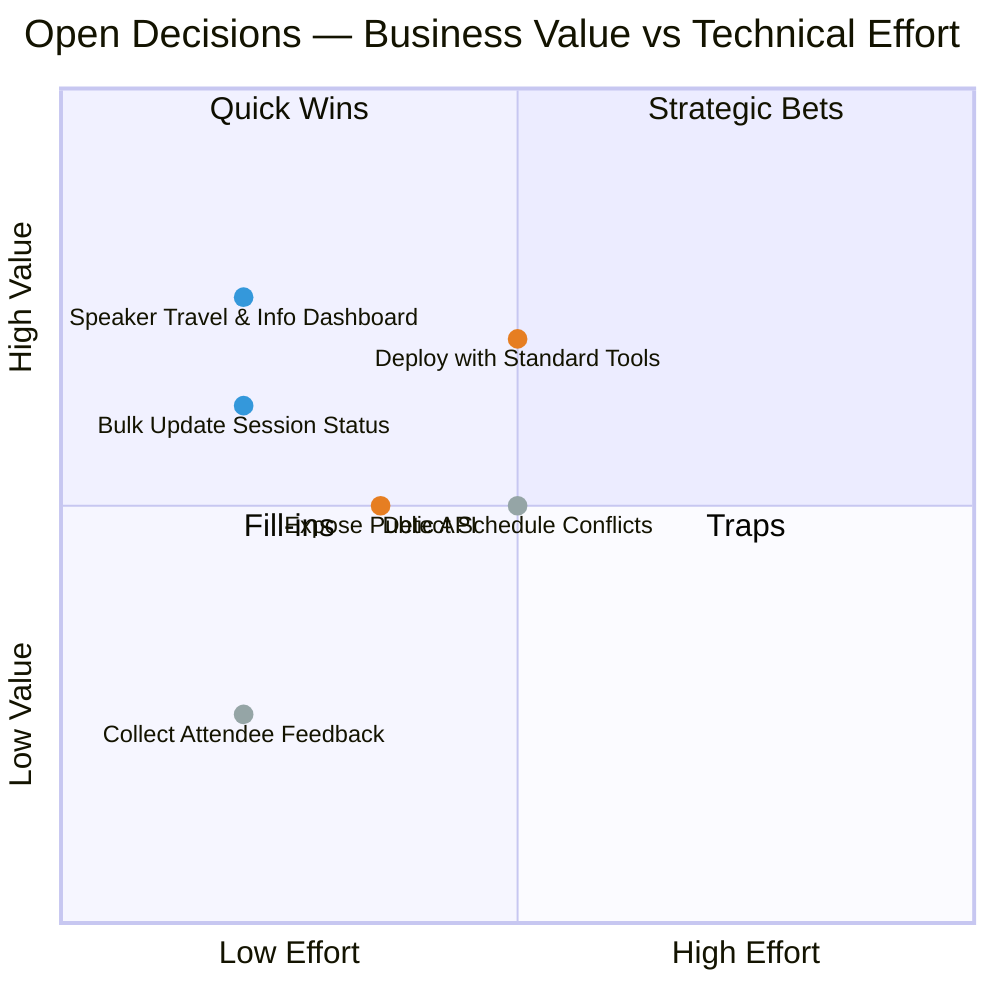

# Step 5: Features Brainstorming

## Goal
Brainstorm and identify potential features based on the personas and user journeys defined in previous steps. This is a divergent thinking exercise — quantity first, filtering second.

---

##  Core Features
*Essential to the primary value proposition.*

| Feature | Description | Why it matters | Related to | Biz Value | Tech Effort | UX Impact | Confidence | Priority |
| :--- | :--- | :--- | :--- | :---: | :---: | :---: | :---: | :---: |
| **Collect Proposals (CfP)** | **Collect** speaker proposals via a public form and **allow** organizers to **view** them in a dashboard | Entry point for all content; without this, there are no sessions to manage | [Fernando](3-personas/fernando-volunteer-organizer.md)'s Need 1, [Andrea](3-personas/andrea-external-speaker.md)'s Primary Goal | **High** | Medium | **High** | 🟢 | **Must-have** |
| **Review & Score Sessions** | **Enable** organizers to **read, score, and select** proposals in a centralized workflow | Replaces spreadsheets and emails, ensuring fair and organized selection process | [Fernando](3-personas/fernando-volunteer-organizer.md)'s Pain 2 | **High** | Medium | **High** | 🟢 | **Must-have** |
| **Automate Speaker Communications** | **Automatically send** email updates to speakers when status changes (submitted/accepted/rejected) | Drastically reduces manual communication effort and keeps speakers informed | [Fernando](3-personas/fernando-volunteer-organizer.md)'s Primary Goal, [Andrea](3-personas/andrea-external-speaker.md)'s Secondary Goal | **High** | Medium | **High** | 🟡 | **Must-have** |
| **Assign Schedule Slots** | **Assign** accepted sessions to specific rooms and time slots via simple inputs | Transforms selected talks into an actionable conference timeline | [Fernando](3-personas/fernando-volunteer-organizer.md)'s Need 1 | **High** | Medium | Medium | 🟢 | **Must-have** |
| **Co-Speaker Management** | **Allow** a proposer to **invite** a colleague to join the session proposal via unique link or email | Many sessions are collaborative; handling this manually is a major pain point | [Andrea](3-personas/andrea-external-speaker.md)'s Need 2, [Andrea](3-personas/andrea-external-speaker.md)'s Pain 2 | **High** | Medium | **High** | 🟡 | **Must-have** |

---

##  Supporting Features
*Enhance the system but not critical to the core value.*

| Feature | Description | Why it matters | Related to | Biz Value | Tech Effort | UX Impact | Confidence | Priority |
| :--- | :--- | :--- | :--- | :---: | :---: | :---: | :---: | :---: |
| **Bulk Update Session Status** | **Select** multiple sessions to **change** their status (e.g., "Accepted", "Rejected") in one action | Saves time when dealing with hundreds of submissions | [Fernando](3-personas/fernando-volunteer-organizer.md)'s Need 3 | Medium | _Low_ | **High** | 🟢 | Should-have |
| **Speaker Travel & Info Dashboard** | **Display** a dedicated page for accepted speakers with reimbursement guides, hotel deals, and travel info | Centralizes logistics info, reducing email questions to organizers | [Andrea](3-personas/andrea-external-speaker.md)'s Need 1, [Andrea](3-personas/andrea-external-speaker.md)'s Pain 3 | **High** | _Low_ | **High** | 🟢 | Should-have |

---

##  Differentiating Features
*Set the product apart from competitors.*

| Feature | Description | Why it matters | Related to | Biz Value | Tech Effort | UX Impact | Confidence | Priority |
| :--- | :--- | :--- | :--- | :---: | :---: | :---: | :---: | :---: |
| **Deploy with Standard Tools** | **Deploy** the application using a standard Docker Compose configuration | Enables volunteers to run the platform on low-cost infrastructure | [Fernando](3-personas/fernando-volunteer-organizer.md)'s Role | **High** | Medium | _Low_ | 🟢 | Must-have |
| **Expose Public API** | **Provide** read-only API endpoints for the schedule and speaker details | Allows advanced organizers to build custom websites or mobile apps | [Fernando](3-personas/fernando-volunteer-organizer.md)'s Tech Savviness | Medium | _Low_ | **High** | 🟡 | Should-have |

---

##  Nice-to-Have Features
*Could add value but lower priority.*

| Feature | Description | Why it matters | Related to | Biz Value | Tech Effort | UX Impact | Confidence | Priority |
| :--- | :--- | :--- | :--- | :---: | :---: | :---: | :---: | :---: |
| **Collect Attendee Feedback** | **Gather** ratings from attendees after sessions occur | Provides value to speakers and helps organizers improve future conferences | [Fernando](3-personas/fernando-volunteer-organizer.md)'s Secondary Goal | _Low_ | _Low_ | Medium | 🟢 | _Nice-to-have_ |
| **Detect Schedule Conflicts** | **Warn** the user if a speaker is double-booked or a room is empty | Improving data quality and preventing day-of-conference issues | [Fernando](3-personas/fernando-volunteer-organizer.md)'s Need 2 | Medium | Medium | Medium | 🟡 | _Nice-to-have_ |

---

## Feature Quadrant — Already Shipped (Core)

| Color | Category |
| :---: | :--- |
|  | Core — shipped |

---

## Feature Quadrant — Open Decisions

| Color | Category |
| :---: | :--- |
|  | Supporting |
|  | Differentiating |
|  | Nice-to-Have |

---

## Notes & Observations

- **Persona Integration:** Added features for Andrea (Speaker) to ensure a balanced ecosystem. Without content (Andrea), Fernando has nothing to organize.
- **Co-Speakers:** Identified as a specific pain point for Andrea, elevated to Core/High priority to ensure competitive advantage/usability.
- **Travel Info:** Added as a dashboard feature to offload organizer support time.
- **Confidence Notes:** 
  - 🟡 "Automate Speaker Communications" — needs clarity on email provider integration (Resend vs other)
  - 🟡 "Co-Speaker Management" — scope unclear: unique link vs email invite vs both?
  - 🟡 "Expose Public API" — authentication strategy needs definition
  - 🟡 "Detect Schedule Conflicts" — conflict rules need business definition

**Coach's question:** If you could only ship three features from the Core list to validate the primary hypothesis that "SessioFlow reduces organizer workload," which would they be and why?

---

**Next Step:** Map these features to user journeys and define sequencing in Step 7 — Features & Sequencing.