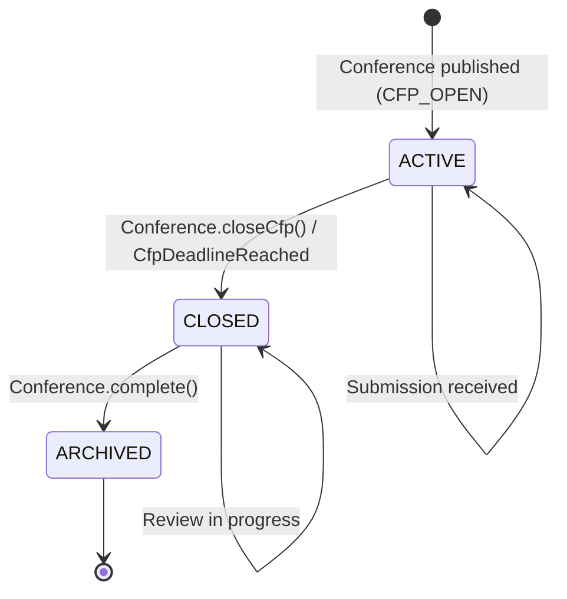

# Entity: CfpConfig

## 🛡️ ADR Compliance Checklist
After generating the entity lifecycle document, review the project's Architecture Decision Records (ADRs) to ensure alignment with established architectural decisions.

- [x] Entity is properly designated as Aggregate Root or Child Entity
- [x] Value Objects encapsulate validation and business rules
- [x] Domain behavior is exposed through methods (not data setters)
- [x] State transitions are explicit and validated
- [x] Domain events are published on state changes
- [x] Repository interfaces are defined for data access
- [x] Entity invariants are documented and enforced
- [x] Entity links to relevant User Flows / Journeys
- [x] Domain events are documented with triggers and side effects
- [x] State definitions are clear and unambiguous
- [x] Validation rules are comprehensive

## 📋 Definition & Context
* **Description:** Configuration settings for a Call for Papers (CfP) submission window. Defines the submission period, rules, and settings for how speakers can submit proposals to an event.
* **Aggregate Relationship:** Child Entity of `Conference` Aggregate (not a root entity)
* **Database Table / Collection:** `cfp_configs` (embedded or separate table with eventId foreign key)
* **Primary Key / Identifier:** Inherited from parent `Conference.id` (no separate identity)
* **Owner Team:** Core Conference Team
* **Domain Context:** Conference Bounded Context (see ADR-009)

---

## 🧱 DDD Structure

### Aggregate Relationship
```
ConferenceAggregate (Root)
└── cfpConfig: CfpConfig (Child Entity / Embedded)
    ├── startDate: CfpStartDate (Value Object)
    ├── endDate: CfpEndDate (Value Object)
    ├── maxSubmissions: MaxSubmissions (Value Object, optional)
    └── requiresApproval: RequiresApproval (Value Object)
```

### Value Objects Used
| Value Object | Purpose | Referenced Doc |
|--------------|---------|----------------|
| `CfpStartDate` | CfP window start date | [[../value-objects/cfp-start-date]] |
| `CfpEndDate` | CfP window end date | [[../value-objects/cfp-end-date]] |
| `MaxSubmissions` | Maximum submission limit (optional) | [[../value-objects/max-submissions]] |
| `CfpStatus` | Active/Inactive status | [[../value-objects/cfp-status]] |

---

## 🗺️ State Machine Diagram
*This Mermaid diagram models all valid states and transitions for this entity. It renders natively in GitHub, GitLab, and Obsidian.*



---

## 🔄 State Transition Matrix
*A strict mapping of every allowed state change, the trigger behind it, and any automatic system side-effects.*

| Current State | Domain Method / Conference | Target State | Guards / Conditions | Side Effects / Actions |
| :--- | :--- | :--- | :--- | :--- |
| `ACTIVE` | `Conference.publishCfp()` | `ACTIVE` | Conference status = CFP_OPEN | Enable submission form; start accepting proposals; publish `CfpOpened` domain event. |
| `ACTIVE` | `Conference.closeCfp()` | `CLOSED` | Organizer has admin rights | Disable submission form; lock all submissions for review; publish `CfpClosed` domain event. |
| `ACTIVE` | `CfpDeadlineReached` (cron) | `CLOSED` | Current time >= cfpEndDate | Auto-close submissions; send closure notifications to speakers; publish `CfpClosed` domain event. |
| `CLOSED` | `Conference.complete()` | `ARCHIVED` | Conference status = COMPLETED | Archive all submission data; make read-only; publish `CfpArchived` domain event. |
| `CLOSED` | New submission attempt | `CLOSED` | CfP is closed | Reject submission; return error to user; no state change. |

---

## 🎯 Domain Behavior

### Core Entity Methods

| Method | Purpose | Pre-conditions | Post-conditions |
|--------|---------|----------------|-----------------|
| `CfpConfig.create()` | Initialize CfP configuration | Valid start/end dates | `CfpConfig` created with `ACTIVE` status |
| `isActive()` | Check if CfP is accepting submissions | None | Returns `true` if status = `ACTIVE` and current time within window |
| `close()` | Close the submission window | Status must be `ACTIVE` | Status → `CLOSED`; submissions locked |
| `validateDates()` | Validate date constraints | None | Throws error if `endDate` <= `startDate` or dates in past |
| `isWithinWindow(date)` | Check if date falls within CfP window | None | Returns `true` if date between start and end |

### Domain Invariants

| Invariant | Description |
|-----------|-------------|
| **Date Order** | `endDate` must always be after `startDate` |
| **Future Dates** | `startDate` must be in the future at creation time |
| **Max Submissions** | If set, must be a positive integer |
| **Status Consistency** | `isActive()` returns `true` only if status = `ACTIVE` AND current time within window |

---

## 📐 Mermaid Diagram & State Definition Consistency

This entity lifecycle document follows the consistency guidelines:

1. **State Completeness:** Every state shown in the Mermaid diagram has a corresponding definition in the State Definitions section
2. **Transition Completeness:** Every transition arrow in the Mermaid diagram is documented in the State Transition Matrix
3. **State Names:** Consistent naming using uppercase (e.g., `ACTIVE`, `CLOSED`)
4. **Trigger Alignment:** The triggering actions/events in the Mermaid diagram match the "Conference / Trigger" column in the State Transition Matrix
5. **Target State Alignment:** The target states in the Mermaid diagram match the "Target State" column in the State Transition Matrix
6. **Domain Methods:** Domain methods shown in the Mermaid (e.g., `Conference.closeCfp()`) are documented in the Domain Behavior section
7. **Terminal States:** Terminal states (`ARCHIVED`) are clearly identified in State Definitions

## 🔍 State Definitions
*Detailed criteria for what each state means in plain English.*

| State | Description | Domain Method |
|-------|-------------|---------------|
| `ACTIVE` | CfP is open and accepting submissions. Speakers can create accounts, fill out the submission form, and submit proposals. The submission deadline is in the future. | `Conference.publishCfp()` |
| `CLOSED` | CfP has been closed (manually or by deadline). No new submissions accepted. Existing submissions are locked and can only be viewed/reviewed by organizers. | `Conference.closeCfp()`, `CfpDeadlineReached` |
| `ARCHIVED` | CfP configuration archived with event. All data preserved in read-only mode for historical reference and reporting. | `Conference.complete()` |

---

## 🛠️ Repository Interface (DDD Pattern)

```typescript
// CfpConfig does not have its own repository - it is accessed through ConferenceRepository
// as part of the Conference Aggregate.

// Example usage through ConferenceRepository:
export interface ConferenceRepository {
  // CfpConfig is loaded as part of Conference aggregate
  findById(id: ConferenceId): Promise<Conference | null>;
  
  // No separate CfpConfigRepository needed
}
```

---

## 🔒 Invariants & Business Rules
*Links to the business rules and invariants enforced by this entity.*

**Invariants:**
* [INV-002](../invariants/INV-002-cfp-date-order.md): Cfp End Date Must Be After Start Date

**Business Rules:**
* [BR-001](../business-rules/BR-001-cfp-dates-validation.md): CfP Dates Must Be Valid
* [BR-005](../business-rules/BR-005-cfp-submission-when-active.md): Submissions Only Accepted When CfP Is Active

---

## 🔗 Linked User Stories & Flows
*Relative links to the User Stories/Flows that interact with or trigger mutations on this entity.*

* [[../../flows/journey-01-setup-event.md]]: Creates `CfpConfig` with `ACTIVE` state
* [[../../flows/journey-02-submit-proposal.md]]: Submissions only accepted when `ACTIVE`
* [[../../flows/journey-03-review-sessions.md]]: Review only possible when `CLOSED`
* [[../../flows/journey-04-acceptance-logistics.md]]: Archives when event completes

---

## 🔗 Domain Conferences

| Conference | Triggered By | Published When |
|-------|--------------|----------------|
| `CfpOpened` | `Conference.publishCfp()` | CfP transitions to `ACTIVE` |
| `CfpClosed` | `Conference.closeCfp()` / `CfpDeadlineReached` | CfP transitions to `CLOSED` |
| `CfpArchived` | `Conference.complete()` | CfP transitions to `ARCHIVED` |

---

## 🔗 Related Documentation

| Document | Purpose |
|----------|---------|
| [[../value-objects/cfp-start-date]] | CfP start date value object |
| [[../value-objects/cfp-end-date]] | CfP end date value object |
| [[../value-objects/cfp-status]] | CfP status enum value object |
| [[../value-objects/max-submissions]] | Maximum submission limit value object |
| [[event.md]] | Parent Conference aggregate documentation |
| [[../../adr/009-adopt-domain-driven-design-structure.md]] | DDD architecture decision |
