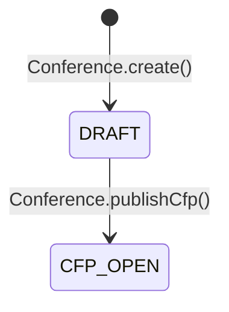
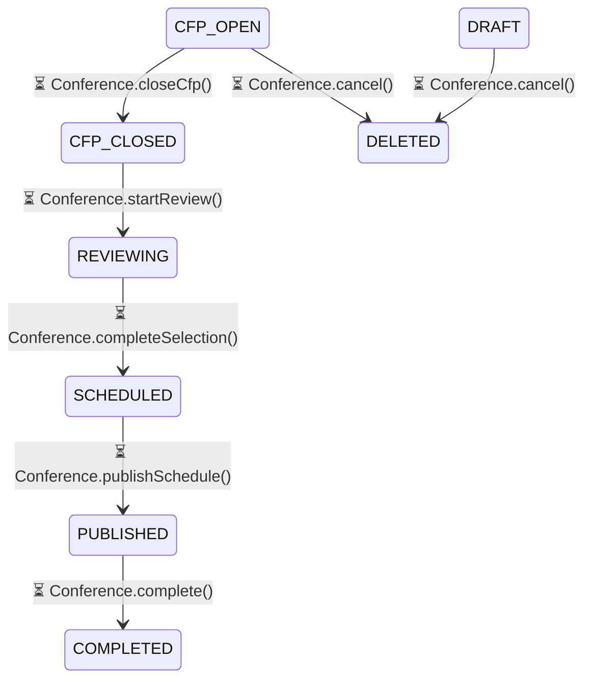

# Entity: Conference

> **Wave 1 reality check.** `ConferenceStatus` ships all eight states, but the class ships **one**
> mutator (`publishCfp()`). Rows that describe the rest of the lifecycle are specifications, so they
> carry `⏳ Planned` and are phrased in the future tense — present tense would claim the code ships.
> Convention: [Traceability](../../../guidelines/traceability.md).

## 📋 Definition & Context

* **Description:** A Call for Papers (CfP) conference organized by a user. Owns the CfP submission window and the conference lifecycle state machine.
* **Aggregate Root:** ✅ Yes — consistency boundary over `CfpConfig` and the status state machine (INV-001).
* **Implementation:** `packages/modules/conference/src/domain/conference.ts`
* **Persistence schema:** `conferences` table — `packages/shared/database/src/schema.ts:16-39`
* **Primary Key / Identifier:** `ConferenceId` (UUIDv4 value object; minted by `ConferenceId.generate()`)
* **Owner Team:** Core Conference Team
* **Domain Context:** Conference Bounded Context (ADR-009)
* **Built scope:** creation + CfP opening. Review, selection, scheduling, publishing, completion and cancellation are specified, not implemented.

---

## 🛡️ ADR Compliance Checklist

Re-verified against the class on 2026-09-16, not against the previous revision of this document.

- [x] Entity is properly designated as Aggregate Root
- [x] Value Objects encapsulate validation and business rules (`ConferenceData` holds VOs, no primitives)
- [x] Domain behavior is exposed through methods, not data setters
- [x] State transitions are explicit and validated (`ConferenceStatus.TRANSITIONS` + `canTransitionTo()`)
- [x] Domain events are recorded on state change, for Outbox persistence (ADR-017)
- [x] Repository interface defined in `domain/`, implemented in `infrastructure/`
- [x] Entity invariants are documented (`INV-001`, `INV-002`, `INV-003`)
- [x] Entity links to the flow that realizes it
- [ ] Every lifecycle stage is implemented — **false today**: 1 of 7 mutators exists (see Status columns)
- [x] Domain events documented with trigger, payload, and the consumer that actually runs
- [x] `⏳ Planned` rows are phrased in the future tense

---

## 🧱 DDD Structure

### Aggregate Composition

Mirrors `ConferenceData` (`conference.ts:16-26`) — every persisted member is a value object except the two timestamps.

```
Conference (Aggregate Root)
├── id: ConferenceId                    // uuid, generated by ConferenceId.generate()
├── name: ConferenceName                // 3–100 chars after trim (BR-002)
├── description: ConferenceDescription  // optional, default '' (schema default)
├── slug: ConferenceSlug                // url-safe, unique (BR-003 / INV-003)
├── status: ConferenceStatus            // 8 states + TRANSITIONS table (INV-001)
├── organizerId: OrganizerId            // tenant key for BR-004
├── cfpConfig: CfpConfig                // embedded configuration (see below)
├── createdAt: Date                     // not a VO, deliberately
└── updatedAt: Date                     // refreshed by publishCfp() and by repository save()

CfpConfig (embedded, domain/value-objects/cfp-config.ts)
├── startDate: CfpStartDate             // today or future, ≤ 365 days ahead (BR-001)
├── endDate: CfpEndDate                 // valid date (BR-001)
├── maxSubmissions?: MaxSubmissions     // positive integer
├── requiresApproval: RequiresApproval  // defaults to true
└── status: CfpStatus                   // ACTIVE | CLOSED | ARCHIVED
```

`⏳ Planned — no code exists for either of these, and neither has a class today:`

* `Sessions` (child entities) — required by `INV-004` / `INV-005`; there is **no** `Session` entity in `domain/`.
* `ConferenceValidationService` (domain service) — no `domain-services/` directory exists; validation lives in the value objects.

### Value Objects Used

| Value Object | Purpose | Referenced Doc |
|--------------|---------|----------------|
| `ConferenceId` | Unique identifier | [conference-id.md](../value-objects/conference-id.md) |
| `ConferenceName` | Title with length constraints | [conference-name.md](../value-objects/conference-name.md) |
| `ConferenceDescription` | Optional description | [conference-description.md](../value-objects/conference-description.md) |
| `ConferenceSlug` | URL-safe identifier | [conference-slug.md](../value-objects/conference-slug.md) |
| `ConferenceStatus` | Lifecycle state + transition table | [conference-status.md](../value-objects/conference-status.md) |
| `OrganizerId` | Organizer / tenant key (BR-004 subject) | [organizer-id.md](../value-objects/organizer-id.md) |
| `CfpConfig` | Submission window configuration | [cfp-config.md](../value-objects/cfp-config.md) |
| `CfpStartDate` | Window start, temporal bounds | [cfp-start-date.md](../value-objects/cfp-start-date.md) |
| `CfpEndDate` | Window end | [cfp-end-date.md](../value-objects/cfp-end-date.md) |
| `CfpStatus` | CfP state enum | [cfp-status.md](../value-objects/cfp-status.md) |
| `MaxSubmissions` | Submission cap | [max-submissions.md](../value-objects/max-submissions.md) |
| `RequiresApproval` | Auto-approve flag, defaults true | [requires-approval.md](../value-objects/requires-approval.md) |

---

## 🗺️ State Machine Diagram

Built — every arrow below is reachable through code that exists:


```mermaid
stateDiagram-v2
    [*] --> DRAFT : Conference.create()
    DRAFT --> CFP_OPEN : Conference.publishCfp()
```

`⏳ Planned` — the states and the transition table exist in `ConferenceStatus`, the mutators that would
drive them do not. Drawn separately so nobody reads this diagram as shipped behaviour:


```mermaid
stateDiagram-v2
    CFP_OPEN --> CFP_CLOSED : ⏳ Conference.closeCfp()
    CFP_CLOSED --> REVIEWING : ⏳ Conference.startReview()
    REVIEWING --> SCHEDULED : ⏳ Conference.completeSelection()
    SCHEDULED --> PUBLISHED : ⏳ Conference.publishSchedule()
    PUBLISHED --> COMPLETED : ⏳ Conference.complete()
    DRAFT --> DELETED : ⏳ Conference.cancel()
    CFP_OPEN --> DELETED : ⏳ Conference.cancel()
```

---

## 🔄 State Transition Matrix

| Current State | Trigger | Target State | Guards / Conditions | Side Effects / Actions | Status |
| :--- | :--- | :--- | :--- | :--- | :--- |
| *(new)* | `Conference.create()` | `DRAFT` | VOs already validated by the caller; `CfpConfig.create()` already enforced INV-002 | Generates id + timestamps; records `ConferenceCreatedEvent` (`conference.ts:74`) | ✅ Built |
| `DRAFT` | `Conference.publishCfp()` | `CFP_OPEN` | `ConferenceStatus.canTransitionTo()` — any other source throws `InvalidStatusTransitionError` (`conference.ts:132-149`) | Sets `CFP_OPEN`; refreshes `updatedAt`; records `CfpOpenedEvent` | ✅ Built |
| `CFP_OPEN` | `Conference.closeCfp()` *(not built)* | `CFP_CLOSED` | Will require `CFP_OPEN` | Will record `CfpClosedEvent`; submissions will stop accepting entries | ⏳ Planned |
| `CFP_OPEN` | Cron deadline sweep *(not built)* | `CFP_CLOSED` | Will compare `now` against `cfpConfig.endDate` | Will record `CfpClosedEvent`; no scheduler exists today | ⏳ Planned |
| `CFP_CLOSED` | `Conference.startReview()` *(not built)* | `REVIEWING` | Will require `CFP_CLOSED` | Will record `ReviewStartedEvent` | ⏳ Planned |
| `REVIEWING` | `Conference.completeSelection()` *(not built)* | `SCHEDULED` | Will require every session scored (`INV-004`); no `Session` entity exists | Will record `SelectionCompletedEvent` | ⏳ Planned |
| `SCHEDULED` | `Conference.publishSchedule()` *(not built)* | `PUBLISHED` | Will require every session assigned (`INV-005`) | Will record `SchedulePublishedEvent` | ⏳ Planned |
| `PUBLISHED` | `Conference.complete()` *(not built)* | `COMPLETED` | Will require `PUBLISHED` | Will record `ConferenceCompletedEvent` | ⏳ Planned |
| `DRAFT` / `CFP_OPEN` | `Conference.cancel()` *(not built)* | `DELETED` | Will require a non-terminal state | Will record `ConferenceCancelledEvent`; excluded from the BR-004 count by `ne(status, 'DELETED')` | ⏳ Planned |

> **Authentication is not a domain guard.** The old row said "organizer authorized" for `publishCfp()`.
> The aggregate never checks who is calling: authentication is enforced at the route/controller
> (`401 UNAUTHORIZED`), and `organizerId` is taken from the authenticated session by
> `CreateConferenceHandler` — not asserted by the entity.

---

## 🔍 State Definitions

All eight values exist in `ConferenceStatus` (`domain/value-objects/conference-status.ts:4-11`), and
`TRANSITIONS` (:15-22) already declares the full graph. Reachability is the part that is partial.

| State | Meaning | Reachable today |
|-------|---------|-----------------|
| `DRAFT` | Created, CfP not open yet | ✅ via `create()` |
| `CFP_OPEN` | Accepting submissions within the `CfpConfig` window | ✅ via `publishCfp()` |
| `CFP_CLOSED` | Window shut; entries frozen pending review | ❌ no mutator |
| `REVIEWING` | Organizers scoring entries | ❌ no mutator, no `Session` entity |
| `SCHEDULED` | Accepted sessions chosen, not public yet | ❌ no mutator |
| `PUBLISHED` | Public agenda available | ❌ no mutator |
| `COMPLETED` | Conference finished, terminal | ❌ no mutator |
| `DELETED` | Soft delete, terminal; excluded from the free-tier count | ❌ no mutator (the `ne(status,'DELETED')` filter in the repository is built) |

**Consistency:** every state above appears in exactly one diagram and one matrix row per direction, and
every arrow in both diagrams appears in the matrix (SKILL §Mermaid consistency 1-5).

---

## 🎯 Domain Behavior

The public API of `Conference` as it exists — read from `domain/conference.ts`, not from a design sketch.

| Method | Purpose | Preconditions | Effects | Status |
| ------ | ------- | ------------- | ------- | ------ |
| `static create(params: CreateConferenceParameters)` | Named constructor for new conferences; mints id, sets `DRAFT`, stamps `createdAt`/`updatedAt` | All arguments are value objects | Records `ConferenceCreatedEvent` | ✅ Built |
| `static fromData(data: ConferenceData)` | Reconstitution for repositories only | Called by `DrizzleConferenceRepository.toDomain()` only | No events, no creation-time validation (by design) | ✅ Built |
| `publishCfp(): void` | `DRAFT → CFP_OPEN` | Status must be `DRAFT` (`canTransitionTo`) | Mutates `status` + `updatedAt`; records `CfpOpenedEvent`; throws `InvalidStatusTransitionError` otherwise | ✅ Built |
| `pullDomainEvents(): DomainEvent[]` | Flush recorded events for Outbox persistence | — | Returns a copy and empties the internal list | ✅ Built |
| `toData(): ConferenceData` | Persistence projection | — | Shallow copy of `_data` | ✅ Built |
| `get id / name / description / slug / status / organizerId / cfpConfig / createdAt / updatedAt` | Read-only projection of `_data` (9 getters) | — | None | ✅ Built |
| `protected recordEvent(event)` | Event recording hook for the aggregate | Subclass-visible only | Appends to `_domainEvents` | ✅ Built |
| `closeCfp(reason)` | Will close the submission window | `CFP_OPEN` | Will emit `CfpClosedEvent` | ⏳ Planned |
| `startReview()` | Will open the review phase | `CFP_CLOSED` | Will emit `ReviewStartedEvent` | ⏳ Planned |
| `completeSelection()` | Will finalize acceptances | `REVIEWING`; all sessions scored (INV-004) | Will emit `SelectionCompletedEvent` | ⏳ Planned |
| `publishSchedule()` | Will make the agenda public | `SCHEDULED`; all sessions assigned (INV-005) | Will emit `SchedulePublishedEvent` | ⏳ Planned |
| `complete()` | Will mark the conference finished | `PUBLISHED` | Will emit `ConferenceCompletedEvent` | ⏳ Planned |
| `cancel(reason)` | Will soft-delete the conference | `DRAFT` or `CFP_OPEN` | Will emit `ConferenceCancelledEvent` | ⏳ Planned |

> **No data setters.** `_data` is `private readonly` and only `publishCfp()` mutates it; the planned
> mutators above are the only sanctioned way to change `status` (INV-001).

---

## 📣 Domain Events

| Domain Event | Constructed By | Payload | Consumer / Side Effects | Status |
| ------------ | -------------- | ------- | ----------------------- | ------ |
| `ConferenceCreatedEvent` (`type: 'CONFERENCE_CREATED'`) | `Conference.create()` — `conference.ts:74` | `aggregateId`, `name`, `slug`, `organizerId`, `timestamp` | Persisted to `outbox_messages` with `status: 'PENDING'` by `DrizzleOutboxRepository.saveAll()` inside the ADR-017 transaction (`create-conference.handler.ts:87-89`) | ✅ Built (persisted) |
| `CfpOpenedEvent` (`type: 'CFP_OPENED'`) | `Conference.publishCfp()` — `conference.ts:140` | `aggregateId`, `startDate`, `endDate`, `timestamp` | Same Outbox write. The source comment is explicit: the welcome-email worker is optional per ADR-011-01 and **out of scope** | ✅ Built (persisted) |
| `CfpClosedEvent`, `ReviewStartedEvent`, `SelectionCompletedEvent`, `SchedulePublishedEvent`, `ConferenceCompletedEvent`, `ConferenceCancelledEvent` | *(not built — no files under `domain/events/`)* | TBD | Will be emitted once the mutators above exist | ⏳ Planned |

> **Nothing dispatches the Outbox yet.** `OutboxProcessor.processPending()` is defined twice —
> `packages/shared/bus/src/outbox-processor.ts:10` and `packages/shared/database/src/outbox-processor.ts:10` —
> and is called from nowhere (and not re-exported from `shared/bus/src/index.ts`). Today
> `outbox_messages` is an append-only log: no consumer runs, so **no email, notification or analytics
> side effect fires**. Any document that lists "sends welcome email" as a side effect of `CFP_OPENED` is
> describing a worker that has not been built.

---

## 🔒 Invariants & Business Rules
*The `Enforces` edge: every rule this entity is responsible for upholding. Both ends or it didn't
ship — each rule listed here links back to this entity in its `Enforced by` table.
Convention: [Traceability](../../../guidelines/traceability.md).*

* **Invariants:**
  * [INV-001](../invariants/INV-001-state-transition-validity.md): Conference State Transitions Must Follow State Machine ✅ enforced today
  * [INV-002](../invariants/INV-002-cfp-date-order.md): Cfp End Date Must Be After Start Date ✅ enforced today (delegated to `CfpConfig.create()`)
  * [INV-003](../invariants/INV-003-slug-uniqueness.md): Conference Slug Must Be Unique Across All Conferences ✅ enforced today
  * [INV-004](../invariants/INV-004-session-scoring-before-scheduling.md): All Sessions Must Be Scored Before Selection Can Be Completed ⏳ Planned — `completeSelection()` and the `Session` entity do not exist
  * [INV-005](../invariants/INV-005-session-assignment-before-publishing.md): All Accepted Sessions Must Be Assigned Before Schedule Can Be Published ⏳ Planned — `publishSchedule()` does not exist

* **Business Rules:**
  * [BR-001](../business-rules/BR-001-cfp-dates-validation.md): CfP Dates Must Be Valid ✅ (delegated to `CfpStartDate` / `CfpEndDate` / `CfpConfig`)
  * [BR-002](../business-rules/BR-002-conference-name-validation.md): Conference Name Must Meet Requirements ✅ (via `ConferenceName.create()`)
  * [BR-003](../business-rules/BR-003-slug-uniqueness.md): Conference Slug Must Be Unique ✅ (via `ConferenceSlug.create()` + handler pre-check + unique index)
  * [BR-004](../business-rules/BR-004-free-tier-conference-limit.md): Free Tier Conference Creation Limit ✅ counted against this aggregate by the handler, not by the entity

### Enforcement & tests

Where each guard lives and what pins it. Only members and tests opened in this pass are listed.

| Rule | Enforcing member | Test | Status |
| ---- | ---------------- | ---- | ------ |
| [INV-001](../invariants/INV-001-state-transition-validity.md) | `Conference.publishCfp()` + `ConferenceStatus.canTransitionTo()` + `InvalidStatusTransitionError` | `tests/unit/modules/conference/domain/conference.test.ts` | ✅ Verified |
| [INV-002](../invariants/INV-002-cfp-date-order.md) | `CfpConfig.create()` → `CfpDatesInvalidError` | `tests/unit/modules/conference/domain/cfp-config.test.ts` | ✅ Verified |
| [INV-003](../invariants/INV-003-slug-uniqueness.md) | `ConferenceSlug.create()` + `CreateConferenceHandler.findBySlug()` pre-check + `conferences_slug_unique` | `tests/integration/modules/conference/conference-repository.integration.test.ts` | ✅ Verified |
| [BR-004](../business-rules/BR-004-free-tier-conference-limit.md) | `CreateConferenceHandler.execute()` (`FREE_TIER_LIMIT = 5`) + `ConferenceRepository.countActiveByOrganizerId()` | `tests/unit/modules/conference/application/commands/create-conference/create-conference.test.ts` | ✅ Verified |
| [INV-004](../invariants/INV-004-session-scoring-before-scheduling.md) | — (`completeSelection()` not built) | none — acceptance criteria live in the invariant doc | ⏳ Planned |
| [INV-005](../invariants/INV-005-session-assignment-before-publishing.md) | — (`publishSchedule()` not built) | none | ⏳ Planned |

---

## 🛠️ Repository Interface

Transcribed from the persistence port in `domain/` — do not "improve" it here.

```typescript
// packages/modules/conference/src/domain/conference-repository.interface.ts:17-23
export interface ConferenceRepository {
  findById(id: ConferenceId): Promise<Conference | null>;
  findBySlug(slug: ConferenceSlug): Promise<Conference | null>;
  /** Counts non-DELETED conferences for an organizer (BR-004). */
  countActiveByOrganizerId(organizerId: OrganizerId): Promise<number>;
  save(conference: Conference, tx?: TransactionClient): Promise<void>;
}
```

> `save()`'s optional `tx` is not decoration: when `CreateConferenceHandler` passes it
> (`create-conference.handler.ts:87-89`), the aggregate write and the Outbox insert join one
> transaction, which is what makes ADR-017's Outbox atomic. Documenting `save(conference)` alone hides
> the guarantee.
>
> `delete(id)`, `findByOrganizerId()` and `findByStatus()` are **not** on the port. `DELETED` is reached
> through a `cancel()` mutator that is `⏳ Planned`, and organizer/status listings are not implemented —
> the repository exposes an index on each column (`schema.ts:37-38`) but no query for them.

---

## 🔗 Linked User Stories & Flows

| Flow | Interaction | Status |
|------|-------------| ------ |
| [journey-01-setup-conference.md](../flows/journey-01-setup-conference.md) | Drives `Conference.create()` → `publishCfp()` | ✅ Built |
| [feature-01-conference-creation-with-cfp.md](../flows/features/journey-01/feature-01-conference-creation-with-cfp.md) | Realizes the same call chain end to end | ✅ Built |
| [journey-03-selection-and-program.md](../../../../inception/5-user-journeys/journey-03-selection-and-program.md) | Will drive `closeCfp()` → `startReview()` → `completeSelection()` | ⏳ Planned |
| [journey-04-acceptance-and-logistics.md](../../../../inception/5-user-journeys/journey-04-acceptance-and-logistics.md) | Will drive `publishSchedule()` → `complete()` | ⏳ Planned |

---

## 🔗 Related Documentation

| Document | Purpose |
|----------|---------|
| [conference-status.md](../value-objects/conference-status.md) | State enum + `TRANSITIONS` table |
| [cfp-config.md (entity)](cfp-config.md) | Embedded CfP configuration child entity |
| [cfp-config.md (value object)](../value-objects/cfp-config.md) | Same concept, VO view — see the naming collision note below |
| [conference-repository.interface.ts](../../../../../packages/modules/conference/src/domain/conference-repository.interface.ts) | Persistence port |
| [009-adopt-domain-driven-design-structure.md](../../../../adr/009-adopt-domain-driven-design-structure.md) | DDD architecture decision |

> **Naming collision (open issue):** `CfpConfig` is documented both as a child entity
> (`entities/cfp-config.md`) and as a composite value object (`value-objects/cfp-config.md`), and
> `bounded-contexts/conference/README.md` calls it "Composite Value Object". Pick one classification
> before a `Session` aggregate lands, or every link to `cfp-config.md` stays ambiguous.
