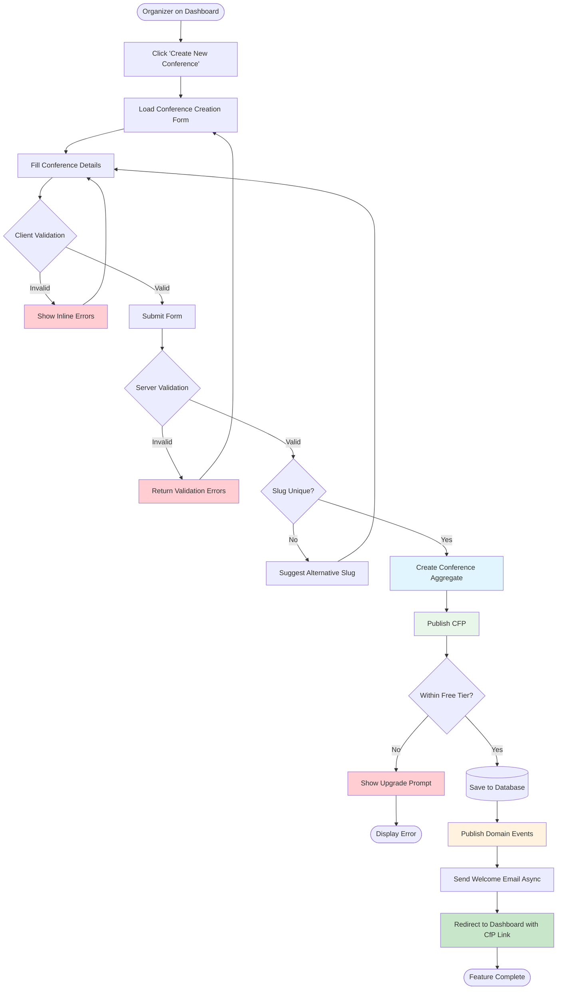

# Feature: Conference Creation & CFP Configuration

**Feature ID:** CONF-001  
**Related Flow:** Journey 01 - Setup Conference  
**Bounded Context:** Conference  
**Priority:** P0 (MVP Wave 1)  
**Status:** 📋 Planned

---

## 📋 Feature Overview

This feature enables conference organizers to create a new conference and configure its Call for Papers (CfP) settings, including submission dates, rules, and basic conference information.

**User Story:** As a conference organizer, I want to create a new conference and configure its CfP settings so that I can share a submission link with potential speakers and start collecting proposals.

---

## 🎯 Functional Requirements

### FR-001: Conference Basic Information

**Description:** Organizer can enter basic conference details during creation.

**Fields:**
| Field | Type | Required | Validation |
|-------|------|----------|------------|
| Name | String | ✅ Yes | 3-100 characters, alphanumeric + spaces |
| Description | String | ❌ No | Max 1000 characters |
| Logo URL | String | ❌ No | Valid URL format |
| Organizer ID | String | ✅ Yes | Auto-filled from authentication |

**Business Rules:**
- Conference name must be sanitized (remove special characters)
- Name must be unique across all conferences
- Slug auto-generated from name (URL-safe)

### FR-002: CFP Date Configuration

**Description:** Organizer can set the submission window for the conference.

**Fields:**
| Field | Type | Required | Validation |
|-------|------|----------|------------|
| CFP Start Date | Date | ✅ Yes | Must be >= today |
| CFP End Date | Date | ✅ Yes | Must be > start date |

**Business Rules:**
- End date must be after start date (INV-002)
- Start date must be in the future
- Maximum window duration: 180 days (warning required for longer)
- Dates validated on client and server

### FR-003: Optional Settings

**Description:** Organizer can configure optional CfP settings.

**Fields:**
| Field | Type | Default | Description |
|-------|------|---------|-------------|
| Max Submissions | Integer | Unlimited | Maximum number of submissions accepted |
| Requires Approval | Boolean | true | Whether submissions require organizer approval |

---

## 🔄 User Flow



---

## 🏗️ Technical Specification

### Domain Model

**Entities:**
- `Conference` - Aggregate root
- `CfpConfig` - Child entity (embedded)

**Value Objects:**
- `ConferenceId` - UUIDv4 identifier
- `ConferenceName` - Validated conference name
- `ConferenceSlug` - URL-safe unique slug
- `ConferenceStatus` - Enum (DRAFT, CFP_OPEN, etc.)
- `CfpStartDate` - Validated start date
- `CfpEndDate` - Validated end date
- `CfpConfig` - Submission configuration

**Domain Events:**
- `ConferenceCreated` - Triggered on creation
- `CfpOpened` - Triggered when CFP is published

### API Contract

**Endpoint:** `POST /api/v1/conferences`

**Request Body:**
```json
{
  "name": "Tech Conference 2026",
  "description": "Annual technology conference",
  "logoUrl": "https://example.com/logo.png",
  "cfpStartDate": "2026-08-01T00:00:00Z",
  "cfpEndDate": "2026-09-30T23:59:59Z",
  "maxSubmissions": 100,
  "requiresApproval": true
}
```

**Response (201 Created):**
```json
{
  "id": "550e8400-e29b-41d4-a716-446655440000",
  "name": "Tech Conference 2026",
  "slug": "tech-conference-2026",
  "status": "CFP_OPEN",
  "cfpConfig": {
    "startDate": "2026-08-01T00:00:00Z",
    "endDate": "2026-09-30T23:59:59Z",
    "status": "ACTIVE"
  },
  "cfpUrl": "https://sessioflow.app/cfp/tech-conference-2026"
}
```

**Error Responses:**
- `400 Bad Request` - Validation errors
- `401 Unauthorized` - Not authenticated
- `403 Forbidden` - Free tier limit exceeded
- `409 Conflict` - Slug already exists

### Database Schema

**Table: conferences**
```sql
CREATE TABLE conferences (
  id UUID PRIMARY KEY DEFAULT gen_random_uuid(),
  organizer_id UUID NOT NULL REFERENCES users(id),
  name VARCHAR(100) NOT NULL,
  slug VARCHAR(100) NOT NULL UNIQUE,
  description TEXT,
  logo_url VARCHAR(500),
  status VARCHAR(20) NOT NULL DEFAULT 'DRAFT',
  created_at TIMESTAMP WITH TIME ZONE DEFAULT NOW(),
  updated_at TIMESTAMP WITH TIME ZONE DEFAULT NOW()
);

CREATE INDEX idx_conferences_organizer ON conferences(organizer_id);
CREATE INDEX idx_conferences_status ON conferences(status);
```

**Table: cfp_configs**
```sql
CREATE TABLE cfp_configs (
  conference_id UUID PRIMARY KEY REFERENCES conferences(id) ON DELETE CASCADE,
  start_date DATE NOT NULL,
  end_date DATE NOT NULL,
  max_submissions INTEGER,
  requires_approval BOOLEAN DEFAULT true,
  status VARCHAR(20) NOT NULL DEFAULT 'ACTIVE',
  created_at TIMESTAMP WITH TIME ZONE DEFAULT NOW(),
  updated_at TIMESTAMP WITH TIME ZONE DEFAULT NOW(),
  CONSTRAINT valid_dates CHECK (end_date > start_date)
);
```

**RLS Policies:**
```sql
-- Organizers can only create conferences for their own account
CREATE POLICY "Organizers can create conferences"
ON conferences FOR INSERT
WITH CHECK (organizer_id = auth.uid());

-- Organizers can only view their own conferences
CREATE POLICY "Organizers can view their conferences"
ON conferences FOR SELECT
USING (organizer_id = auth.uid());
```

---

## ✅ Acceptance Criteria

### AC-001: Successful Conference Creation
**Given** the organizer is authenticated  
**When** they fill out all required fields with valid data  
**Then** the system creates a Conference in DRAFT state  
**And** transitions it to CFP_OPEN state  
**And** creates a CfpConfig with ACTIVE status  
**And** publishes ConferenceCreated and CfpOpened domain events  
**And** redirects to dashboard with CfP link

### AC-002: Validation Errors
**Given** the organizer submits invalid data  
**When** any field fails validation  
**Then** the system returns 400 Bad Request  
**And** displays appropriate error messages  
**And** no conference is created

### AC-003: Slug Uniqueness
**Given** the organizer enters a conference name  
**When** the generated slug already exists  
**Then** the system returns 409 Conflict  
**And** suggests alternative slugs  
**And** no conference is created

### AC-004: Free Tier Limit
**Given** the organizer has reached their free tier limit (5 conferences)  
**When** they attempt to create a new conference  
**Then** the system returns 403 Forbidden  
**And** displays upgrade prompt  
**And** no conference is created

### AC-005: Date Validation
**Given** the organizer enters CFP dates  
**When** end date is before or equal to start date  
**Then** the system displays validation error  
**And** prevents form submission  
**And** no conference is created

---

## 🧪 Testing Strategy

### Unit Tests
- Value object validation tests
- Entity state transition tests
- Domain service validation tests
- Use case logic tests

### Integration Tests
- Repository persistence tests
- Database transaction tests
- Domain event publishing tests

### E2E Tests
- Complete user journey from form to dashboard
- Error scenario validation
- Authentication and authorization tests

### Test Coverage Targets
- Domain layer: ≥95%
- Application layer: ≥90%
- Interface layer: ≥80%
- Overall: ≥80%

---

## 📝 Implementation Checklist

### Phase 0: E2E Contract
- [ ] Write E2E test for complete flow
- [ ] Document acceptance criteria
- [ ] Run E2E (expected to fail)

### Phase 1: Domain Layer
- [ ] Implement ConferenceId value object
- [ ] Implement ConferenceName value object
- [ ] Implement ConferenceSlug value object
- [ ] Implement ConferenceStatus value object
- [ ] Implement CfpStartDate value object
- [ ] Implement CfpEndDate value object
- [ ] Implement CfpConfig value object
- [ ] Implement Conference entity
- [ ] Implement ConferenceValidationService
- [ ] Write and pass all domain tests

### Phase 2: Domain Interfaces
- [ ] Define ConferenceRepository interface
- [ ] Implement domain event types
- [ ] Implement domain exception classes
- [ ] Write and pass interface tests

### Phase 3: Infrastructure & Application
- [ ] Create database migrations
- [ ] Configure RLS policies
- [ ] Implement ConferenceRepository
- [ ] Implement CreateConference use case
- [ ] Write and pass integration tests

### Phase 4: RESTful API
- [ ] Implement POST /api/v1/conferences
- [ ] Implement GET /api/v1/conferences
- [ ] Implement GET /api/v1/conferences/:id
- [ ] Add authentication/authorization
- [ ] Write and pass API tests

### Phase 5: User Interface
- [ ] Implement ConferenceCreationForm component
- [ ] Implement ConferenceList component
- [ ] Add form validation
- [ ] Implement error handling
- [ ] Write and pass component tests

### Phase 6: Validation
- [ ] Run E2E test (should pass)
- [ ] Run all unit tests
- [ ] Run linting
- [ ] Run type checking
- [ ] Verify test coverage

---

## 🔗 Dependencies

### Internal Dependencies
- Authentication module (Auth0 integration)
- Email service (Resend - optional)
- Database client (Supabase)

### External Dependencies
- Auth0 for authentication
- Resend for email notifications
- Supabase for database and storage

---

## 📚 Related Documentation

- [Journey 01 - Setup Conference](./journey-01-setup-conference.md)
- [Conference Entity](../entities/conference.md)
- [CfpConfig Entity](../entities/cfp-config.md)
- [Business Rules](../business-rules/)
- [Invariants](../invariants/)
- [Architecture Decision Records](../../adr/)

---

*Feature specification derived from Journey 01 user flow.*
*Last updated: 2026-07-03*