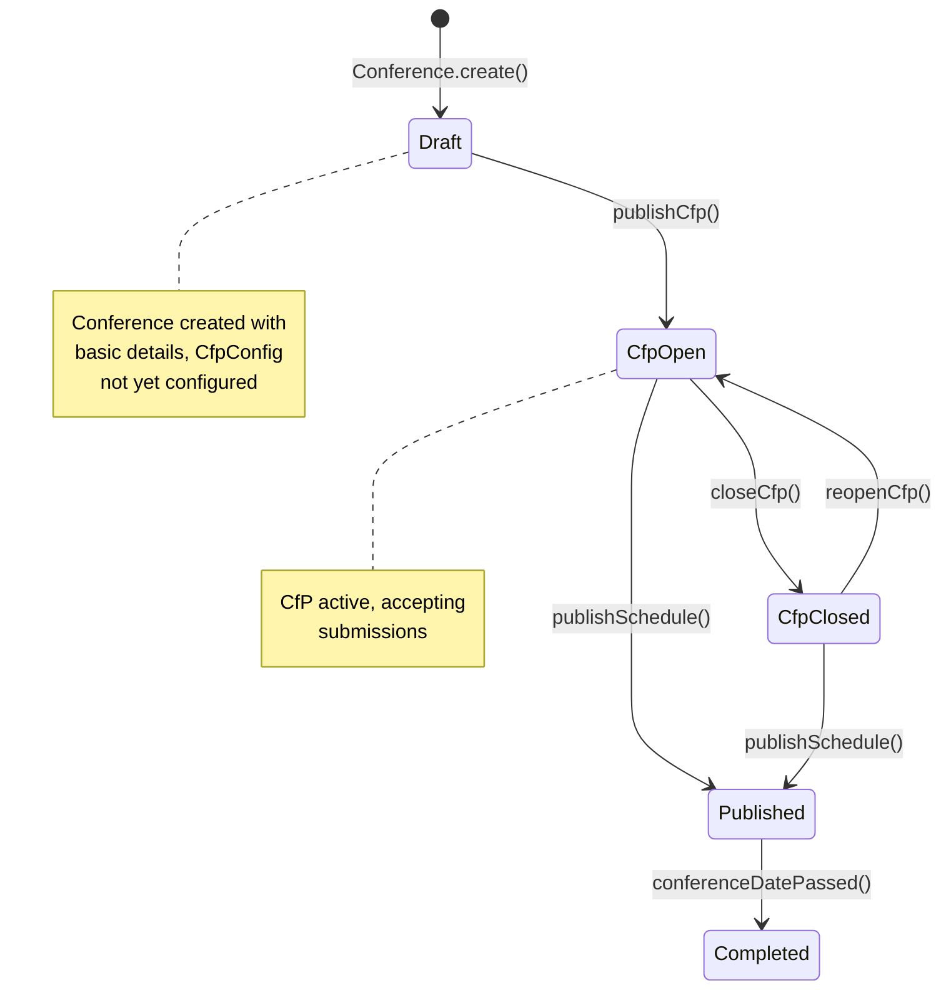

# Journey 01: Setup Conference (CfP Configuration) - Development Plan

* **Date:** 2026-07-03
* **Status:** 📋 **Planning Phase**
* **Flow:** `journey-01-setup-conference.md`
* **Context:** Conference (Bounded Context)

---

## 🎯 Overview

This document outlines the development plan for implementing **Journey 01: Setup Conference**. The organizer creates a new conference and configures its Call for Papers (CfP) settings in a single flow, transitioning the conference from creation through `DRAFT` → `CFP_OPEN` with an active CfP submission window.

**Flow Description:** A conference organizer authenticates, fills out a conference creation form (name, description, CfP dates), and submits. The system validates input, checks slug uniqueness, creates the `Conference` aggregate in `DRAFT` state, calls `publishCfp()` to transition to `CFP_OPEN`, creates a linked `CfpConfig` child entity, publishes domain events, and returns a shareable CfP URL.

**Associated Features:**
| Feature | Description | Status |
|---------|-------------|--------|
| Conference Creation | Create a new conference with validated input | 📋 Planned |
| CfP Configuration | Set submission dates and CfP settings | 📋 Planned |
| Slug Generation | Generate unique URL-safe slugs for conferences | 📋 Planned |
| Domain Events | Publish ConferenceCreated and CfpOpened events | 📋 Planned |
| Welcome Email | Send welcome email after successful creation | 📋 Planned |

---

## 📋 Prerequisites

| ADR | Decision | Status | Impact |
|-----|----------|--------|--------|
| ADR-002 | Use Supabase for Backend & Database | ✅ Approved | Database schema, RLS policies, Supabase client setup |
| ADR-004 | Use Auth0 for Authentication | ✅ Approved | JWT-based auth, organizer identity, RLS integration |
| ADR-006 | Use RESTful API Design | ✅ Approved | `POST /api/v1/conferences` endpoint structure |
| ADR-007 | Use Zod for Validation | ✅ Approved | Zod schemas for input validation (client & server) |
| ADR-009 | Adopt DDD Structure | ✅ Approved | Layer separation, domain methods, repository pattern |

---

## 🏗️ DDD Structure - Conference Context

### Project Layout

```
src/
├── domain/
│   └── conference/
│       ├── conference.ts              # Conference aggregate root
│       ├── cfp-config.ts              # CfpConfig child entity
│       ├── value-objects/
│       │   ├── conference-id.ts       # ConferenceId UUID
│       │   ├── conference-name.ts     # ConferenceName (3-100 chars)
│       │   ├── conference-slug.ts     # ConferenceSlug (URL-safe)
│       │   ├── conference-status.ts   # ConferenceStatus enum
│       │   ├── cfp-config-status.ts   # CfpConfigStatus enum
│       │   └── cfp-dates.ts           # CfpDates (start/end with validation)
│       ├── services/
│       │   └── conference-domain-service.ts  # Business rule checks
│       └── repositories/
│           └── conference-repository.ts  # Repository interface
│
├── application/
│   └── conference/
│       ├── use-cases/
│       │   └── create-conference.ts    # POST /api/v1/conferences
│       └── dto/
│           └── create-conference.dto.ts  # Request/Response types
│
├── infrastructure/
│   ├── external/
│   │   └── email-service.ts           # Resend email adapter
│   └── database/
│       ├── supabase-client.ts         # Supabase client
│       └── conference-repository.ts   # Supabase implementation
│
└── interfaces/
    ├── web/
    │   └── (dashboard)/
    │       └── conferences/
    │           ├── new/
    │           │   └── page.tsx        # Creation form
    │           └── [id]/
    │               └── page.tsx        # Dashboard overview
    └── api/
        └── v1/
            └── conferences/
                └── route.ts           # POST (create) & GET (list)
```

---

## 🗺️ Conference Lifecycle (State Machine)



---

## 📦 Implementation Phases

### Phase 1: Core Domain

**Goal:** Implement the domain model — entities, value objects, and domain services. This is the foundation that no other layer depends on.

#### Tasks

1. **Value Objects**
   - [ ] `ConferenceId` — UUIDv4 generation, immutable identifier
   - [ ] `ConferenceName` — 3-100 characters, sanitization, uniqueness context
   - [ ] `ConferenceSlug` — URL-safe generation from name, uniqueness validation
   - [ ] `ConferenceStatus` — Enum: `DRAFT`, `CFP_OPEN`, `CFP_CLOSED`, `PUBLISHED`, `COMPLETED`
   - [ ] `CfpConfigStatus` — Enum: `ACTIVE`, `INACTIVE`, `CLOSED`
   - [ ] `CfpDates` — Start/end date pair with validation (end > start, not in past, max 180 days)

2. **Entity: Conference**
   - [ ] Implement aggregate root with state machine (Draft → CfpOpen → ...)
   - [ ] Domain method: `Conference.create()` — creates in `DRAFT` state
   - [ ] Domain method: `publishCfp()` — transitions to `CFP_OPEN`, creates `CfpConfig`
   - [ ] Domain method: `closeCfp()` — transitions to `CFP_CLOSED`
   - [ ] Domain method: `reopenCfp()` — transitions back to `CFP_OPEN`
   - [ ] Domain method: `publishSchedule()` — transitions to `PUBLISHED`
   - [ ] Domain method: `conferenceDatePassed()` — transitions to `COMPLETED`
   - [ ] Domain events: `ConferenceCreated`, `CfpOpened`, `CfpClosed`, `CfpReopened`
   - [ ] Invariants: state transitions only via domain methods (no direct state mutation)

3. **Entity: CfpConfig**
   - [ ] Child entity with `ACTIVE`/`INACTIVE`/`CLOSED` states
   - [ ] Method: `validateDates()` — ensures end > start, max 180 days
   - [ ] Method: `activate()` / `deactivate()`
   - [ ] Invariant: dates must be valid, must belong to parent Conference

4. **Domain Services**
   - [ ] `checkFreeTierLimit()` — verify organizer hasn't exceeded 5 active conferences
   - [ ] `slugExists()` — delegate to repository, handle conflicts

#### Deliverables
- [ ] `src/domain/conference/conference.ts`
- [ ] `src/domain/conference/cfp-config.ts`
- [ ] `src/domain/conference/value-objects/` (6 files)
- [ ] `src/domain/conference/services/conference-domain-service.ts`
- [ ] Unit tests for all domain objects (Vitest)

---

### Phase 2: Domain Interfaces

**Goal:** Define repository contracts and the domain event system. These interfaces let infrastructure and application layers depend on abstractions.

#### Tasks

1. **Repository Interface**
   - [ ] `ConferenceRepository` interface in `src/domain/conference/repositories/`
   - [ ] Methods: `findById(id)`, `findBySlug(slug)`, `findByOrganizerId(organizerId)`, `findByStatus(status)`, `save(conference)`, `delete(id)`
   - [ ] Return types use domain entities (not DTOs)

2. **Domain Event System**
   - [ ] Create domain event types: `ConferenceCreated`, `CfpOpened`, `CfpClosed`, `CfpReopened`
   - [ ] Event publisher interface (`DomainEventPublisher`)
   - [ ] Event listener contracts

3. **Domain Exception System**
   - [ ] `InvalidConferenceError` — invalid conference data
   - [ ] `InvalidCfpConfigError` — invalid CfP configuration
   - [ ] `ConferenceNotFoundError` — conference does not exist
   - [ ] `FreeTierLimitExceededError` — organizer exceeded free tier
   - [ ] `SlugAlreadyExistsError` — slug conflict

#### Deliverables
- [ ] `src/domain/conference/repositories/conference-repository.ts`
- [ ] `src/domain/conference/events/*.ts` (4 event types)
- [ ] `src/domain/conference/exceptions/*.ts` (5 error classes)
- [ ] Unit tests for domain events and exceptions

---

### Phase 3: Infrastructure & Application

**Goal:** Implement the database layer, use cases, and external adapters.

#### Tasks

1. **Database Schema (Migration)**
   - [ ] `conferences` table: id (PK, UUID), organizer_id (FK → users), name, slug (UNIQUE), description, logo_url, status, cfp_start_date, cfp_end_date, created_at, updated_at, deleted_at
   - [ ] `cfp_configs` table: id (PK), conference_id (FK → conferences CASCADE), status, max_submissions, requires_approval, created_at, updated_at
   - [ ] RLS policies for conference and cfp_configs isolation

2. **Supabase Client**
   - [ ] `infrastructure/database/supabase-client.ts`
   - [ ] Auth integration with JWT token

3. **Repository Implementation**
   - [ ] `ConferenceRepository` with all interface methods
   - [ ] Transaction support for Conference + CfpConfig atomic save
   - [ ] Slug uniqueness check via `findBySlug`
   - [ ] Soft delete with `deleted_at`

4. **Use Cases**
   - [ ] `CreateConference` — validates input with Zod, checks slug uniqueness, creates Conference aggregate, publishes CfP, saves, publishes domain events
   - [ ] `ListConferences` — fetch by organizerId with status filtering
   - [ ] `GetConference` — fetch by id with organizer authorization

5. **Email Adapter**
   - [ ] `EmailService` interface with `sendWelcomeEmail()`
   - [ ] Resend integration (async, best-effort)

#### Deliverables
- [ ] Database migration files
- [ ] RLS policies defined
- [ ] `src/infrastructure/database/supabase-client.ts`
- [ ] `src/infrastructure/database/conference-repository.ts`
- [ ] `src/application/conference/use-cases/create-conference.ts`
- [ ] `src/application/conference/use-cases/list-conferences.ts`
- [ ] `src/application/conference/use-cases/get-conference.ts`
- [ ] `src/infrastructure/external/email-service.ts`
- [ ] Unit tests for repository and use cases

---

### Phase 4: RESTful API

**Goal:** Implement API endpoints following ADR-006 RESTful conventions.

#### Tasks

1. **API Structure**
   - [ ] Zod request/response schemas in `src/application/conference/dto/`
   - [ ] Standard error response format

2. **Endpoints**
   - [ ] `GET /api/v1/conferences` — List organizer's conferences (with status filter)
   - [ ] `POST /api/v1/conferences` — Create conference with CfP configuration
   - [ ] `GET /api/v1/conferences/:id` — Get conference details

3. **Authentication**
   - [ ] Extract organizerId from JWT (Auth0)
   - [ ] Verify organizer authorization on all endpoints
   - [ ] Return 401/403 for unauthorized access

#### Deliverables
- [ ] `src/interfaces/api/v1/conferences/route.ts`
- [ ] `src/application/conference/dto/create-conference.dto.ts`
- [ ] `src/application/conference/dto/conference-response.dto.ts`
- [ ] Unit tests for each endpoint
- [ ] API tests with mocked repository

---

### Phase 5: Frontend

**Goal:** Build the Next.js pages and components for the conference setup flow.

#### Tasks

1. **Conference Creation Form**
   - [ ] `/dashboard/conferences/new/page.tsx` — Conference creation page
   - [ ] Form fields: name, description, logo URL, CfP start date, CfP end date, max submissions, requires approval
   - [ ] Client-side Zod validation with React Hook Form
   - [ ] Date picker with validation (end > start, future dates)
   - [ ] Auto-generated slug preview
   - [ ] Loading state and error handling

2. **Conference Dashboard**
   - [ ] `/dashboard/conferences/page.tsx` — List conferences with status badges
   - [ ] Conference cards with CfP status, submission count
   - [ ] Quick action: create new conference
   - [ ] Navigation to CfP URL

3. **Conference Detail**
   - [ ] `/dashboard/conferences/[id]/page.tsx` — Conference overview
   - [ ] Display CfP URL with copy button
   - [ ] Status indicator and quick actions

#### Deliverables
- [ ] Next.js pages and layouts
- [ ] Reusable form components
- [ ] Zod form validation integration
- [ ] Component tests (React Testing Library)

---

### Phase 6: Testing & Refinement

**Goal:** Comprehensive test coverage and end-to-end flow validation.

#### Tasks

1. **Unit Tests**
   - [ ] Domain objects: 95%+ coverage
   - [ ] Use cases: 90%+ coverage
   - [ ] Value objects: 100% coverage

2. **Integration Tests**
   - [ ] Conference creation: create → publish CfP → verify CfpConfig
   - [ ] State transition validation (all legal transitions)
   - [ ] Error path testing (validation, slug conflicts, tier limits)

3. **E2E Tests**
   - [ ] **Flow E2E: Journey 01** — Complete user journey: login → create conference → verify CfP URL → dashboard redirect
   - [ ] Journey steps from `journey-01-setup-conference.md`
   - [ ] Error scenarios: invalid dates, duplicate slug, unauthenticated access

4. **Refinement**
   - [ ] Performance: API response <200ms (P95)
   - [ ] Error handling polish across all layers
   - [ ] Documentation updates (API docs, component docs)

#### Deliverables
- [ ] Test coverage reports
- [ ] E2E test suite (`tests/e2e/journey-01-setup-conference.spec.ts`)
- [ ] Performance benchmarks
- [ ] Final documentation

---

## 🚨 Key Constraints & Considerations

### From ADR-009 (DDD)
- Domain entities use methods (`publishCfp()`, `closeCfp()`), not public setters
- Value objects encapsulate all validation logic
- Repository pattern abstracts Supabase from domain
- No circular dependencies between layers

### From ADR-007 (Zod)
- Client-side validation before API calls (React Hook Form)
- Server-side validation in API routes (same schema)
- Zod schemas in `src/application/conference/dto/`

### From ADR-006 (REST)
- Resource-based URLs: `/api/v1/conferences`
- HTTP verbs for actions (POST for create)
- Standard status codes: 201 Created, 400 Bad Request, 403 Forbidden, 409 Conflict, 500 Internal Server Error

### From ADR-002 (Supabase)
- RLS policies for organizer isolation
- PostgreSQL foreign keys with CASCADE delete for CfpConfig
- Soft delete with `deleted_at` column

### From Journey 01 Flow Documentation
- Conference goes `DRAFT` → `CFP_OPEN` in single operation (no intermediate save)
- CfpConfig created atomically with Conference
- Domain events published before response is sent
- Welcome email is async/best-effort (never blocks response)
- Free tier limit (5 active conferences) checked before creation
- Slug uniqueness enforced via database constraint + application-level check

---

## 🎯 Success Criteria

### Functional
- [ ] Organizer can create a conference with valid name, dates, and CfP settings
- [ ] Conference transitions from `DRAFT` → `CFP_OPEN` on creation
- [ ] `CfpConfig` is created atomically with the conference
- [ ] Slug is generated and unique across all conferences
- [ ] `ConferenceCreated` and `CfpOpened` domain events are published
- [ ] Welcome email is sent asynchronously after creation
- [ ] Organizer is redirected to dashboard with CfP link on success
- [ ] Validation errors display inline (invalid dates, slug conflicts)
- [ ] Free tier limit (5 conferences) is enforced

### Non-Functional
- [ ] 95%+ test coverage for domain layer
- [ ] 90%+ for use cases and application layer
- [ ] API response <200ms (P95)
- [ ] Zero data corruption incidents
- [ ] Zero unauthorized access incidents
- [ ] All ADR compliance checks passed

---

## 🔗 Related Documentation

- [Bounded Context README](./README.md)
- [Conference Entity](../entities/conference.md)
- [CfpConfig Entity](../entities/cfp-config.md)
- [Business Rule: CfP Dates Validation](../business-rules/BR-001-cfp-dates-validation.md)
- [Business Rule: Conference Name Validation](../business-rules/BR-002-conference-name-validation.md)
- [Business Rule: Slug Uniqueness](../business-rules/BR-003-slug-uniqueness.md)
- [Business Rule: Free Tier Limit](../business-rules/BR-004-free-tier-conference-limit.md)
- [Invariant: State Transition Validity](../invariants/INV-001-state-transition-validity.md)
- [Invariant: Cfp Date Order](../invariants/INV-002-cfp-date-order.md)
- [Invariant: Slug Uniqueness](../invariants/INV-003-slug-uniqueness.md)
- **Flow Documentation:** [./journey-01-setup-conference.md](./journey-01-setup-conference.md)
- [Architecture Decision Records](../../../adr/)

---

*This development plan is derived from the project's ADRs, domain specifications, and Journey 01 flow documentation.*