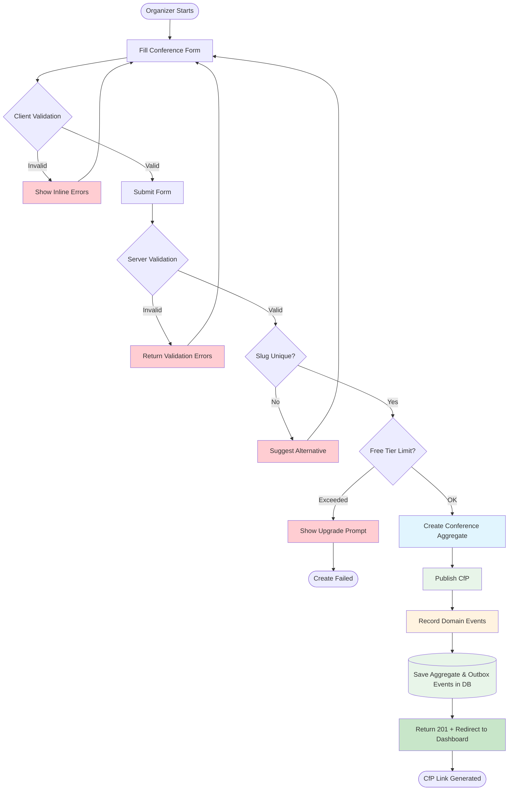
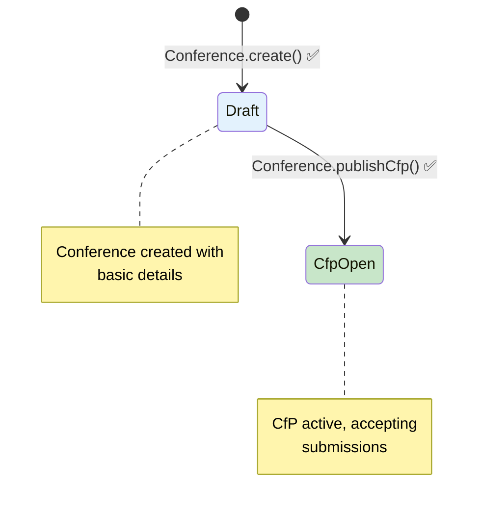

# Journey 01: Setup Conference (C4P Configuration)

## 🛡️ ADR Compliance Checklist
After generating the flow document, review the project's Architecture Decision Records (ADRs) to ensure alignment with established architectural decisions.

- [x] Entity mutations use domain methods rather than direct property setters
- [x] State transitions match entity lifecycle state machine
- [x] Domain events are published on state changes
- [x] Repository pattern is used for data access
- [x] Input validation uses schema validation

## 📋 Overview
* **As a:** Conference Organizer (Fernando)
* **I want to:** Create a new conference and configure its Call for Papers (CfP) settings
* **So that:** I can share a submission link with potential speakers and start collecting proposals
* **Source:** Inception Step 6 - User Journey Mapping (Journey 1)
* **Related Feature:** Setup Conference (C4P Configuration) from Wave 1 (MVP)
* **Impacted Entities:** 
  * [Conference Entity](../entities/conference.md) (e.g., `Conference` created with `DRAFT` -> `CFP_OPEN` status)
  * [CfpConfig Entity](../entities/cfp-config.md) (e.g., `CfpConfig` created with submission dates and settings)
* **Bounded Context:** Conference

---

## 🗺️ Visual Flow & Sequence
*Maps the sequence of user actions, domain behavior, and system reactions for Journey 1. Follows DDD patterns per ADR-009. Includes error paths and alternative flows.*

```mermaid
sequenceDiagram
    autonumber
    actor Organizer
    participant UI as Frontend
    participant API as Application Service
    participant Domain as Conference Aggregate
    participant DB as Repository & Outbox

    Note over Organizer, DB: Journey 01: Setup Conference Flow

    Organizer->>UI: Click "Create New Conference"
    Note over UI: Wave 1 auth: the organizer is resolved on submit by the injected<br/>getAuthUser() port (default mock-user-id — there is no /auth/me route, F1-D12)

    Organizer->>UI: Fill conference form<br/>(name, dates, description)
    UI->>UI: Client-side Zod validation
    
    rect rgb(232, 245, 233)
        note right of UI: Happy Path - All Valid
        Organizer->>UI: Click "Create Conference"
        UI->>API: POST /api/v1/conferences
        API->>API: Validate payload with Zod
        API->>DB: Handler: findBySlug() (BR-003) before countActiveByOrganizerId() (BR-004)
        DB-->>API: Valid & within free tier limit
        
        API->>Domain: Conference.create({name, description, slug, organizerId, cfpConfig})
        Note over Domain: Conference state: DRAFT
        API->>Domain: Conference.publishCfp()
        Note over Domain: Conference state: CFP_OPEN<br/>CfpConfig created: ACTIVE
        
        Domain->>Domain: Record ConferenceCreated<br/>& CfpOpened events
        API->>DB: Save Aggregate & Outbox Events (Transaction)
        DB-->>API: Persisted
        
        API-->>UI: 201 Created ({ data } — CreateConferenceResponse;<br/>frontend derives /cfp/{slug}, F1-D9)
        UI-->>Organizer: Redirect to Dashboard<br/>with CfP link

        Note over DB: outbox_messages rows persist as PENDING inside the same transaction —<br/>no consumer/worker is shipped (ADR-011-01, F1-D7)
    end

    rect rgb(255, 235, 238)
        note right of UI: Error Path - Validation Failed
        Organizer->>UI: Submit invalid data
        UI->>API: POST /api/v1/conferences
        API->>API: Validate payload
        API-->>UI: 400 Bad Request + errors
        UI-->>Organizer: Show inline errors
    end

    rect rgb(255, 235, 238)
        note right of API: Error Path - Duplicate Slug
        API->>DB: Check slug uniqueness
        DB-->>API: Slug exists
        API-->>UI: 409 Conflict
        UI-->>Organizer: Inline error: pick a different name (D1 — no auto-suffix)
    end

    rect rgb(255, 235, 238)
        note right of API: Error Path - Free Tier Limit Exceeded
        API->>DB: Check active count by organizerId
        DB-->>API: Active conferences >= 5 (BR-004)
        API-->>UI: 403 Forbidden + upgrade prompt
    end

    Note over Organizer, DB: Domain Events Recorded & Persisted
    Note right of Domain: CONFERENCE_CREATED / CFP_OPENED → outbox_messages (PENDING) via the ADR-017<br/>transaction — analytics / welcome-email consumers are ⏳ not built (ADR-011-01)
```

---

## 🏃‍♂️ Step-by-Step Walkthrough (Happy Path)

| Step | User Action | System Reaction | Domain/Entity Impact |
| :--- | :--- | :--- | :--- |
| **1** | Clicks "Create New Conference" button in dashboard | Loads conference creation form with validation schema | None (UI Level) |
| **2** | — | Controller resolves the organizer via the injected `getAuthUser()` auth port (`401 UNAUTHORIZED` when absent) | None (Security) |
| **3** | — | Wave 1 default auth is the mocked `mock-user-id` (ADR-004-01, F1-D12) | None (Security) |
| **4** | Enters conference name, description, and CfP dates (no logo field — excluded by F1-D8) | Client-side validates using the shared Zod schema in real-time | None (UI Level) |
| **5** | Selects CfP start and end dates via date picker | Validates end date is after start date, prevents past dates | None (UI Level) |
| **6** | Clicks "Create Conference" submit button | Shows loading state, sends POST request with payload | None (UI Level) |
| **7** | — | **Application Service:** Validates all fields against Zod schema | None (Validation) |
| **8** | — | **Repository:** Check slug uniqueness (`findBySlug`) and free tier limit (`countActiveByOrganizerId`) | None (Validation) |
| **9** | — | **Domain Layer:** `Conference.create()` mints the id via `ConferenceId.generate()` (UUIDv4) | New ConferenceId |
| **10** | — | **Domain Layer:** `Conference.create({name, description, slug, organizerId, cfpConfig})` creates Conference in `DRAFT` state | `Conference` → `DRAFT` |
| **11** | — | **Domain Layer:** `Conference.publishCfp()` transitions Conference to `CFP_OPEN` | `Conference` → `CFP_OPEN` |
| **12** | — | **Domain Layer:** `CfpConfig` child entity created with validated dates | `CfpConfig` → `ACTIVE` |
| **13** | — | **Domain Layer:** Records `ConferenceCreated` and `CfpOpened` domain events on Aggregate | Domain Events Recorded |
| **14** | — | **Repository:** `ConferenceRepository.save()` persists Aggregate & Outbox Events in a single DB transaction | Database Persisted |
| **15** | — | Outbox rows (`CONFERENCE_CREATED`, `CFP_OPENED`) remain `PENDING` — **no worker/consumer is shipped** (ADR-011-01, F1-D7) | None (async consumers ⏳ Planned) |
| **16** | — | Returns 201 Created with `{ data }` (`CreateConferenceResponse`); the UI derives the `/cfp/{slug}` link client-side (F1-D9) | Response Sent |
| **17** | Views success notification | Redirects to Conference Dashboard with pre-populated CfP link | None (UI Level) |

---

## ✅ Acceptance Criteria & Scenarios

### Scenario 1: Successful Conference Creation (Happy Path)
* **Given** the organizer is authenticated and on the dashboard,
* **When** they fill out all required conference fields and submit the form,
* **Then** the system creates a `Conference` record with `DRAFT` status,
* **And** calls `Conference.publishCfp()` to transition to `CFP_OPEN` status,
* **And** creates a linked `CfpConfig` with the specified submission window in `ACTIVE` state,
* **And** records `ConferenceCreated` and `CfpOpened` domain events into the Transactional Outbox,
* **And** redirects the user to the Conference Dashboard with a shareable CfP link.

### Scenario 2: Minimal Conference Setup
* **Given** the organizer wants to quickly set up a CfP,
* **When** they enter only the required fields (conference name, CfP start/end dates),
* **Then** the system creates the conference with default settings for optional fields,
* **And** the CfP is immediately ready to accept submissions.

---

## ⚠️ Edge Cases, Errors, & Boundary Conditions

### 1. Business Logic Failures

| What If | System Handling | Domain / Application Method | Entity Impact |
|---------|-----------------|-----------------------------|---------------|
| User selects CfP end date before start date | Display inline validation error *"End date must be after start date"*, prevent form submission | `CfpConfig.create()` throws `CfpDatesInvalidError` ([BR-001](../business-rules/BR-001-cfp-dates-validation.md), [INV-002](../invariants/INV-002-cfp-date-order.md)) | No lifecycle change; no entities created |
| Conference name contains special characters or is too long | Reject with `ConferenceNameTooLongError` (no truncation — organizer must shorten the name) | `ConferenceName.create()` validates and trims | `Conference` not created |
| User tries to create more than 5 active conferences (free tier limit) | Display upgrade prompt with pricing information | `CreateConferenceHandler.execute()` evaluates `countActiveByOrganizerId(organizerId) >= 5` | No lifecycle change; `Conference` not created |
| Slug already exists in database | Display error *"Conference name already taken, try a different name"* | `ConferenceRepository.findBySlug()` returns existing conference | No lifecycle change; `Conference` not created |

### 2. Technical Failures

| What If | System Handling | Domain Impact |
|---------|-----------------|---------------|
| Database connection fails during Conference creation | Rollback any partial writes, display generic error message *"Unable to create conference. Please try again."*, log error to monitoring service | No entities created; transaction aborted |
| Slug generation produces a duplicate (two conferences with same name) | Reject with `409 SLUG_EXISTS` and show an inline form error; **no** numeric-suffix retry (decision D1) | `Conference` not created |
| Welcome email is never sent | By design in Wave 1: outbox rows persist as `PENDING` but nothing calls `OutboxProcessor.processPending()` — an append-only log (ADR-011-01, F1-D7) | `Conference` and `CfpConfig` persisted; no external side effect fires |

### 3. Validation Boundary Conditions

| What If | System Handling | Domain Method | Entity Impact |
|---------|-----------------|---------------|---------------|
| CfP window is set for more than 180 days | Reject with `400 CFP_DATES_INVALID` — "Cfp window cannot be more than 180 days" (hard cap, F1-D4) | `CfpConfig.create()` window check | No lifecycle change; no entities created |
| User tries to create conference with a date in the past | Block submission with error *"CfpStartDate must be in the future or today"* | `CfpStartDate.create()` throws `CfpStartDateNotInFutureError` | No lifecycle change; no entities created |
| No authenticated user | Controller returns `401 UNAUTHORIZED` (`unauthorizedResponse()`) | `getAuthUser()` auth port — mocked `mock-user-id` in Wave 1 (F1-D12) | No entities created |

---

## 🛠️ Technical Notes & Validation Rules

### RESTful API Endpoint (ADR-006)

```
POST /api/v1/conferences
Content-Type: application/json
Authorization: Bearer {jwt}

Request Body:
{
  "name": "string (required, 3-100 characters)",
  "description": "string (optional, max 1000 characters, default '')",
  "cfpStartDate": "ISO 8601 date (required, must be >= today, <= today + 365d)",
  "cfpEndDate": "ISO 8601 date (required, must be > cfpStartDate, window <= 180 days)",
  "maxSubmissions": "integer (optional, positive, default: unlimited)",
  "requiresApproval": "boolean (optional, default: true)"
}

> No `logoUrl` field (F1-D8 — not in the contract nor the DB schema). `organizerId` is **not**
> accepted from the body; it comes from the auth port.

Response: 201 Created
{
  "data": {
    "id": "uuid",
    "name": "string",
    "description": "string",
    "slug": "string",
    "status": "CFP_OPEN",
    "organizerId": "string",
    "cfp": {
      "isOpen": true,
      "startDate": "ISO 8601",
      "endDate": "ISO 8601",
      "maxSubmissions": "number | undefined",
      "requiresApproval": true
    },
    "createdAt": "ISO 8601",
    "updatedAt": "ISO 8601"
  }
}

> The response is `CreateConferenceResponse` wrapped in `{ data }` — there is **no `cfpUrl`** field
> (F1-D9: the dashboard derives `/cfp/{slug}` client-side) and no `cfpConfig.status` (the DTO
> exposes `cfp.isOpen` instead).
```

### Zod Validation Schema (ADR-007)

```typescript
// packages/api-definitions/src/zod/conference.ts (as shipped)
export const ConferenceCreateSchema = z
  .object({
    name: z.string().min(3, {message: 'Name must be at least 3 characters'}).max(100),
    description: z.string().max(1000).optional().default(''),
    cfpStartDate: z.iso.date({message: 'Start date must be a valid date'}),
    cfpEndDate: z.iso.date({message: 'End date must be a valid date'}),
    maxSubmissions: z.number().int().positive().optional(),
    requiresApproval: z.boolean().optional().default(true),
  })
  .refine((data) => data.cfpEndDate > data.cfpStartDate, {
    message: 'End date must be after start date',
  });
```

> Dates are validated as ISO date **strings** (`z.iso.date()`), not coerced `Date`s; the domain
> VOs (`CfpStartDate`/`CfpEndDate`/`CfpConfig.create()`) remain the final authority (F1-D10).

### Database Constraints (ADR-002 - Supabase)

| Constraint | Description |
|------------|-------------|
| `conferences.slug` | `conferences_slug_unique` — UNIQUE across all conferences (`schema.ts:36`) |
| `conferences.organizer_id` | Indexed (`idx_conferences_organizer_id`); **no FK to a `users` table in Wave 1** — auth is mocked (F1-D12) |
| `conferences.cfp_config` | JSONB column **embedded in `conferences`** — there is no separate `cfp_configs` table |
| `outbox_messages` | Append-only event log written in the same transaction (ADR-017) |

### Row-Level Security (ADR-002 — ⏳ Planned, not shipped)

No `CREATE POLICY` / RLS statement exists in migrations `0000`/`0001`. Wave 1 access control lives
in the application layer: the controller calls `getAuthUser()` and answers
`401 UNAUTHORIZED` when no user is present; `organizerId` is taken from the auth port, never from
the request body. The Supabase RLS policy below is the **target state**, not shipped SQL:

```sql
-- ⏳ Planned (ADR-002): Organizer can only create conferences for their own account
CREATE POLICY "Organizers can create conferences"
ON conferences FOR INSERT
WITH CHECK (organizer_id = auth.uid());
```

### Generated Fields

| Field | Value |
|-------|-------|
| `slug` | URL-safe version of conference name (e.g., "My Conference 2026" → "my-conference-2026") |
| `cfpUrl` | *(not returned by the API — the frontend derives `{baseUrl}/cfp/{slug}` from `data.slug`, F1-D9)* |
| `status` | `CFP_OPEN` upon creation (after `publishCfp()` call) |

### Enforced Business Rules

* [BR-001](../business-rules/BR-001-cfp-dates-validation.md): CfP Dates Must Be Valid
* [BR-002](../business-rules/BR-002-conference-name-validation.md): Conference Name Must Meet Requirements
* [BR-003](../business-rules/BR-003-slug-uniqueness.md): Conference Slug Must Be Unique
* [BR-004](../business-rules/BR-004-free-tier-conference-limit.md): Free Tier Conference Creation Limit

### Enforced Invariants

* [INV-001](../invariants/INV-001-state-transition-validity.md): Conference State Transitions Must Follow State Machine (this flow exercises `DRAFT → CFP_OPEN` via `publishCfp()`)
* [INV-002](../invariants/INV-002-cfp-date-order.md): Cfp End Date Must Be After Start Date
* [INV-003](../invariants/INV-003-slug-uniqueness.md): Conference Slug Must Be Unique Across All Conferences

### Implementation & tests

*Where this flow actually lives, so changing a rule above starts here. Convention:
[Traceability](../../../guidelines/traceability.md).*

| Concern | Where |
| ------- | ----- |
| Entry point | `apps/frontend/src/app/api/v1/conferences/route.ts` |
| Controller | `packages/modules/conference/src/interfaces/http/create-conference.controller.ts` |
| Application | `packages/modules/conference/src/application/commands/create-conference/create-conference.handler.ts` |
| Domain | `packages/modules/conference/src/domain/conference.ts` + `value-objects/` |
| Infrastructure | `packages/modules/conference/src/infrastructure/database/conference.repository.ts` |
| Tests | `tests/unit/modules/conference/`, `tests/backend/modules/conference/`, `tests/integration/modules/conference/`, `tests/e2e/conference-setup.spec.ts` |

> **Both ends or it didn't ship:** every rule and invariant listed in the two sections above links
> back to this flow in its own `Traces up to` list. Adding a rule here means adding that link too.

### Domain Events Published

| Domain Event | Triggered By | Side Effects |
|-------|--------------|--------------|
| `ConferenceCreatedEvent` (`CONFERENCE_CREATED`) | `Conference.create()` | Persisted to `outbox_messages` (PENDING) in the ADR-017 transaction. Analytics/logging consumers ⏳ not built |
| `CfpOpenedEvent` (`CFP_OPENED`) | `Conference.publishCfp()` | Same outbox write. Welcome-email worker is ⏳ out of scope (ADR-011-01, F1-D7) — **nothing dispatches the outbox yet** |

---

## 🔄 Alternative Flow (Flowchart)

Shows decision points and error handling paths:



---

## 📊 Entity State Diagram

Shows the Conference entity lifecycle **as shipped**. Unbuilt states/mutators are specified in
[entities/conference.md](../entities/conference.md) (built vs ⏳ Planned split), not drawn here as
reachable behaviour:



---

## 📝 Mermaid Diagram & Walkthrough Consistency

This flow document follows the consistency guidelines:

1. **Step Numbering:** Each step in the walkthrough table corresponds to a logical action in the Mermaid diagram
2. **Sequence Alignment:** The order of steps matches the sequence shown in the Mermaid diagram
3. **Completeness:** Every major action in the Mermaid diagram has a corresponding step in the walkthrough
4. **Detail Level:** The walkthrough provides additional detail for each Mermaid interaction
5. **Numbering Strategy:** Sequential numbering (1-17) where each number represents a distinct action/interaction

## 🔗 Linked Documentation

| Document | Relationship |
|----------|--------------|
| [Conference Entity](../entities/conference.md) | Conference entity lifecycle and state machine |
| [CfpConfig Entity](../entities/cfp-config.md) | CfpConfig child entity lifecycle |
| [ConferenceId Value Object](../value-objects/conference-id.md) | Conference identifier value object |
| [ConferenceStatus Value Object](../value-objects/conference-status.md) | Conference status enum value object |
| [ADR-002: Use Supabase for Backend](../../../../adr/002-00-use-supabase-for-backend-and-database.md) | Supabase and RLS decision |
| [ADR-006: Use RESTful API Design](../../../../adr/006-use-restful-api-design.md) | RESTful API design decision |
| [ADR-007: Use Zod for Validation](../../../../adr/007-use-zod-for-validation.md) | Zod validation strategy |
| [ADR-009: Adopt DDD Structure](../../../../adr/009-adopt-domain-driven-design-structure.md) | DDD architecture decision |
| [ADR-011-01: Optional Email Abstraction](../../../../adr/011-01-use-resend-email-amendment-optional-abstraction.md) | Asynchronous email sending |
| [ADR-017: Drizzle ORM](../../../../adr/017-use-drizzle-orm-with-ddd-transactions.md) | Drizzle ORM and transactional outbox |
| [ADR-023: Comprehensive Monorepo Structure](../../../../adr/023-comprehensive-monorepo-structure-update.md) | Monorepo module and app boundaries |

---

## 📜 History

* **2026-09-16:** Docs audit alignment with shipped code and the Feature 01/02 decision log
  (F1/D1, D4, D7, D8, D9, D12): removed the Outbox-Worker/Resend welcome-email elements (no
  consumer calls `processPending()`), `logoUrl` (never in the contract or schema), and `cfpUrl`
  from the 201 body (frontend derives `/cfp/{slug}`); response corrected to
  `{ data: CreateConferenceResponse }`; Zod block replaced with the shipped
  `ConferenceCreateSchema` (`z.iso.date()`); `CfpConfig.validateDates()` references removed
  (checks live in `CfpConfig.create()`); the 180-day window is a hard `400` reject, not a
  soft warning; unauthorized path corrected to `401` via `getAuthUser()` and the RLS block
  marked ⏳ Planned (no policy exists in migrations `0000`/`0001`); `GET /auth/me` replaced
  by the auth-port description; entity state diagram reduced to shipped transitions
  (`create()` → `publishCfp()`), with planned states deferred to the built/⏳ split in
  [entities/conference.md](../entities/conference.md); INV-001 added to Enforced Invariants
  (reciprocity with the invariant doc).
