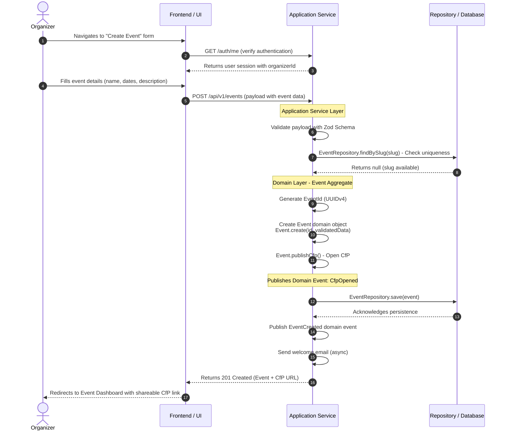

# Journey 01: Setup Event (C4P Configuration)

## 📋 Overview
* **As a:** Event Organizer (Fernando)
* **I want to:** Create a new event and configure its Call for Papers (CfP) settings
* **So that:** I can share a submission link with potential speakers and start collecting proposals
* **Source:** Inception Step 6 - User Journey Mapping (Journey 1)
* **Related Feature:** Setup Event (C4P Configuration) from Wave 1 (MVP)
* **Impacted Entities:** 
  * [[../entities/event]] (e.g., `Event` created with `DRAFT` -> `CFP_OPEN` status)
  * [[../entities/cfp-config]] (e.g., `CfpConfig` created with submission dates and settings)
* **Bounded Context:** Event

---

## 🗺️ Visual Flow & Sequence
*Maps the sequence of user actions, domain behavior, and system reactions for Journey 1. Follows DDD patterns per ADR-009. Natively renders in GitHub, GitLab, and Obsidian.*



---

## 🏃‍♂️ Step-by-Step Walkthrough (Happy Path)

| Step | User Action | System Reaction | Domain/Entity Impact |
| :--- | :--- | :--- | :--- |
| **1** | Clicks "Create New Event" button in dashboard | Loads event creation form with validation schema | None (UI Level) |
| **2** | — | GET /auth/me - Verify authentication | None (Security) |
| **3** | — | Returns user session with organizerId | None (Security) |
| **4** | Enters event name, description, and logo URL | Client-side validates using Zod schema in real-time | None (UI Level) |
| **5** | Selects CfP start and end dates via date picker | Validates end date is after start date, prevents past dates | None (UI Level) |
| **6** | Clicks "Create Event" submit button | Shows loading state, sends POST request with payload | None (UI Level) |
| **7** | — | **Application Service:** Validates all fields against Zod schema | None (Validation) |
| **8** | — | **Repository:** Check slug uniqueness (findBySlug) | None (Validation) |
| **9** | — | **Domain Layer:** `EventId.generate()` creates UUIDv4 | New EventId |
| **10** | — | **Domain Layer:** `Event.create(id, validatedData)` creates Event in `DRAFT` state | `Event` → `DRAFT` |
| **11** | — | **Domain Layer:** `Event.publishCfp()` transitions Event to `CFP_OPEN` | `Event` → `CFP_OPEN` |
| **12** | — | **Domain Layer:** `CfpConfig` child entity created with validated dates | `CfpConfig` → `ACTIVE` |
| **13** | — | **Domain Layer:** Publishes `EventCreated` and `CfpOpened` domain events | Domain Events Published |
| **14** | — | **Repository:** `EventRepository.save()` persists Event and CfpConfig | Database Persisted |
| **15** | — | **Application Service:** Triggers welcome email (async) via Resend | External Service |
| **16** | — | Returns 201 Created with Event and CfP URL | Response Sent |
| **17** | Views success notification | Redirects to Event Dashboard with pre-populated CfP link | None (UI Level) |

---

## ✅ Acceptance Criteria & Scenarios

### Scenario 1: Successful Event Creation (Happy Path)
* **Given** the organizer is authenticated and on the dashboard,
* **When** they fill out all required event fields and submit the form,
* **Then** the system creates an `Event` record with `DRAFT` status,
* **And** calls `Event.publishCfp()` to transition to `CFP_OPEN` status,
* **And** creates a linked `CfpConfig` with the specified submission window in `ACTIVE` state,
* **And** publishes `EventCreated` and `CfpOpened` domain events,
* **And** redirects the user to the Event Dashboard with a shareable CfP link.

### Scenario 2: Minimal Event Setup
* **Given** the organizer wants to quickly set up a CfP,
* **When** they enter only the required fields (event name, CfP start/end dates),
* **Then** the system creates the event with default settings for optional fields,
* **And** the CfP is immediately ready to accept submissions.

---

## ⚠️ Edge Cases, Errors, & Boundary Conditions

### 1. Business Logic Failures

| What If | System Handling | Domain Method | Entity Impact |
|---------|-----------------|---------------|---------------|
| User selects CfP end date before start date | Display inline validation error *"End date must be after start date"*, prevent form submission | `CfpConfig.validateDates()` throws `InvalidCfpConfigError` | No lifecycle change; no entities created |
| Event name contains special characters or is too long | Sanitize input, truncate to max 100 characters, display warning | `EventName.create()` validates and sanitizes | `Event` created with sanitized name |
| User tries to create more than 5 active events (free tier limit) | Display upgrade prompt with pricing information | `CreateEvent.execute()` checks subscription tier | No lifecycle change; `Event` not created |
| Slug already exists in database | Display error *"Event name already taken, try a different name"* | `EventRepository.findBySlug()` returns existing event | No lifecycle change; `Event` not created |

### 2. Technical Failures

| What If | System Handling | Domain Impact |
|---------|-----------------|---------------|
| Database connection fails during Event creation | Rollback any partial writes, display generic error message *"Unable to create event. Please try again."*, log error to monitoring service | No entities created; transaction aborted |
| Slug generation produces a duplicate (two events with same name) | Append numeric suffix (e.g., `my-event-2`), retry up to 3 times | `Event` created with unique slug |
| Welcome email fails to send | Log error, continue with successful response (email is best-effort) | `Event` and `CfpConfig` persisted; email queued for retry |

### 3. Validation Boundary Conditions

| What If | System Handling | Domain Method | Entity Impact |
|---------|-----------------|---------------|---------------|
| CfP window is set for more than 180 days | Warn user that extended windows may reduce submission quality, require confirmation | `CfpConfig.validateDates()` checks duration | `CfpConfig` created with extended dates after confirmation |
| User tries to create event with a date in the past | Block submission with error *"Event dates must be in the future"* | `CfpStartDate.create()` validates future date | No lifecycle change; no entities created |
| User is not authorized (organizerId mismatch) | Return 403 Forbidden, log security violation | RLS policy prevents access | No entities created |

---

## 🛠️ Technical Notes & Validation Rules

### RESTful API Endpoint (ADR-006)

```
POST /api/v1/events
Content-Type: application/json
Authorization: Bearer {jwt}

Request Body:
{
  "name": "string (required, 3-100 characters)",
  "description": "string (optional, max 1000 characters)",
  "logoUrl": "string (optional, valid URL)",
  "cfpStartDate": "ISO 8601 date (required, must be >= today)",
  "cfpEndDate": "ISO 8601 date (required, must be > cfpStartDate)",
  "maxSubmissions": "integer (optional, default: unlimited)",
  "requiresApproval": "boolean (optional, default: true)"
}

Response: 201 Created
{
  "id": "uuid",
  "name": "string",
  "slug": "string",
  "status": "CFP_OPEN",
  "cfpConfig": {
    "startDate": "ISO 8601 date",
    "endDate": "ISO 8601 date",
    "status": "ACTIVE"
  },
  "cfpUrl": "https://sessioflow.app/cfp/{slug}"
}
```

### Zod Validation Schema (ADR-007)

```typescript
const eventCreateSchema = z.object({
  name: z.string().min(3).max(100),
  description: z.string().max(1000).optional(),
  logoUrl: z.string().url().optional().or(z.literal('')),
  cfpStartDate: z.coerce.date(),
  cfpEndDate: z.coerce.date(),
  maxSubmissions: z.number().int().positive().optional(),
  requiresApproval: z.boolean().default(true)
}).refine(data => data.cfpEndDate > data.cfpStartDate, {
  message: "End date must be after start date"
});
```

### Database Constraints (ADR-002 - Supabase)

| Constraint | Description |
|------------|-------------|
| `events.slug` | UNIQUE across all events |
| `events.organizerId` | FOREIGN KEY to `users.id` with RLS policy |
| `cfp_configs.eventId` | FOREIGN KEY to `events.id` with CASCADE delete |

### Row-Level Security (ADR-002)

```sql
-- RLS Policy: Organizer can only create events for their own account
CREATE POLICY "Organizers can create events"
ON events FOR INSERT
WITH CHECK (organizer_id = auth.uid());
```

### Generated Fields

| Field | Value |
|-------|-------|
| `slug` | URL-safe version of event name (e.g., "My Event 2026" → "my-event-2026") |
| `cfpUrl` | `{baseUrl}/cfp/{slug}` (e.g., `https://sessioflow.app/cfp/my-event-2026`) |
| `status` | `CFP_OPEN` upon creation (after `publishCfp()` call) |

### Domain Events Published

| Event | Triggered By | Side Effects |
|-------|--------------|--------------|
| `EventCreated` | `Event.create()` | Log event creation, initialize analytics |
| `CfpOpened` | `Event.publishCfp()` | Send welcome email to organizer, notify subscribers |

---

## 🔗 Linked Documentation

| Document | Relationship |
|----------|--------------|
| [[../entities/event]] | Event entity lifecycle and state machine |
| [[../entities/cfp-config]] | CfpConfig child entity lifecycle |
| [[../value-objects/event-id]] | Event identifier value object |
| [[../value-objects/event-status]] | Event status enum value object |
| [[../../adr/009-adopt-domain-driven-design-structure.md]] | DDD architecture decision |
| [[../../adr/006-use-restful-api-design.md]] | RESTful API design decision |
| [[../../adr/007-use-zod-for-validation.md]] | Zod validation strategy |
| [[../../adr/002-use-supabase-for-backend-and-database.md]] | Supabase and RLS decision |
