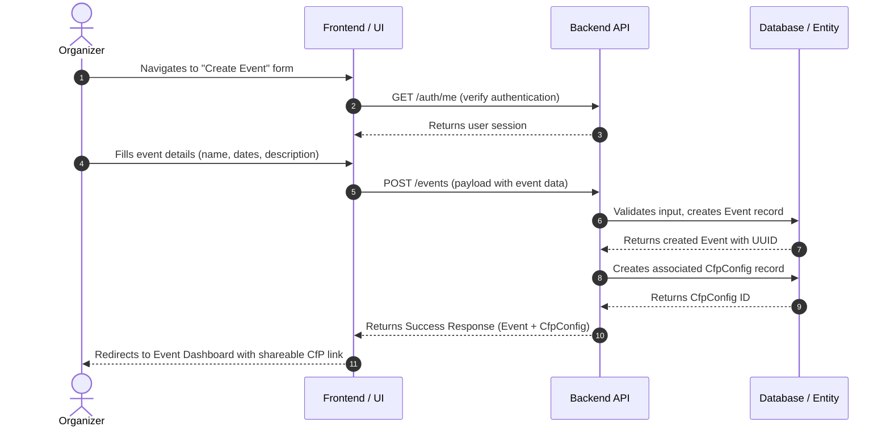

# Journey 01: Setup Event (C4P Configuration)

## 📋 Overview
* **As a:** Event Organizer (Fernando)
* **I want to:** Create a new event and configure its Call for Papers (CfP) settings
* **So that:** I can share a submission link with potential speakers and start collecting proposals
* **Source:** Inception Step 6 - User Journey Mapping (Journey 1)
* **Related Feature:** Setup Event (C4P Configuration) from Wave 1 (MVP)
* **Impacted Entities:** 
  * [[event]] (e.g., `Event` created with `draft` -> `active` status)
  * [[cfp-config]] (e.g., `CfpConfig` created with submission dates and settings)

---

## 🗺️ Visual Flow & Sequence
*Maps the sequence of user actions and system reactions for Journey 1 from the Inception documentation. Natively renders in GitHub, GitLab, and Obsidian.*



---

## 🏃‍♂️ Step-by-Step Walkthrough (Happy Path)

| Step | User Action | System Reaction | Entity Lifecycle Impact |
| :--- | :--- | :--- | :--- |
| **1** | Clicks "Create New Event" button in dashboard | Loads event creation form with validation schema | None (UI Level) |
| **2** | Enters event name, description, and logo URL | Client-side validates required fields in real-time | None (UI Level) |
| **3** | Selects CfP start and end dates via date picker | Validates end date is after start date, prevents past dates | None (UI Level) |
| **4** | Clicks "Create Event" submit button | Shows loading state, sends POST request with payload | None (UI Level) |
| **5** | — | Validates all fields against Zod schema, checks user authorization | `Event` -> `draft` |
| **6** | — | Generates unique event slug, creates Event record in database | `Event` -> `active` |
| **7** | — | Creates associated `CfpConfig` with submission window dates | `CfpConfig` -> `active` |
| **8** | — | Returns 201 Created with Event object and CfP submission URL | None (Response) |
| **9** | Views success notification | Redirects to Event Dashboard with pre-populated CfP link | None (UI Level) |

---

## ✅ Acceptance Criteria & Scenarios

### Scenario 1: Successful Event Creation (Happy Path)
* **Given** the organizer is authenticated and on the dashboard,
* **When** they fill out all required event fields and submit the form,
* **Then** the system creates an `Event` record with `active` status,
* **And** creates a linked `CfpConfig` with the specified submission window,
* **And** redirects the user to the Event Dashboard with a shareable CfP link.

### Scenario 2: Minimal Event Setup
* **Given** the organizer wants to quickly set up a CfP,
* **When** they enter only the required fields (event name, CfP start/end dates),
* **Then** the system creates the event with default settings for optional fields,
* **And** the CfP is immediately ready to accept submissions.

---

## ⚠️ Edge Cases, Errors, & Boundary Conditions

### 1. Business Logic Failures
* **What if:** The user selects a CfP end date before the start date?
* **System Handling:** Display inline validation error *"End date must be after start date"*, prevent form submission.
* **Entity Impact:** No lifecycle change occurs; no entities created.

* **What if:** The event name contains special characters or is too long?
* **System Handling:** Sanitize input, truncate to max 100 characters, display warning.
* **Entity Impact:** `Event` created with sanitized name.

* **What if:** The user tries to create more than 5 active events (free tier limit)?
* **System Handling:** Display upgrade prompt with pricing information.
* **Entity Impact:** No lifecycle change occurs; `Event` not created.

### 2. Technical Failures
* **What if:** Database connection fails during Event creation?
* **System Handling:** Rollback any partial writes, display generic error message *"Unable to create event. Please try again."*, log error to monitoring service.
* **Entity Impact:** No entities created; transaction aborted.

* **What if:** Slug generation produces a duplicate (two events with same name)?
* **System Handling:** Append numeric suffix (e.g., `my-event-2`), retry up to 3 times.
* **Entity Impact:** `Event` created with unique slug.

### 3. Validation Boundary Conditions
* **What if:** CfP window is set for more than 180 days?
* **System Handling:** Warn user that extended windows may reduce submission quality, require confirmation.
* **Entity Impact:** `CfpConfig` created with extended dates after confirmation.

* **What if:** User tries to create event with a date in the past?
* **System Handling:** Block submission with error *"Event dates must be in the future"*.
* **Entity Impact:** No lifecycle change occurs.

---

## 🛠️ Technical Notes & Validation Rules
* **Required Input Payload:**
  ```json
  {
    "name": "string (required, 3-100 characters)",
    "description": "string (optional, max 1000 characters)",
    "logoUrl": "string (optional, valid URL)",
    "cfpStartDate": "ISO 8601 date (required, must be >= today)",
    "cfpEndDate": "ISO 8601 date (required, must be > cfpStartDate)",
    "maxSubmissions": "integer (optional, default: unlimited)",
    "requiresApproval": "boolean (optional, default: true)"
  }
  ```

* **Zod Validation Schema:**
  ```typescript
  const eventCreateSchema = z.object({
    name: z.string().min(3).max(100),
    description: z.string().max(1000).optional(),
    logoUrl: z.string().url().optional().or(z.literal('')),
    cfpStartDate: z.coerce.date(),
    cfpEndDate: z.coerce.date(),
    maxSubmissions: z.number().int().positive().optional(),
    requiresApproval: z.boolean().default(true)
  }).refine(data => data.cfpEndDate > data.cfpStartDate, {
    message: "End date must be after start date"
  });
  ```

* **Database Constraints:**
  * `events.slug` must be UNIQUE across all events
  * `events.organizerId` is a FOREIGN KEY to `users.id`
  * `cfp_configs.eventId` is a FOREIGN KEY to `events.id` with CASCADE delete

* **Generated Fields:**
  * `slug`: URL-safe version of event name (e.g., "My Event 2026" -> "my-event-2026")
  * `cfpUrl`: `{baseUrl}/cfp/{slug}` (e.g., `https://sessioflow.app/cfp/my-event-2026`)
  * `status`: Default to `active` upon creation

* **Post-Creation Side Effects:**
  * Send welcome email to organizer with CfP link
  * Create default event permissions (organizer = full access)
