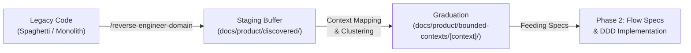

# Discovered Domain Rules (Brownfield Staging Buffer)

This directory serves as the **staging buffer** for Business Rules and Domain Invariants extracted through software archeology / reverse engineering from legacy or brownfield codebases.

---

## 1. Purpose of the Staging Buffer

In legacy codebases (often structured as a *Big Ball of Mud*), business policies and transactional invariants are frequently intertwined across monolithic controllers, god services, or database triggers without clear architectural boundaries.

Forcing an extracted rule into a formal **Bounded Context** on day one creates artificial boundaries that can distort the domain model.

The `discovered/` buffer allows you to:
1. **Safely extract and document** rules and invariants as they currently exist in legacy code.
2. **Preserve direct source traceability** (`Source File`, line numbers, and original conditions).
3. **Defer bounded context assignment** until domain clustering and context mapping are mature.

---

## 2. Directory Structure

```text
docs/product/discovered/
├── README.md                          # This guide
├── business-rules/                    # Staged business policies, workflows, and calculations
│   └── BR-RAW-[XXX]-[rule-name].md
└── invariants/                        # Staged transactional data integrity constraints
    └── INV-RAW-[XXX]-[invariant-name].md
```

---

## 3. Metadata Standards for Staged Rules

Every document in `discovered/` must capture source traceability metadata in its header:

```markdown
# BR-RAW-001: Automatic Reservation Expiration

* **Source File:** `src/legacy/services/OrderManager.ts:145-189`
* **Extraction Date:** 2026-09-15
* **Candidate Bounded Context:** [TBD / Suspected: `ticketing` or `billing`]
* **Domain Tags:** `[checkout, reservation, timeout, expiration]`
```

---

## 4. The Graduation Lifecycle

Once a set of rules has been staged in `discovered/`:



1. **Extraction:** Use `/reverse-engineer-domain` to analyze legacy files or modules. Ambiguous rules land here.
2. **Clustering / Context Mapping:** Review staged rules to discover cohesive domain aggregates and bounded context boundaries.
3. **Graduation:** Move the validated rule into `docs/product/bounded-contexts/{bounded-context}/business-rules/` or `invariants/`, updating the rule number and removing the `RAW` prefix.
