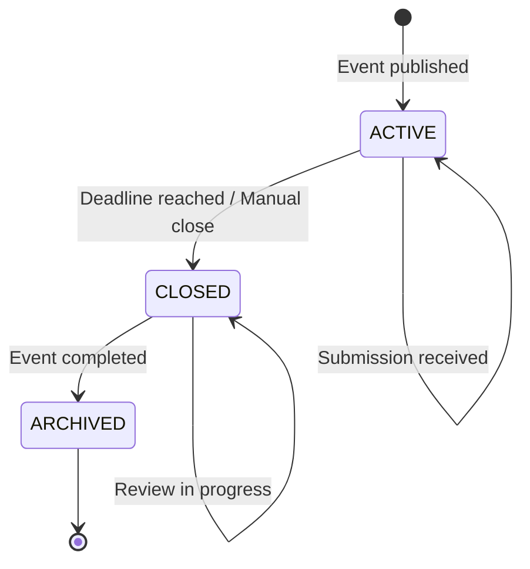

# Entity: CfpConfig

## 📋 Definition & Context
* **Description:** Configuration settings for a Call for Papers (CfP) submission window. Defines the submission period, rules, and settings for how speakers can submit proposals to an event.
* **Database Table / Collection:** `cfp_configs`
* **Primary Key / Identifier:** `UUIDv4`
* **Owner Team:** Core Event Team

---

## 🗺️ State Machine Diagram
*This Mermaid diagram models all valid states and transitions for this entity. It renders natively in GitHub, GitLab, and Obsidian.*

---

## 🔄 State Transition Matrix
*A strict mapping of every allowed state change, the trigger behind it, and any automatic system side-effects.*

| Current State | Event / Trigger | Target State | Guards / Conditions | Side Effects / Actions |
| :--- | :--- | :--- | :--- | :--- |
| `ACTIVE` | Event transitions to `CFP_OPEN` | `ACTIVE` | Event status = CFP_OPEN | Enable submission form; start accepting proposals. |
| `ACTIVE` | Organizer manually closes CfP | `CLOSED` | Organizer has admin rights | Disable submission form; lock all submissions for review. |
| `ACTIVE` | System cron (deadline reached) | `CLOSED` | Current time >= cfpEndDate | Auto-close submissions; send closure notifications to speakers. |
| `CLOSED` | Event transitions to `COMPLETED` | `ARCHIVED` | Event status = COMPLETED | Archive all submission data; make read-only. |
| `CLOSED` | New submission attempt | `CLOSED` | CfP is closed | Reject submission; return error to user. |

---

## 🔍 State Definitions
*Detailed criteria for what each state means in plain English.*

* **`ACTIVE`**: The CfP is open and accepting submissions. Speakers can create accounts, fill out the submission form, and submit proposals. The submission deadline is in the future.

* **`CLOSED`**: The CfP has been closed (either manually by the organizer or automatically by the deadline). No new submissions are accepted. Existing submissions are locked and can only be viewed or reviewed by organizers.

* **`ARCHIVED`**: The CfP configuration has been archived along with the event. All data is preserved in read-only mode for historical reference and reporting.

---

## 🔗 Linked User Stories & Flows
*Relative links to the User Stories/Flows that interact with or trigger mutations on this entity.*

* [[../../product/flows/journey-01-setup-event.md]]: Creates `CfpConfig` with `ACTIVE` state
* [[../../product/flows/journey-02-submit-proposal.md]]: Submissions only accepted when `ACTIVE`
* [[../../product/flows/journey-03-review-sessions.md]]: Review only possible when `CLOSED`
* [[../../product/flows/journey-04-acceptance-logistics.md]]: Archives when event completes
