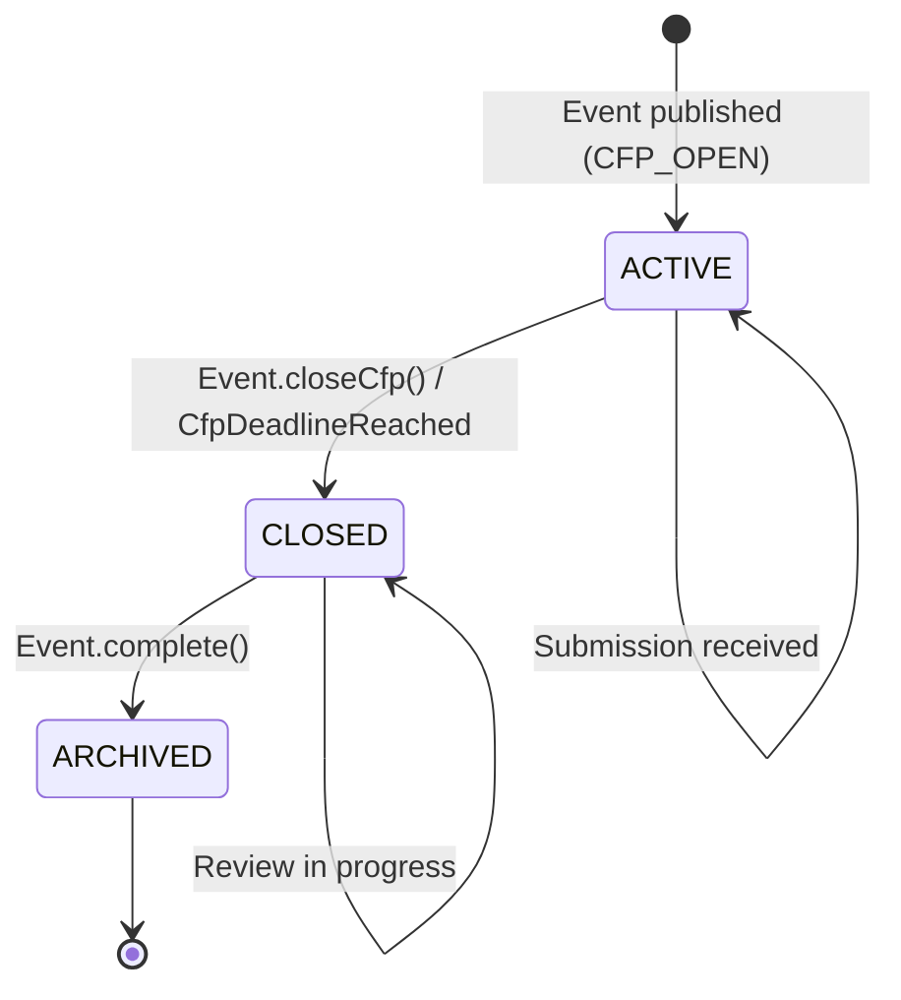

# Entity: CfpConfig

## 📋 Definition & Context
* **Description:** Configuration settings for a Call for Papers (CfP) submission window. Defines the submission period, rules, and settings for how speakers can submit proposals to an event.
* **Aggregate Relationship:** Child Entity of `Event` Aggregate (not a root entity)
* **Database Table / Collection:** `cfp_configs` (embedded or separate table with eventId foreign key)
* **Primary Key / Identifier:** Inherited from parent `Event.id` (no separate identity)
* **Owner Team:** Core Event Team
* **Domain Context:** Event Bounded Context (see ADR-009)

---

## 🧱 DDD Structure

### Aggregate Relationship
```
EventAggregate (Root)
└── cfpConfig: CfpConfig (Child Entity / Embedded)
    ├── startDate: CfpStartDate (Value Object)
    ├── endDate: CfpEndDate (Value Object)
    ├── maxSubmissions: MaxSubmissions (Value Object, optional)
    └── requiresApproval: RequiresApproval (Value Object)
```

### Value Objects Used
| Value Object | Purpose | Referenced Doc |
|--------------|---------|----------------|
| `CfpStartDate` | CfP window start date | [[value-objects/cfp-start-date]] |
| `CfpEndDate` | CfP window end date | [[value-objects/cfp-end-date]] |
| `MaxSubmissions` | Maximum submission limit (optional) | [[value-objects/max-submissions]] |
| `CfpStatus` | Active/Inactive status | [[value-objects/cfp-status]] |

---

## 🗺️ State Machine Diagram
*This Mermaid diagram models all valid states and transitions for this entity. It renders natively in GitHub, GitLab, and Obsidian.*



---

## 🔄 State Transition Matrix
*A strict mapping of every allowed state change, the trigger behind it, and any automatic system side-effects.*

| Current State | Domain Method / Event | Target State | Guards / Conditions | Side Effects / Actions |
| :--- | :--- | :--- | :--- | :--- |
| `ACTIVE` | `Event.publishCfp()` | `ACTIVE` | Event status = CFP_OPEN | Enable submission form; start accepting proposals; publish `CfpOpened` domain event. |
| `ACTIVE` | `Event.closeCfp()` | `CLOSED` | Organizer has admin rights | Disable submission form; lock all submissions for review; publish `CfpClosed` domain event. |
| `ACTIVE` | `CfpDeadlineReached` (cron) | `CLOSED` | Current time >= cfpEndDate | Auto-close submissions; send closure notifications to speakers; publish `CfpClosed` domain event. |
| `CLOSED` | `Event.complete()` | `ARCHIVED` | Event status = COMPLETED | Archive all submission data; make read-only; publish `CfpArchived` domain event. |
| `CLOSED` | New submission attempt | `CLOSED` | CfP is closed | Reject submission; return error to user; no state change. |

---

## 🎯 Domain Behavior

### Core Entity Methods

| Method | Purpose | Pre-conditions | Post-conditions |
|--------|---------|----------------|-----------------|
| `CfpConfig.create()` | Initialize CfP configuration | Valid start/end dates | `CfpConfig` created with `ACTIVE` status |
| `isActive()` | Check if CfP is accepting submissions | None | Returns `true` if status = `ACTIVE` and current time within window |
| `close()` | Close the submission window | Status must be `ACTIVE` | Status → `CLOSED`; submissions locked |
| `validateDates()` | Validate date constraints | None | Throws error if `endDate` <= `startDate` or dates in past |
| `isWithinWindow(date)` | Check if date falls within CfP window | None | Returns `true` if date between start and end |

### Domain Invariants

| Invariant | Description |
|-----------|-------------|
| **Date Order** | `endDate` must always be after `startDate` |
| **Future Dates** | `startDate` must be in the future at creation time |
| **Max Submissions** | If set, must be a positive integer |
| **Status Consistency** | `isActive()` returns `true` only if status = `ACTIVE` AND current time within window |

---

## 🔍 State Definitions
*Detailed criteria for what each state means in plain English.*

| State | Description | Domain Method |
|-------|-------------|---------------|
| `ACTIVE` | CfP is open and accepting submissions. Speakers can create accounts, fill out the submission form, and submit proposals. The submission deadline is in the future. | `Event.publishCfp()` |
| `CLOSED` | CfP has been closed (manually or by deadline). No new submissions accepted. Existing submissions are locked and can only be viewed/reviewed by organizers. | `Event.closeCfp()`, `CfpDeadlineReached` |
| `ARCHIVED` | CfP configuration archived with event. All data preserved in read-only mode for historical reference and reporting. | `Event.complete()` |

---

## 🛠️ Repository Interface (DDD Pattern)

```typescript
// CfpConfig does not have its own repository - it is accessed through EventRepository
// as part of the Event Aggregate.

// Example usage through EventRepository:
export interface EventRepository {
  // CfpConfig is loaded as part of Event aggregate
  findById(id: EventId): Promise<Event | null>;
  
  // No separate CfpConfigRepository needed
}
```

---

## 🔗 Linked User Stories & Flows
*Relative links to the User Stories/Flows that interact with or trigger mutations on this entity.*

* [[../../product/flows/journey-01-setup-event.md]]: Creates `CfpConfig` with `ACTIVE` state
* [[../../product/flows/journey-02-submit-proposal.md]]: Submissions only accepted when `ACTIVE`
* [[../../product/flows/journey-03-review-sessions.md]]: Review only possible when `CLOSED`
* [[../../product/flows/journey-04-acceptance-logistics.md]]: Archives when event completes

---

## 🔗 Domain Events

| Event | Triggered By | Published When |
|-------|--------------|----------------|
| `CfpOpened` | `Event.publishCfp()` | CfP transitions to `ACTIVE` |
| `CfpClosed` | `Event.closeCfp()` / `CfpDeadlineReached` | CfP transitions to `CLOSED` |
| `CfpArchived` | `Event.complete()` | CfP transitions to `ARCHIVED` |

---

## 🔗 Related Documentation

| Document | Purpose |
|----------|---------|
| [[value-objects/cfp-start-date]] | CfP start date value object |
| [[value-objects/cfp-end-date]] | CfP end date value object |
| [[value-objects/cfp-status]] | CfP status enum value object |
| [[value-objects/max-submissions]] | Maximum submission limit value object |
| [[event.md]] | Parent Event aggregate documentation |
| [[../../adr/009-adopt-domain-driven-design-structure.md]] | DDD architecture decision |
