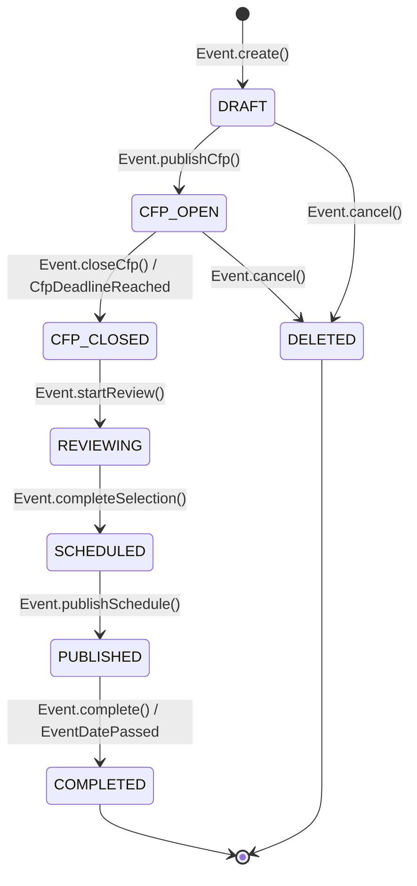

# Entity: Event

## 📋 Definition & Context
* **Description:** Represents a Call for Papers (CfP) event organized by a user. Contains all configuration, settings, and metadata for a single event lifecycle from creation through completion.
* **Aggregate Root:** ✅ Yes (Event is the aggregate root; manages consistency boundary for CfP configuration, sessions, and schedules)
* **Database Table / Collection:** `events`
* **Primary Key / Identifier:** `EventId` (UUIDv4 Value Object)
* **Owner Team:** Core Event Team
* **Domain Context:** Event Bounded Context (see ADR-009)

---

## 🧱 DDD Structure

### Aggregate Composition
```
EventAggregate
├── Event (Root Entity)
│   ├── id: EventId (Value Object)
│   ├── name: EventName (Value Object)
│   ├── description: Description (Value Object)
│   ├── slug: EventSlug (Value Object)
│   ├── status: EventStatus (Value Object / Enum)
│   ├── createdAt: CreatedAt (Value Object)
│   └── cfpConfig: CfpConfig (Child Entity / Embedded)
│       ├── startDate: CfpStartDate
│       ├── endDate: CfpEndDate
│       └── isActive: CfpStatus
├── Sessions (Child Entities) - Collection of Session entities
└── Domain Services
    └── EventValidationService (validates business rules)
```

### Value Objects Used
| Value Object | Purpose | Referenced Doc |
|--------------|---------|----------------|
| `EventId` | Unique identifier with validation | [[value-objects/event-id]] |
| `EventName` | Event title with length constraints | [[value-objects/event-name]] |
| `EventSlug` | URL-safe identifier generator | [[value-objects/event-slug]] |
| `EventStatus` | State enum (DRAFT, CFP_OPEN, etc.) | [[value-objects/event-status]] |
| `CfpConfig` | Submission window configuration | [[value-objects/cfp-config]] |

---

## 🗺️ State Machine Diagram
*This Mermaid diagram models all valid states and transitions for this entity. It renders natively in GitHub, GitLab, and Obsidian.*



---

## 🔄 State Transition Matrix
*A strict mapping of every allowed state change, the trigger behind it, and any automatic system side-effects.*

| Current State | Domain Method / Event | Target State | Guards / Conditions | Side Effects / Actions |
| :--- | :--- | :--- | :--- | :--- |
| `DRAFT` | `Event.create()` | `DRAFT` | Event name valid; CfP dates in future | Create `CfpConfig` child entity; generate unique slug; publish `EventCreated` domain event. |
| `DRAFT` | `Event.publishCfp()` | `CFP_OPEN` | CfP dates are valid; organizer authorized | Set status to `CFP_OPEN`; publish `CfpOpened` domain event; send welcome email. |
| `DRAFT` | `Event.cancel()` | `DELETED` | No submissions exist | Soft delete; mark as deleted; publish `EventCancelled` domain event. |
| `CFP_OPEN` | `Event.closeCfp()` | `CFP_CLOSED` | CfP end date reached or manual action | Lock submission form; publish `CfpClosed` domain event; notify speakers. |
| `CFP_OPEN` | `CfpDeadlineReached` (cron) | `CFP_CLOSED` | Current time >= cfpEndDate | Auto-close submissions; publish `CfpClosed` domain event. |
| `CFP_CLOSED` | `Event.startReview()` | `REVIEWING` | Submissions exist to review | Enable scoring dashboard; publish `ReviewStarted` domain event. |
| `REVIEWING` | `Event.completeSelection()` | `SCHEDULED` | All sessions scored; acceptances defined | Generate session list; publish `SelectionCompleted` domain event. |
| `SCHEDULED` | `Event.publishSchedule()` | `PUBLISHED` | All sessions assigned to rooms/times | Generate public agenda; publish `SchedulePublished` domain event; send acceptance emails. |
| `PUBLISHED` | `Event.complete()` | `COMPLETED` | Event date passed or manual close | Archive event; publish `EventCompleted` domain event; enable feedback collection. |

---

## 🎯 Domain Behavior

### Core Entity Methods

| Method | Purpose | Pre-conditions | Post-conditions |
|--------|---------|----------------|-----------------|
| `Event.create()` | Initialize new event in DRAFT state | Valid name, CfP dates in future | Event created with `CfpConfig` child |
| `publishCfp()` | Open event for submissions | Status must be `DRAFT` | Status → `CFP_OPEN`; `CfpOpened` event published |
| `closeCfp(reason)` | Close submission window | Status must be `CFP_OPEN` | Status → `CFP_CLOSED`; `CfpClosed` event published |
| `startReview()` | Begin review process | Status must be `CFP_CLOSED` | Status → `REVIEWING`; `ReviewStarted` event published |
| `completeSelection()` | Finalize session selection | Status must be `REVIEWING`; all sessions scored | Status → `SCHEDULED`; `SelectionCompleted` event published |
| `publishSchedule()` | Make schedule public | Status must be `SCHEDULED`; all sessions assigned | Status → `PUBLISHED`; `SchedulePublished` event published |
| `complete()` | Mark event as finished | Status must be `PUBLISHED` or `SCHEDULED` | Status → `COMPLETED`; `EventCompleted` event published |
| `cancel(reason)` | Cancel the event | Status must be `DRAFT` or `CFP_OPEN` | Status → `DELETED`; `EventCancelled` event published |

### Domain Invariants

| Invariant | Description |
|-----------|-------------|
| **Cfp Dates Valid** | `cfpEndDate` must always be after `cfpStartDate` |
| **State Transitions** | Only allowed transitions per state machine (no skipping states) |
| **Session Scoring** | All sessions must be scored before `completeSelection()` can succeed |
| **Session Assignment** | All accepted sessions must have time slots before `publishSchedule()` can succeed |
| **Slug Uniqueness** | Event slug must be unique across all events |

---

## 🔍 State Definitions
*Detailed criteria for what each state means in plain English.*

| State | Description | Domain Method |
|-------|-------------|---------------|
| `DRAFT` | Event created but not yet published. CfP not visible to speakers. Only organizer can access. | `Event.create()` |
| `CFP_OPEN` | Event is live and accepting proposal submissions. Speakers can submit talks via public form. | `Event.publishCfp()` |
| `CFP_CLOSED` | Submission deadline passed or manually closed. No new submissions accepted. Proposals locked for review. | `Event.closeCfp()`, `CfpDeadlineReached` |
| `REVIEWING` | Organizer actively reviewing and scoring submissions. Scoring dashboard active. Speakers cannot modify submissions. | `Event.startReview()` |
| `SCHEDULED` | Selection complete. Sessions accepted/rejected. Time slots and rooms being assigned. Schedule not yet public. | `Event.completeSelection()` |
| `PUBLISHED` | Event agenda live and visible to public. Speakers notified of acceptance/rejection. Schedule finalized. | `Event.publishSchedule()` |
| `COMPLETED` | Event concluded. All sessions occurred. Data archived for historical reference. Feedback collection may be enabled. | `Event.complete()` |
| `DELETED` | Event cancelled by organizer before going live. All data soft-deleted and no longer accessible. | `Event.cancel()` |

---

## 🛠️ Repository Interface (DDD Pattern)

```typescript
// Repository Interface (abstraction - see ADR-009)
export interface EventRepository {
  findById(id: EventId): Promise<Event | null>;
  findBySlug(slug: EventSlug): Promise<Event | null>;
  findByOrganizerId(organizerId: string): Promise<Event[]>;
  findByStatus(status: EventStatus): Promise<Event[]>;
  save(event: Event): Promise<void>;
  delete(id: EventId): Promise<void>;
}
```

---

## 🔗 Linked User Stories & Flows
*Relative links to the User Stories/Flows that interact with or trigger mutations on this entity.*

* [[../../product/flows/journey-01-setup-event.md]]: Triggers `Event.create()` → `Event.publishCfp()`
* [[../../product/flows/journey-03-review-sessions.md]]: Triggers `Event.closeCfp()` → `Event.startReview()` → `Event.completeSelection()`
* [[../../product/flows/journey-04-acceptance-logistics.md]]: Triggers `Event.publishSchedule()` → `Event.complete()`

---

## 🔗 Domain Events

| Event | Triggered By | Published When |
|-------|--------------|----------------|
| `EventCreated` | `Event.create()` | Event first created in DRAFT state |
| `CfpOpened` | `Event.publishCfp()` | Event transitions to CFP_OPEN |
| `CfpClosed` | `Event.closeCfp()` | Event transitions to CFP_CLOSED |
| `ReviewStarted` | `Event.startReview()` | Event transitions to REVIEWING |
| `SelectionCompleted` | `Event.completeSelection()` | Event transitions to SCHEDULED |
| `SchedulePublished` | `Event.publishSchedule()` | Event transitions to PUBLISHED |
| `EventCompleted` | `Event.complete()` | Event transitions to COMPLETED |
| `EventCancelled` | `Event.cancel()` | Event transitions to DELETED |

---

## 🔗 Related Documentation

| Document | Purpose |
|----------|---------|
| [[value-objects/event-id]] | Unique identifier value object |
| [[value-objects/event-name]] | Event title value object |
| [[value-objects/event-slug]] | URL-safe slug value object |
| [[value-objects/event-status]] | State enum value object |
| [[value-objects/cfp-config]] | CfP configuration value object |
| [[../../adr/009-adopt-domain-driven-design-structure.md]] | DDD architecture decision |
