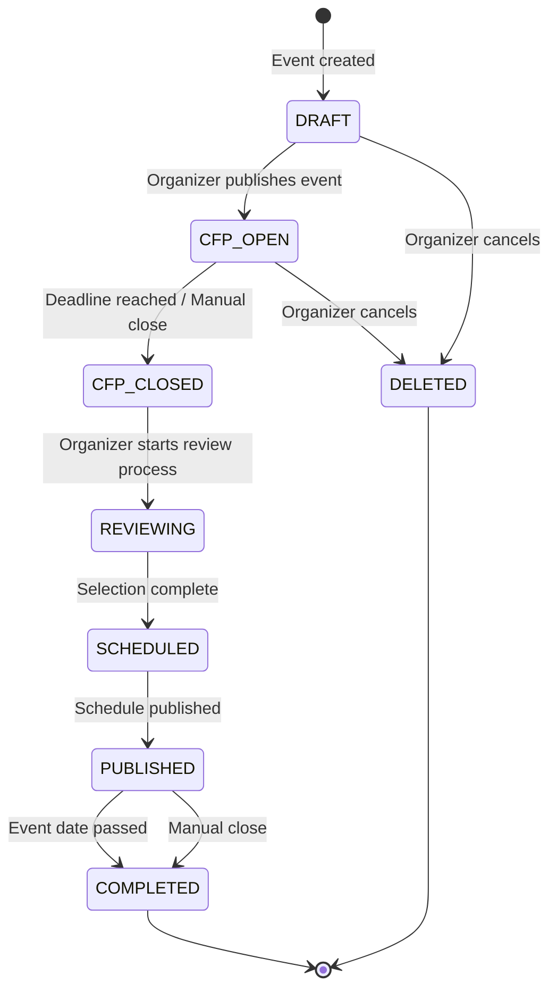

# Entity: Event

## 📋 Definition & Context
* **Description:** Represents a Call for Papers (CfP) event organized by a user. Contains all configuration, settings, and metadata for a single event lifecycle from creation through completion.
* **Database Table / Collection:** `events`
* **Primary Key / Identifier:** `UUIDv4`
* **Owner Team:** Core Event Team

---

## 🗺️ State Machine Diagram
*This Mermaid diagram models all valid states and transitions for this entity. It renders natively in GitHub, GitLab, and Obsidian.*

---

## 🔄 State Transition Matrix
*A strict mapping of every allowed state change, the trigger behind it, and any automatic system side-effects.*

| Current State | Event / Trigger | Target State | Guards / Conditions | Side Effects / Actions |
| :--- | :--- | :--- | :--- | :--- |
| `DRAFT` | Organizer submits event creation form | `CFP_OPEN` | Event name valid; CfP dates in future | Create `CfpConfig` record; generate unique slug; send welcome email. |
| `DRAFT` | Organizer cancels event | `DELETED` | No submissions exist | Soft delete; mark as deleted; archive related data. |
| `CFP_OPEN` | Organizer manually closes CfP | `CFP_CLOSED` | CfP end date reached or manual action | Lock submission form; notify speakers of closure. |
| `CFP_OPEN` | System cron (deadline reached) | `CFP_CLOSED` | Current time >= cfpEndDate | Auto-close submissions; trigger notification batch. |
| `CFP_CLOSED` | Organizer initiates review | `REVIEWING` | Submissions exist to review | Enable scoring dashboard; notify reviewers. |
| `REVIEWING` | Organizer completes selection | `SCHEDULED` | All sessions scored; acceptances defined | Generate session list; prepare scheduling interface. |
| `SCHEDULED` | Organizer assigns time slots | `PUBLISHED` | All sessions assigned to rooms/times | Generate public agenda; send acceptance emails. |
| `PUBLISHED` | Event date passed (cron) | `COMPLETED` | Current date > eventEndDate | Archive event; enable feedback collection. |
| `PUBLISHED` | Organizer manually closes | `COMPLETED` | Event concluded | Disable scheduling; archive data. |

---

## 🔍 State Definitions
*Detailed criteria for what each state means in plain English.*

* **`DRAFT`**: The event has been created but not yet published. The CfP is not visible to speakers. Only the organizer can access and modify the event.

* **`CFP_OPEN`**: The event is live and accepting proposal submissions. Speakers can access the public CfP form and submit talks. Submissions are being collected.

* **`CFP_CLOSED`**: The submission deadline has passed (or was manually closed). No new submissions are accepted. Existing proposals are locked for review.

* **`REVIEWING`**: The organizer is actively reviewing and scoring submissions. The scoring dashboard is active. Speakers cannot modify their submissions.

* **`SCHEDULED`**: Selection is complete. Sessions have been accepted/rejected. Time slots and rooms are being assigned. The schedule is not yet public.

* **`PUBLISHED`**: The event agenda is live and visible to the public. Speakers have been notified of acceptance/rejection. The schedule is finalized.

* **`COMPLETED`**: The event has concluded. All sessions have occurred. Data is archived for historical reference. Feedback collection may be enabled.

* **`DELETED`**: The event was cancelled by the organizer before going live. All associated data is soft-deleted and no longer accessible.

---

## 🔗 Linked User Stories & Flows
*Relative links to the User Stories/Flows that interact with or trigger mutations on this entity.*

* [[../../product/flows/journey-01-setup-event.md]]: Triggers transition from `None` -> `DRAFT` -> `CFP_OPEN`
* [[../../product/flows/journey-03-review-sessions.md]]: Triggers transition from `CFP_CLOSED` -> `REVIEWING` -> `SCHEDULED`
* [[../../product/flows/journey-04-acceptance-logistics.md]]: Triggers transition from `SCHEDULED` -> `PUBLISHED` -> `COMPLETED`
