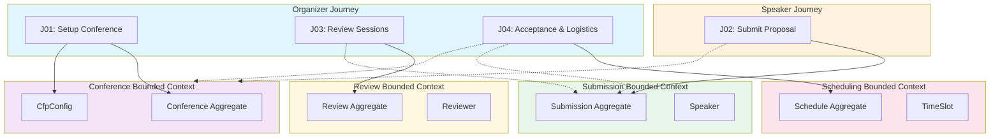

# User Flows & Journeys

**Primary entry point for understanding user journeys** across SessioFlow's bounded contexts.

Each flow represents a complete user story from start to finish, spanning one or more bounded contexts.

## 🗺️ Flow Catalog

| ID | Journey Name | Primary Bounded Context | Related Contexts | Status |
|:---|:-------------|:----------------------|:-----------------|:-------|
| **J01** | [Setup Conference (CfP Configuration)](../bounded-contexts/conference/flows/journey-01-setup-conference.md) | Conference | — | ✅ Complete |
| **J02** | [Submit Proposal](../bounded-contexts/submission/flows/journey-02-submit-proposal.md) | Submission | Conference | ⏳ Pending |
| **J03** | [Review Sessions](../bounded-contexts/review/flows/journey-03-review-sessions.md) | Review | Submission | ⏳ Pending |
| **J04** | [Acceptance & Logistics](../bounded-contexts/scheduling/flows/journey-04-acceptance-logistics.md) | Scheduling | Conference, Submission | ⏳ Pending |

---

## 📊 Documentation Structure

Each journey's complete documentation is in a **single file** that includes:

1. **Overview** - User story and impacted entities
2. **Sequence Diagram** - System interactions with error paths
3. **Flowchart** - Decision points and branching logic
4. **State Diagram** - Entity lifecycle visualization
5. **Step-by-Step Walkthrough** - Detailed action/reaction table
6. **Acceptance Criteria** - Gherkin scenarios
7. **Edge Cases** - Business logic, technical, and validation failures
8. **Technical Notes** - API specs, validation schemas, DB constraints

**No separate flow map files** - all diagrams are embedded in the flow specification.

## 📋 Flow Details

### Journey 01: Setup Conference (CfP Configuration)

**As a** Conference Organizer  
**I want to** Create a new conference and configure its Call for Papers (CfP) settings  
**So that** I can share a submission link with potential speakers and start collecting proposals

**📄 Detailed Documentation (includes all diagrams):**  
→ [View Full Flow Specification](../bounded-contexts/conference/flows/journey-01-setup-conference.md)

**Includes:**
- Sequence diagram with error paths
- Flowchart with decision points
- State diagram (Conference lifecycle)

**Bounded Contexts Involved:**
- **Conference** (Primary) - Conference aggregate, CfpConfig entity

---

### Journey 02: Submit Proposal

**As a** Speaker  
**I want to** Submit a talk proposal to an event's CfP  
**So that** I can be considered for the event program

**📄 Detailed Documentation (when created, will include):**  
→ [Flow Spec Location](../bounded-contexts/submission/flows/journey-02-submit-proposal.md) *(not yet created)*

**Should include:**
- Sequence diagram with error paths
- Flowchart
- State diagram (Submission lifecycle)

**Bounded Contexts Involved:**
- **Submission** (Primary) - Submission aggregate, Speaker entity
- **Conference** (Referenced) - Conference status validation

---

### Journey 03: Review Sessions

**As a** Organizer/Reviewer  
**I want to** Review and score submitted proposals  
**So that** I can select the best talks for the conference

**📄 Detailed Documentation (when created, will include):**  
→ [Flow Spec Location](../bounded-contexts/review/flows/journey-03-review-sessions.md) *(not yet created)*

**Should include:**
- Sequence diagram with error paths
- Flowchart
- State diagram (Review lifecycle)

**Bounded Contexts Involved:**
- **Review** (Primary) - Review aggregate, Reviewer entity
- **Submission** (Referenced) - Submission data access

---

### Journey 04: Acceptance & Logistics

**As a** Organizer  
**I want to** Accept submissions and publish the conference schedule  
**So that** speakers know their acceptance status and time slots

**📄 Detailed Documentation (when created, will include):**  
→ [Flow Spec Location](../bounded-contexts/scheduling/flows/journey-04-acceptance-logistics.md) *(not yet created)*

**Should include:**
- Sequence diagram with error paths
- Flowchart
- State diagram (Schedule lifecycle)

**Bounded Contexts Involved:**
- **Scheduling** (Primary) - Schedule aggregate, TimeSlot entity
- **Conference** (Referenced) - Conference status updates
- **Submission** (Referenced) - Submission status updates

---

## 🔗 Cross-Context Flow Diagram

This diagram shows how journeys connect across bounded contexts:

---

## 📊 Flow Status Legend

| Status | Meaning |
|:------:|:--------|
| ✅ | Fully documented with flow spec and visual map |
| ⏳ | Flow identified, documentation pending |
| 🔄 | Under review or revision |

---

## 📚 Related Documentation

- [Domain Model](../README.md) - Bounded contexts, aggregates, and DDD structure
- [Flow Specification Template](../../templates/product/flows.md) - Template for creating flow docs

---

**Last Updated:** 2026-06-13  
**Total Journeys:** 4 (1 documented, 3 pending)
