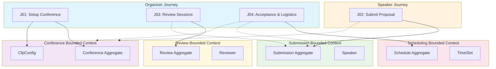

# User Flows & Living Product Specifications

**Primary entry point for Product Managers (PMs) and Engineers** to explore, trace, and propose changes to user journeys, business rules, and domain invariants across SessioFlow.

---

## 🗺️ Master Flow Catalog

| ID | Journey Name | Bounded Context | Business Rules (BR) | Domain Invariants (INV) | Impacted Entities | Status |
|:---|:-------------|:----------------|:---------------------|:------------------------|:------------------|:------:|
| **J01** | [Setup Conference & CfP Configuration](../bounded-contexts/conference/flows/journey-01-setup-conference.md) | Conference | [BR-001](../bounded-contexts/conference/business-rules/BR-001-cfp-dates-validation.md) (CfP Dates) [BR-002](../bounded-contexts/conference/business-rules/BR-002-conference-name-validation.md) (Name Validation) [BR-003](../bounded-contexts/conference/business-rules/BR-003-slug-uniqueness.md) (Slug Uniqueness) [BR-004](../bounded-contexts/conference/business-rules/BR-004-free-tier-conference-limit.md) (Free Tier Limit) | [INV-001](../bounded-contexts/conference/invariants/INV-001-state-transition-validity.md) (State Transitions) [INV-002](../bounded-contexts/conference/invariants/INV-002-cfp-date-order.md) (Date Order) [INV-003](../bounded-contexts/conference/invariants/INV-003-slug-uniqueness.md) (Slug Uniqueness) | `Conference` `CfpConfig` | ✅ Complete |
| **J02** | [Submit Proposal](../../inception/5-user-journeys/journey-02-submitting-talk.md) | Submission | [BR-005](../bounded-contexts/conference/business-rules/BR-005-cfp-submission-when-active.md) (CfP Active Window) *(Submission rules in design)* | *(Pending)* | `Submission` `Speaker` | ⏳ Pending |
| **J03** | [Review Sessions](../../inception/5-user-journeys/journey-03-selection-and-program.md) | Review | *(Review scoring rules in design)* | [INV-004](../bounded-contexts/conference/invariants/INV-004-session-scoring-before-scheduling.md) (Score Before Scheduling) | `Review` `Reviewer` | ⏳ Pending |
| **J04** | [Acceptance & Logistics](../../inception/5-user-journeys/journey-04-acceptance-and-logistics.md) | Scheduling | *(Scheduling rules in design)* | [INV-005](../bounded-contexts/conference/invariants/INV-005-session-assignment-before-publishing.md) (Assign Before Publishing) | `Schedule` `TimeSlot` | ⏳ Pending |

---

## 🌐 Master Index: Business Rules & Domain Invariants

> **PM Quick Reference**: Consult this global index before proposing new features or modifications in `docs/product/working-on/`. Ensure new proposals do not contradict existing invariants or duplicate business rules.

### 📜 Active Business Rules (BR)

| Rule ID | Rule Name | Bounded Context | Business Rule Policy Summary | Enforced In Flow |
|:---|:---|:---|:---|:---|
| [BR-001](../bounded-contexts/conference/business-rules/BR-001-cfp-dates-validation.md) | CfP Dates Validation | Conference | CfP start date must be in the future; end date must be after start date. | [J01: Setup Conference](../bounded-contexts/conference/flows/journey-01-setup-conference.md) |
| [BR-002](../bounded-contexts/conference/business-rules/BR-002-conference-name-validation.md) | Conference Name Validation | Conference | Conference title must be 3 to 100 characters long; non-empty, trimmed string. | [J01: Setup Conference](../bounded-contexts/conference/flows/journey-01-setup-conference.md) |
| [BR-003](../bounded-contexts/conference/business-rules/BR-003-slug-uniqueness.md) | Conference Slug Uniqueness | Conference | URL slug must be lowercase alphanumeric with hyphens, globally unique across system. | [J01: Setup Conference](../bounded-contexts/conference/flows/journey-01-setup-conference.md) |
| [BR-004](../bounded-contexts/conference/business-rules/BR-004-free-tier-conference-limit.md) | Free Tier Conference Limit | Conference | An organizer on the free tier may have at most 5 active conferences simultaneously. | [J01: Setup Conference](../bounded-contexts/conference/flows/journey-01-setup-conference.md) |
| [BR-005](../bounded-contexts/conference/business-rules/BR-005-cfp-submission-when-active.md) | Submissions Window Active | Conference / Submission | Submissions can only be received while the conference status is strictly `CFP_OPEN`. | [J02: Submit Proposal](../../inception/5-user-journeys/journey-02-submitting-talk.md) |

### 🔒 Non-Negotiable Domain Invariants (INV)

| Invariant ID | Invariant Name | Bounded Context | System Integrity Constraint | Enforced In Flow |
|:---|:---|:---|:---|:---|
| [INV-001](../bounded-contexts/conference/invariants/INV-001-state-transition-validity.md) | State Transition Validity | Conference | Conference aggregate can only transition through permitted lifecycle states (e.g. `DRAFT` → `CFP_OPEN`). | [J01: Setup Conference](../bounded-contexts/conference/flows/journey-01-setup-conference.md) |
| [INV-002](../bounded-contexts/conference/invariants/INV-002-cfp-date-order.md) | CfP Date Ordering | Conference | `CfpEndDate` must strictly succeed `CfpStartDate`. Never equal, never reversed. | [J01: Setup Conference](../bounded-contexts/conference/flows/journey-01-setup-conference.md) |
| [INV-003](../bounded-contexts/conference/invariants/INV-003-slug-uniqueness.md) | Global Slug Integrity | Conference | Database unique constraint reified as domain invariant; duplicates throw `SlugExistsError`. | [J01: Setup Conference](../bounded-contexts/conference/flows/journey-01-setup-conference.md) |
| [INV-004](../bounded-contexts/conference/invariants/INV-004-session-scoring-before-scheduling.md) | Session Scoring Before Schedule | Review / Scheduling | A session cannot be scheduled unless all assigned reviews are completed and scored. | [J03: Review Sessions](../../inception/5-user-journeys/journey-03-selection-and-program.md) |
| [INV-005](../bounded-contexts/conference/invariants/INV-005-session-assignment-before-publishing.md) | Room & Slot Assignment | Scheduling | A conference schedule cannot transition to `PUBLISHED` if any session lacks room or time. | [J04: Acceptance & Logistics](../../inception/5-user-journeys/journey-04-acceptance-and-logistics.md) |

---

## 📊 Documentation Structure

Each journey's full specification is consolidated in a **single living file** in its owning bounded context (`bounded-contexts/[context]/flows/`):

1. **Overview**: User story narrative, personas, goals, impacted entities.
2. **Business Rules & Invariants**: Prominent summary of rules governing the flow (PM-friendly).
3. **Sequence Diagram**: Visual sequence of actions, error paths, and async outbox events.
4. **Flowchart**: Branching decision points and validation exits.
5. **State Diagram**: State machine visualization of the aggregate root lifecycle.
6. **Step-by-Step Walkthrough**: Tabular matrix of user action vs. system reaction.
7. **Acceptance Criteria**: Gherkin scenarios (`Given / When / Then`).
8. **Edge Cases**: Business logic, technical, and validation error boundaries.
9. **Technical Notes**: API contract endpoints, Zod schemas, DB constraints.
10. **Implementation & Tests**: File paths mapping directly to packages and test suites.

---

## 📋 Journey Summaries

### Journey 01: Setup Conference (CfP Configuration)

**As a** Conference Organizer  
**I want to** Create a new conference and configure its Call for Papers (CfP) settings  
**So that** I can share a submission link with potential speakers and start collecting proposals  

* **📄 Full Living Specification:** [journey-01-setup-conference.md](../bounded-contexts/conference/flows/journey-01-setup-conference.md)
* **Bounded Context:** `Conference` (Aggregate Root: `Conference`, Child Entity: `CfpConfig`)
* **Governing Rules:** [BR-001](../bounded-contexts/conference/business-rules/BR-001-cfp-dates-validation.md) (Dates), [BR-002](../bounded-contexts/conference/business-rules/BR-002-conference-name-validation.md) (Name), [BR-003](../bounded-contexts/conference/business-rules/BR-003-slug-uniqueness.md) (Slug), [BR-004](../bounded-contexts/conference/business-rules/BR-004-free-tier-conference-limit.md) (Free Tier Limit)
* **Governing Invariants:** [INV-001](../bounded-contexts/conference/invariants/INV-001-state-transition-validity.md) (Transitions), [INV-002](../bounded-contexts/conference/invariants/INV-002-cfp-date-order.md) (Date Order), [INV-003](../bounded-contexts/conference/invariants/INV-003-slug-uniqueness.md) (Unique Slug)

---

### Journey 02: Submit Proposal

**As a** Speaker  
**I want to** Submit a talk proposal to a conference's CfP  
**So that** I can be considered for the conference program  

* **📄 Upstream Journey:** [journey-02-submitting-talk.md](../../inception/5-user-journeys/journey-02-submitting-talk.md) *(Flow spec pending)*
* **Bounded Context:** `Submission` (Primary: `Submission`, `Speaker`; Referenced: `Conference`)
* **Governing Rules:** [BR-005](../bounded-contexts/conference/business-rules/BR-005-cfp-submission-when-active.md) (Must be CFP_OPEN)

---

### Journey 03: Review Sessions

**As an** Organizer / Reviewer  
**I want to** Review and score submitted proposals  
**So that** I can select the best talks for the conference  

* **📄 Upstream Journey:** [journey-03-selection-and-program.md](../../inception/5-user-journeys/journey-03-selection-and-program.md) *(Flow spec pending)*
* **Bounded Context:** `Review` (Primary: `Review`, `Reviewer`; Referenced: `Submission`)
* **Governing Invariants:** [INV-004](../bounded-contexts/conference/invariants/INV-004-session-scoring-before-scheduling.md) (All reviews scored before scheduling)

---

### Journey 04: Acceptance & Logistics

**As an** Organizer  
**I want to** Accept submissions and publish the conference schedule  
**So that** speakers know their acceptance status and time slots  

* **📄 Upstream Journey:** [journey-04-acceptance-and-logistics.md](../../inception/5-user-journeys/journey-04-acceptance-and-logistics.md) *(Flow spec pending)*
* **Bounded Context:** `Scheduling` (Primary: `Schedule`, `TimeSlot`; Referenced: `Conference`, `Submission`)
* **Governing Invariants:** [INV-005](../bounded-contexts/conference/invariants/INV-005-session-assignment-before-publishing.md) (Room & slot assigned before publishing)

---

## 🔗 Cross-Context Flow Diagram

```mermaid
flowchart TB
    subgraph Organizer["Organizer Journey"]
        J01[J01: Setup Conference]
        J03[J03: Review Sessions]
        J04[J04: Acceptance & Logistics]
    end

    subgraph Speaker["Speaker Journey"]
        J02[J02: Submit Proposal]
    end

    subgraph ConferenceBC["Conference Bounded Context"]
        E[Conference Aggregate]
        CFP[CfpConfig]
    end

    subgraph SubmissionBC["Submission Bounded Context"]
        S[Submission Aggregate]
        SP[Speaker]
    end

    subgraph ReviewBC["Review Bounded Context"]
        R[Review Aggregate]
        RV[Reviewer]
    end

    subgraph ScheduleBC["Scheduling Bounded Context"]
        SCH[Schedule Aggregate]
        TS[TimeSlot]
    end

    J01 --> E
    J01 --> CFP
    J02 --> S
    J02 -.-> ConferenceBC
    J03 --> R
    J03 -.-> S
    J04 --> SCH
    J04 -.-> ConferenceBC
    J04 -.-> S

    style Organizer fill:#e1f5fe
    style Speaker fill:#fff3e0
    style ConferenceBC fill:#f3e5f5
    style SubmissionBC fill:#e8f5e9
    style ReviewBC fill:#fff8e1
    style ScheduleBC fill:#fce4ec
```

---

## 🔄 Proposing Changes to Flows or Rules

When a Product Manager or Engineer needs to modify existing behavior:
1. Consult the **Master Flow Catalog** and **Master Index** above.
2. Run `/modify-flow` to scaffold a change proposal in `docs/product/working-on/[change-name]/proposal.md`.
3. Follow the **Grace Period Lifecycle** described in [docs/product/working-on/README.md](../working-on/README.md).
