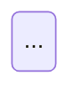

# Flow Documentation Structure Guidelines

## Overview

This document defines the structure and standards for user flow documentation in SessioFlow.

## 📁 Directory Structure

```
docs/product/
├── README.md                          # DDD model reference
├── flows/
│   └── README.md                      # Flow catalog (entry point)
└── bounded-contexts/
    └── [context-name]/
        └── flows/
            └── journey-[XX]-[name].md # Complete flow specification
```

## 🎯 Single Source of Truth

**Each flow is documented in ONE comprehensive file** that contains:

1. **Overview** - User story format (As a... I want... So that...)
2. **Sequence Diagram** - System interactions with **error paths** in colored rectangles
3. **Flowchart** - Decision points and branching logic
4. **State Diagram** - Entity lifecycle visualization
5. **Step-by-Step Walkthrough** - Detailed action/reaction table
6. **Acceptance Criteria** - Gherkin scenarios
7. **Edge Cases** - Business logic, technical, and validation failures
8. **Technical Notes** - API specs, Zod schemas, DB constraints, RLS policies
9. **Linked Documentation** - References to entities, value objects, ADRs

## 📊 Diagram Requirements

### Sequence Diagram

- **Must include error paths** using colored `rect` blocks
- Happy path: `rgb(232, 245, 233)` (green)
- Error paths: `rgb(255, 235, 238)` (red)
- Must show domain events and side effects
- Must align with walkthrough table steps

### Flowchart

- Shows decision points and branching logic
- Color-code outcomes: success (green), error (red), warning (yellow)
- Must cover all major decision points

### State Diagram

- Shows primary entity/aggregate lifecycle
- Include notes explaining key states
- Color-code states: initial (orange), active (yellow), success (green), error (red)

## 🔗 Navigation Flow

```
User wants to understand a journey
         |
         v
flows/README.md (Catalog)
         |
         v
Click journey link
         |
         v
Complete flow spec (all diagrams inline)
```

## ❌ What NOT to Do

- **Do NOT create separate flow map files** - all diagrams go in the flow spec
- **Do NOT create a `flow-maps/` directory** - consolidated structure only
- **Do NOT include only happy path** - must show error scenarios
- **Do NOT split diagrams across multiple files** - single source of truth

## ✅ Best Practices

1. **Comprehensive Error Coverage**
   - Show at least 3 error paths in sequence diagram
   - Include business logic failures
   - Include technical failures
   - Include validation boundary conditions

2. **Diagram Consistency**
   - Sequence diagram steps must match walkthrough table
   - Flowchart decisions must align with edge cases
   - State diagram must match entity lifecycle

3. **Cross-Referencing**
   - Link to business rules (BR-XXX)
   - Link to invariants (INV-XXX)
   - Link to entities and value objects
   - Link to relevant ADRs

## 🛠️ Templates & Commands

- **Template:** `docs/templates/product/flows.md`
- **Command:** `docs/commands/product/create-flow.md`
- **Flow Catalog:** `docs/product/flows/README.md`

## 📝 Example Flow Structure

```markdown
# Journey 01: Setup Conference (CfP Configuration)

## 🛡️ ADR Compliance Checklist
...

## 📋 Overview
...

## 🗺️ Visual Flow & Sequence
```mermaid
sequenceDiagram
    ...
    rect rgb(232, 245, 233)
        # Happy path
    end
    rect rgb(255, 235, 238)
        # Error path 1
    end
    rect rgb(255, 235, 238)
        # Error path 2
    end
```

## 🔄 Alternative Flow (Flowchart)


## 📊 Entity State Diagram


## 🏃‍♂️ Step-by-Step Walkthrough
...

## ✅ Acceptance Criteria
...

## ⚠️ Edge Cases
...

## 🛠️ Technical Notes
...
```

## 📚 Related Documentation

- [Flow Template](../../templates/product/flows.md)
- [Create Flow Command](../../commands/product/create-flow.md)
- [Business Rules Guide](./business-rules-vs-invariants.md)

---

**Last Updated:** 2026-06-13  
**Version:** 2.0 (Consolidated Structure)
