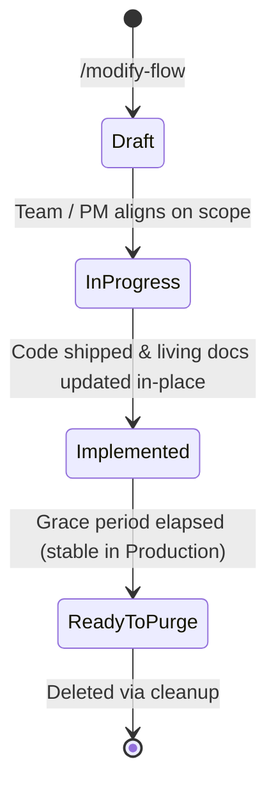

# Working-On: In-Flight Change Management & Staging Buffer

This directory serves as the **transient staging buffer** for proposed behavioral changes, refactorings, and feature modifications before they are permanently baked into living documentation and production code.

---

## 🔄 Proposal Lifecycle & Grace Period

Every change proposal lives in its own subdirectory (`docs/product/working-on/[change-name]/`) containing `proposal.md` and `implementation-plan.md`. It progresses through four distinct lifecycle states:



### 1. `Draft` (Formulation)
- **Actor:** Product Manager (PM) or Tech Lead.
- **Artifacts:** `proposal.md` outlining the problem, current vs. desired behavior, and affected rules.
- **Living Docs:** Untouched.

### 2. `In Progress` (Execution)
- **Actor:** Engineer / AI Coding Agent.
- **Artifacts:** `implementation-plan.md` broken into phased TDD tasks.
- **Living Docs:** Untouched until code implementation is verified.

### 3. `Implemented (Grace Period)` (Production Safety Buffer)
- **Trigger:** Code is merged and living documentation (`bounded-contexts/`, `flows/README.md`) has been updated in place.
- **Why keep it?** Instead of immediate deletion, the folder is preserved during a **grace period** (e.g. while on staging or early production) in case:
  - Rapid adjustments or hotfixes are needed.
  - Verification telemetry reveals regressions.
  - The team needs quick access to the original rationale.
- **Header in `proposal.md`**:
  ```markdown
  **Status:** Implemented (Grace Period)
  **Shipped Date:** YYYY-MM-DD
  **Living Docs Updated:** [Journey XX](../../bounded-contexts/.../flows/journey-XX.md)
  ```

### 4. `Ready to Purge` (Safe to Delete)
- **Trigger:** The change is confirmed stable in production, or the next feature cycle begins.
- **Action:** Mark the status as `Ready to Purge` (or delete the folder directly):
  ```bash
  rm -rf docs/product/working-on/[change-name]
  ```
- **Invariant:** Because living documentation in `docs/product/bounded-contexts/` was already updated in Step 3, **zero historical or technical context is lost when deleting a purged proposal**.

---

## 📋 Directory Convention

```text
docs/product/working-on/
├── README.md                          # This lifecycle and buffer policy guide
│
├── [change-name-1]/                   # e.g., extend-cfp-dates/
│   ├── proposal.md                    # Status: In Progress
│   └── implementation-plan.md
│
└── [change-name-2]/                   # e.g., free-tier-conference-limit-adjustment/
    ├── proposal.md                    # Status: Implemented (Grace Period)
    └── implementation-plan.md
```

---

## 🧹 Housekeeping Rules

1. **Never treat `working-on/` as permanent documentation**: Permanent behavior belongs in `docs/product/bounded-contexts/` and `docs/product/flows/`.
2. **Always close edges in living docs before setting `Implemented`**: Ensure rules, flows, and tests are updated in place before entering the grace period.
3. **Purge on new cycles**: At the start of a new sprint, feature, or during `/audit-docs` runs, delete any proposal directory marked `Ready to Purge` or completed past its grace period.
