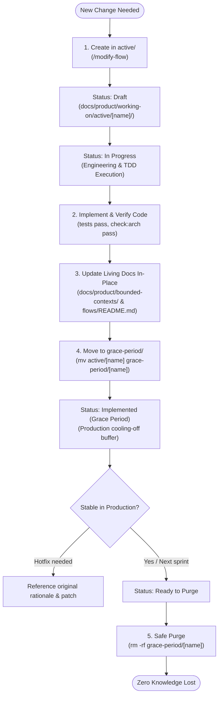

# Working-On: In-Flight Change Management & Staging Buffer

This directory serves as the **transient staging buffer** for proposed behavioral changes, refactorings, and feature modifications before they are permanently baked into living documentation and production code.

To avoid **context bleeding** across parallel branches, git worktrees, or AI agent sessions, proposals are strictly partitioned into two physical subdirectories:

```text
docs/product/working-on/
├── README.md                          # This lifecycle and buffer policy guide
│
├── active/                            # 🟢 ONLY currently active work (Draft or In Progress)
│   └── [change-name]/                 # Feature actively being designed or coded
│       ├── proposal.md                # Status: Draft | In Progress
│       └── implementation-plan.md
│
└── grace-period/                      # 🟡 Production/Staging safety buffer (Passive)
    └── [completed-change-name]/       # Code shipped, living docs updated, cooling off
        ├── proposal.md                # Status: Implemented (Grace Period) | Ready to Purge
        └── implementation-plan.md
```

---

## 🤖 Strict Agent Rule (LLM Guardrail)

> [!IMPORTANT]
> **AI Agents must ONLY search, read, and write within `docs/product/working-on/active/`.**
> 
> The directory `docs/product/working-on/grace-period/` contains passive, historical proposals that are already live in production. Agents must **NEVER** treat proposals in `grace-period/` as active requirements or allow them to influence new tasks in parallel branches or worktrees.

---

## 🔄 Proposal Lifecycle & Physical Movement



### Phase 1: Active Development (`active/`)
1. **Creation**: The PM or engineer invokes `/modify-flow`.
2. **Path**: Created exclusively at `docs/product/working-on/active/[change-name]/proposal.md`.
3. **Execution**: The engineer implements code and tests following `implementation-plan.md`.

### Phase 2: Completion & Transition (`grace-period/`)
Once code is verified and living documentation (`bounded-contexts/`, `flows/README.md`) is updated in place:
1. Update `proposal.md` header:
   ```markdown
   * **Status:** 🚀 Implemented (Grace Period)
   * **Shipped Date:** YYYY-MM-DD
   * **Living Docs Updated:** [Journey XX](../../bounded-contexts/.../flows/journey-XX.md)
   ```
2. **Move directory out of active view**:
   ```bash
   mv docs/product/working-on/active/[change-name] docs/product/working-on/grace-period/
   ```
   *Result*: The proposal is immediately hidden from agents working on new tasks in `active/`.

### Phase 3: Safe Purge
When the change is confirmed stable in production or during the next sprint cleanup:
1. Delete the directory from `grace-period/`:
   ```bash
   rm -rf docs/product/working-on/grace-period/[change-name]
   ```
2. **Zero Knowledge Loss**: Because the living documentation in `bounded-contexts/` was updated in Phase 2, deleting from `grace-period/` deletes no truth.

---

## 🧹 Housekeeping & Git Worktree Hygiene

- When switching git branches or creating a worktree, `working-on/active/` will only contain work relevant to that branch.
- Periodic cleanup: Any proposal in `grace-period/` older than 7 days or verified in production should be deleted.
