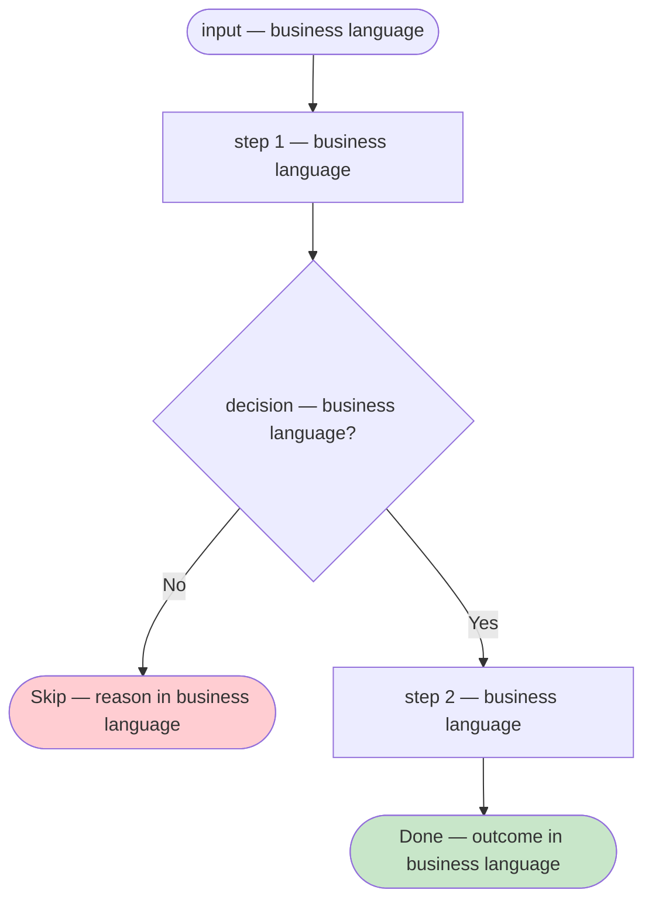
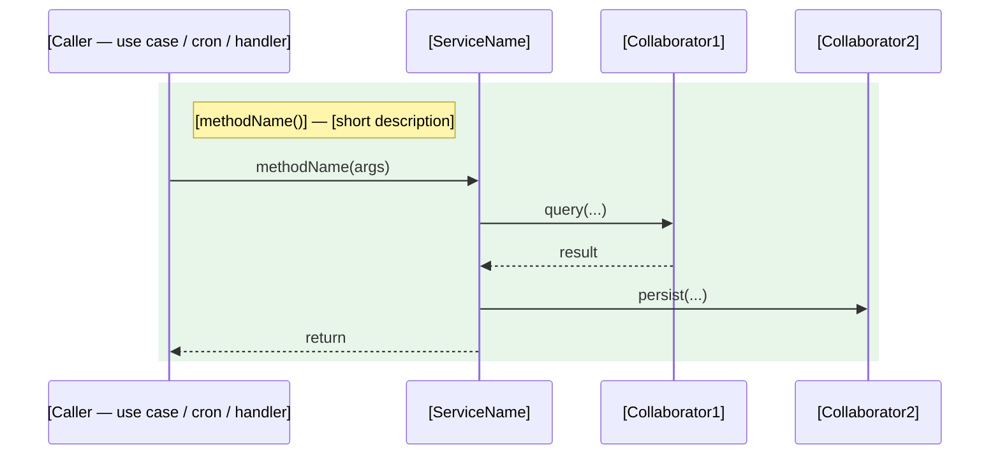

# Domain Service: [ServiceName]

* **Bounded context:** [context]
* **Owner Team:** [Team name]
* **Status:** Shipped | Partially planned (see A4)

---

# Part A — Product View

> For PMs and POs. Describes the behaviour that is **shipped today**. No class, method or table names; business language only.

## A1. Summary

> [One plain-language sentence: what this service decides or orchestrates, and why it matters to the business.]

## A2. Business Context

* **Why it exists as a domain service:** [Why this logic cannot live inside a single aggregate — it spans several aggregates, repositories or external collaborators.]
* **Business problem it solves:** [What would go wrong without it — duplicate deliveries, uncapped quotas, missed routing, etc.]

### Participating Flows

| Flow | What this service does in it |
|------|------------------------------|
| [Flow name](../flows/[flow-file].md) | [Plain-language description of the role] |

## A3. How It Decides

### Decision Paths

| Path | When it applies | Key constraint |
|------|----------------|----------------|
| [path name] | [trigger or caller] | [the main rule: capped, uncapped, filtered, etc.] |

### Governing Policies

| Rule | Plain-language summary |
|------|------------------------|
| [BR-XXX](../business-rules/BR-XXX-[slug].md) | [One sentence: what this rule means for the business] |
| [INV-XXX](../invariants/INV-XXX-[slug].md) | [One sentence: what this invariant guarantees] |

### Decision Flow — [path name]

*Repeat one block per decision path.*

## A4. Pending Changes

What is coming that A1–A3 do not describe yet. Detail lives in the proposal; a row is removed, and A1–A3 updated, when its slice ships. Leave the table empty (or write "None") when nothing is pending.

| Change | Slice | Proposal | Ticket | Status |
|--------|:-----:|----------|--------|--------|
| [One-sentence description] | [S1] | [proposal link](../../../working-on/active/[change]/proposal.md) | [KEY-123] | 📋 Planned / 🔄 In Progress |

---

# Part B — Developer View

> For developers. Code-level detail. Mark anything not yet in the code as ⏳ Planned.

## B1. Definition

* **Type:** Domain Service (stateless)
* **Source file:** `[path/to/ServiceName.ext]`

## B2. Collaborators

| Collaborator | Role | Status |
|--------------|------|--------|
| `[RepositoryOrService]` | [What it provides to this service] | [✅ Built / ⏳ Planned] |

## B3. Methods

*Repeat one block per public method.*

### `[methodName(args)]: ReturnType`

[One-line description of what this method does and when it is called.]

| Aspect | Detail |
|--------|--------|
| **Guards** | [Preconditions that must hold; return-early cases] |
| **Steps** | [Ordered list of what the method does] |
| **Side Effects** | [Records persisted, domain events queued, external calls, logs — only consumers that exist today] |
| **Returns** | [What it returns and what the value means] |
| **Status** | [✅ Built — found in the class you opened / ⚠️ Unverified — believed, not opened / ⏳ Planned — no code yet, write Steps in the future tense] |

## B4. Sequence Diagram

*One `rect` block per method.*

## B5. Rules & Invariants Enforced

| Rule / Invariant | Where it is enforced here |
|------------------|---------------------------|
| [BR-XXX](../business-rules/BR-XXX-[slug].md) | [Which method applies it and how] |
| [INV-XXX](../invariants/INV-XXX-[slug].md) | [Which method upholds it and how] |

## B6. Traceability

### Enforced by

| Layer | Where | Guard | Status |
|-------|-------|-------|--------|
| Domain service | `[path/to/ServiceName.ext]` | `[methodName()]` | [✅ Verified / ⚠️ Unverified / ⏳ Planned] |

### Verified by

* `[path/to/test]` — "[test title that covers the rule or invariant]"

## B7. Linked Flows

| Flow | Usage |
|------|-------|
| [Flow name](../flows/[flow-file].md) | [Which method is called and at which step] |
