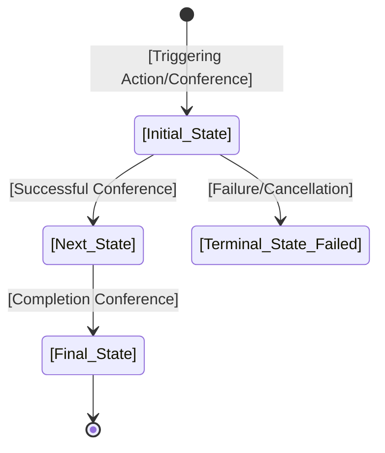

# Entity: [Entity Name (e.g., Order, Subscription)]

## 📋 Definition & Context
* **Description:** [Brief summary of what this entity represents in the system domain]
* **Database Table / Collection:** `[table_or_collection_name]`
* **Primary Key / Identifier:** `[id format, e.g., UUIDv4]`
* **Owner Team:** [e.g., Core Commerce / Billing Team]

---

## 🗺️ State Machine Diagram
*This Mermaid diagram models all valid states and transitions for this entity. It renders natively in GitHub, GitLab, and Obsidian.*

---

## 🔄 State Transition Matrix
*A strict mapping of every allowed state change, the trigger behind it, and any automatic system side-effects.*

| Current State | Event / Trigger | Target State | Guards / Conditions | Side Effects / Actions |
| :--- | :--- | :--- | :--- | :--- |
| `[e.g., DRAFT]` | User clicks "Submit" | `[PENDING]` | Cart total must be > 0 | Deduct inventory stock; lock items for 15 mins. |
| `[e.g., PENDING]`| Stripe webhook success | `[PAID]` | Payment status == paid | Generate invoice; trigger confirmation email. |
| `[e.g., PENDING]`| Cron timeout (15m) | `[CANCELLED]` | Time elapsed > 15 mins | Release inventory lock back to stock pool. |

---

## 🔍 State Definitions
*Detailed criteria for what each state means in plain English.*

* **`[STATE_NAME_1]`**: The entity has been created but is not yet finalized or validated. (e.g., `DRAFT`).
* **`[STATE_NAME_2]`**: Awaiting a critical async response or third-party confirmation. (e.g., `PENDING_PAYMENT`).
* **`[STATE_NAME_3]`**: The terminal successful state of the entity. (e.g., `COMPLETED`).
* **`[STATE_NAME_4]`**: The entity is dead/archived and can no longer transition. (e.g., `CANCELLED`).

## 🔒 Invariants & Business Rules
*Relative links to the business rules and invariants enforced by this entity.*

* **Invariants:**
  * [INV-[XXX]](../invariants/INV-[XXX]-[invariant-name].md): [Short invariant strict title]

* **Business Rules:**
  * [BR-[XXX]](../business-rules/BR-[XXX]-[rule-name].md): [Short business rule active title]

---

## 🔗 Linked User Stories & Flows
*Relative links to the User Stories/Flows that interact with or trigger mutations on this entity.*

* [US-101-example-flow.md](US-101-example-flow.md): Triggers transition from `None` -> `DRAFT`
* [US-202-example-payment.md](US-202-example-payment.md): Triggers transition from `PENDING` -> `PAID` or `CANCELLED`