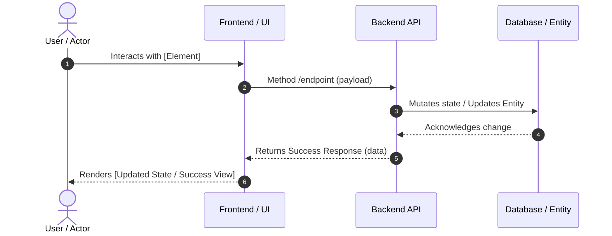

# Journey [XX]: [Feature/Flow Title]

## 📋 Overview
* **As a:** [User Role / Persona]
* **I want to:** [Action they want to take]
* **So that:** [The value or outcome they receive]
* **Source:** Inception Step 6 - User Journey Mapping (Journey [X])
* **Related Feature:** [Feature Name] from Wave [X] ([MVP/Phase])
* **Impacted Entities:** 
  * [[entity-name-1]] (e.g., `Order` changes from `Draft` -> `Pending`)
  * [[entity-name-2]] (e.g., `Inventory` item quantity decrements)

---

## 🗺️ Visual Flow & Sequence
*Use this Mermaid section to map out the happy path step-by-step based on the journey from Inception Step 6. Natively renders in GitHub, GitLab, and Obsidian.*



---

## 🏃‍♂️ Step-by-Step Walkthrough (Happy Path)

| Step | User Action | System Reaction | Entity Lifecycle Impact |
| :--- | :--- | :--- | :--- |
| **1** | Clicks "Place Order" | Validates fields, shows loading spinner, sends API request. | None (UI Level) |
| **2** | — | Validates stock availability, reserves items. | `InventoryItem` -> `Reserved` |
| **3** | — | Generates unique order ID, saves invoice draft. | `Order` -> `Draft` |
| **4** | Views payment modal | Redirects user to Stripe checkout overlay. | `Order` -> `PendingPayment` |

---

## ✅ Acceptance Criteria & Scenarios

### Scenario 1: Successful Execution (Happy Path)
* **Given** the user has items in their cart,
* **When** they click "Place Order",
* **Then** the system should redirect them to the payment gateway,
* **And** the `Order` state must transition to `PendingPayment`.

### Scenario 2: Alternative / Parallel Path
* **Given** ...
* **When** ...
* **Then** ...

---

## ⚠️ Edge Cases, Errors, & Boundary Conditions

### 1. Business Logic Failures
* **What if:** Stock drops to 0 at the exact moment the user clicks submit?
* **System Handling:** Roll back any partial database writes, display error message *"Item no longer available"*, and redirect back to cart.
* **Entity Impact:** No lifecycle change occurs; `Order` remains uncreated.

### 2. Technical Failures
* **What if:** The Stripe payment webhook fails or delays after the user pays?
* **System Handling:** Rely on a background reconciliation cron job to poll Stripe every 5 minutes.
* **Entity Impact:** `Order` safely sits in `PendingPayment` until background task pushes it to `Paid`.

---

## 🛠️ Technical Notes & Validation Rules
* **Required Input Payload:**
  ```json
  {
    "itemId": "uuid",
    "quantity": "integer > 0"
  }
  ```

* **Enforced Business Rules:**
  * [BR-[XXX]](../business-rules/BR-[XXX]-[rule-name].md): [Short business rule active title]

* **Enforced Invariants:**
  * [INV-[XXX]](../invariants/INV-[XXX]-[invariant-name].md): [Short invariant strict title]